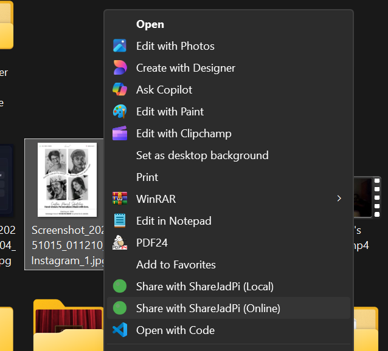
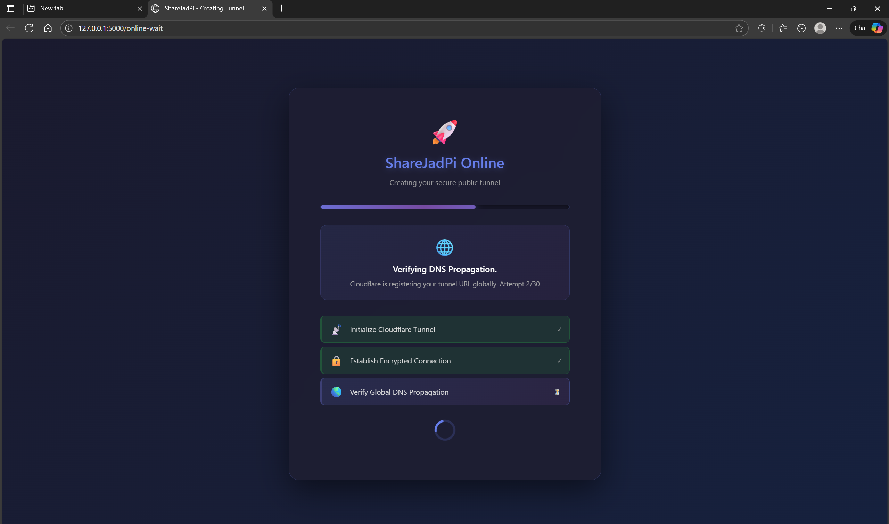
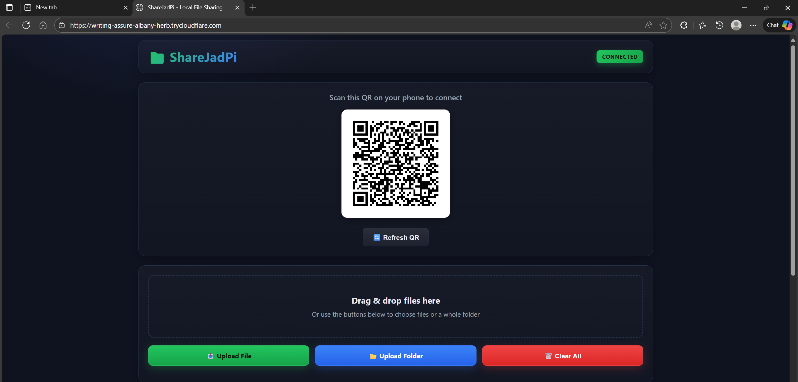

# ShareJadPi v4.5.0# ShareJadPi v4.1.3


**🌐 Share files ANYWHERE with one click - Local WiFi AND Public Internet!****Fast, secure local file sharing between your PC and mobile devices over WiFi.**


[](https://github.com/hetcharusat/sharejadpi)[](https://github.com/hetcharusat/sharejadpi)

[](https://www.python.org/)[](https://www.python.org/)

[](LICENSE)[](LICENSE)


<div align="center"><div align="center">

    

### 📥 Download for Windows### 📥 Download for Windows


<a href="https://github.com/hetcharusat/sharejadpi/releases/latest"><a href="https://github.com/hetcharusat/sharejadpi/releases/latest">

    

</a></a>


**✨ One-click installer • 🔥 Firewall auto-configured • 🚀 Ready in 30 seconds****✨ One-click installer • 🔥 Firewall auto-configured • 🚀 Ready in 30 seconds**


<sub>Windows 10/11 (64-bit) • 51 MB download</sub><sub>Windows 10/11 (64-bit) • 51 MB download</sub>


</div></div>


------


## 🌟 What Makes ShareJadPi Unique?ShareJadPi turns your Windows PC into a local file server accessible from any device on your network. Share files instantly, sync clipboard, upload from mobile, and more—all with a beautiful, modern web interface.


ShareJadPi is the **ONLY** local file sharing tool that combines:---

- 🏠 **Local WiFi Sharing** - Lightning-fast transfers on your network## ✨ Key Features

- 🌍 **Public Internet Sharing** - Share files with ANYONE, ANYWHERE via Cloudflare Tunnel

- 🖱️ **One-Click Context Menu** - Right-click → Share (Local or Online)- 🖱️ **One-Click Sharing** - Right-click any file → "Share with ShareJadPi"

- 🔐 **Enterprise-Grade Security** - Token-based auth, encrypted tunnels, zero data storage- 🔒 **Token-Based Security** - Unique 32-char tokens protect your files, no unauthorized access

- 📱 **QR Code Access** - Instant secure mobile connection

**No other repository offers this dual-mode sharing!**- ⚡ **Background Folder Zipping** - Live progress with speed & ETA

- 🎨 **Beautiful Dark UI** - Modern, responsive design

---- 📋 **Clipboard Sync** - Share text between devices

- 🚀 **Network Speed Test** - Test local network performance

## 🚀 Groundbreaking Features- 📦 **Large File Support** - Handle files up to 50GB

- 🔥 **Multi-Select Actions** - Zip, pin, delete multiple files

### 🌍 Share Files ANYWHERE (Public Internet)- ⚙️ **System Tray App** - Runs quietly in background

The **killer feature** that sets ShareJadPi apart - share files with people across the globe without port forwarding, DDNS, or VPN!

---

<div align="center">

## 📸 Screenshots & Demo

<p><i>Right-click any file → "Share with ShareJadPi (Online)" → Instant global link!</i></p>

</div>### 🖱️ Context Menu Integration

Video: Coming soon — see the placeholders in [Video Tutorials](#-video-tutorials-placeholders)

**How it works:**

1. Right-click file/folder → "Share with ShareJadPi (Online)"### 🏠 Mobile Interface

2. Wait 10-15 seconds for secure Cloudflare tunnel creation

3. Get a public `https://` link that works ANYWHERE

4. Share the link - no login, no account needed!### 📂 System Tray Access

Video: Coming soon — see the placeholders in [Video Tutorials](#-video-tutorials-placeholders)

<div align="center">

### ☑️ Multi-Select & Zip

<p><i>Beautiful waiting page with real-time progress</i></p>

</div>

### 📤 File Upload

<div align="center">



<p><i>Recipient gets full-featured web interface - download, preview, upload</i></p>### ⚙️ Settings Panel

</div>Video: Coming soon — see the placeholders in [Video Tutorials](#-video-tutorials-placeholders)


**✨ Powered by Cloudflare's global CDN - blazing fast worldwide!**### 📋 Clipboard & Speed Test


---

### 📁 File Management

### 🏠 Local WiFi Sharing (Classic Mode)


Perfect for home/office networks - ultra-fast transfers on your local network.### 📦 Folder Zipping Progress


<div align="center">

---

<p><i>System tray with quick access to all features</i></p>

</div>


- 🖱️ **One-Click Sharing** - Right-click any file → "Share with ShareJadPi"## 🎯 Quick Start

- 📱 **QR Code Access** - Scan and connect instantly from mobile

- ⚡ **Gigabit Speed** - Max out your local network bandwidth### Download & Run (Recommended)

- 🔒 **Token Security** - 32-character unique tokens protect access1. **Download** `ShareJadPi-4.1.3-Setup.exe` from [Releases](https://github.com/hetcharusat/sharejadpi/releases/latest)

2. **Run** the exe

---3. **Allow firewall** when prompted ⚠️ *Important: Don't miss this!*

4. **Right-click tray icon** → "Show QR"

## ✨ All the Features You Need5. **Scan QR** with your phone → Done! 🎉


### 📤 File Operations### Run from Source

- ⚡ **Background Folder Zipping** - Live progress with speed & ETA```bash

- 📦 **Large File Support** - Handle files up to 50GBgit clone https://github.com/hetcharusat/sharejadpi.git

- 🔥 **Multi-Select Actions** - Zip, pin, delete multiple filescd sharejadpi

- 📥 **Bidirectional Transfer** - Upload files from mobile to PCpip install -r requirements.txt

python sharejadpi.py

<div align="center">```


---


</div>## 📖 Documentation


### 🎨 User Interface- **[Contributing Guide](docs/CONTRIBUTING.md)** - How to contribute to the project

- 🌑 **Beautiful Dark Theme** - Modern, responsive design

- 📱 **Mobile-Optimized** - Works perfectly on phones & tablets---

- 🎭 **Intuitive Icons** - Clear, easy-to-understand interface

## 🐛 Can't Connect from Mobile?

<div align="center">

**#1 Issue:** Missed the firewall prompt!


**Quick Fix:**

</div>1. Download and run the installer - it configures firewall automatically

2. Or manually allow port 5000 in Windows Firewall

### ⚙️ System Integration3. Restart ShareJadPi

- 🎯 **Context Menu** - Right-click integration (Local + Online)

- 🔔 **System Tray App** - Runs quietly in background---

- 🚀 **Auto-Start** - Launch with Windows (optional)

- 📋 **Clipboard Sync** - Share text between devices## 🚀 What's New in v4.1.3

- 📶 **Speed Test** - Test your network performance

**Final reliability pass for Online Sharing (Cloudflare Tunnel):**

---- ✅ Auto-starts the ShareJadPi server when using context menu “Share with ShareJadPi (Online)”

- ✅ Removed any blocking prompts in CLI flows for seamless context-menu usage

## 🎯 Quick Start- ✅ More robust tunnel startup and output parsing; better failure messages

- ✅ Toast notifications for “building link” and “shared online” with clear timeouts

### Option 1: Download Installer (Recommended)- ✅ Added lightweight debug log at %TEMP%\ShareJadPi.log for context-menu diagnostics

1. **Download** `ShareJadPi-4.5.0-Setup.exe` from [Releases](https://github.com/hetcharusat/sharejadpi/releases/latest)

2. **Run** the installer (requires admin for firewall rules)Recent versions:

3. **Choose options:**- v4.1.2: Fixed bundled cloudflared path using `sys._MEIPASS`; ensured onefile bundles extract and work at runtime

   - ✅ Context menu integration (highly recommended!)- v4.1.1: Attempted bundling (path resolution incomplete)

   - ✅ Auto-start with Windows

   - ✅ Desktop shortcutCore v4.0 improvements retained:

4. **Start sharing!**- 🔒 Stronger security: token-gated routes, Cloudflare header detection, remote settings hidden

   - **Local:** Right-click file → "Share with ShareJadPi (Local)"- 📱 Smarter QR and notifications: separate local vs tunnel QR; multi-line Windows toasts

   - **Online:** Right-click file → "Share with ShareJadPi (Online)"- 🚧 More reliable online sharing: server-side reachability check before redirect; improved waiting page (dark theme)

- ⏱️ Dynamic idle timeout based on file size with activity tracking during downloads

### Option 2: Run from Source- 📣 Clearer Windows notifications during context menu actions

```bash

git clone https://github.com/hetcharusat/sharejadpi.git---

cd sharejadpi

pip install -r requirements.txt## 🎬 Video Tutorials (placeholders)

python sharejadpi.py

```We’ll publish short video tutorials soon. Until then, these placeholders indicate what’s coming:


**For Online Sharing:** Download `cloudflared.exe` from [Cloudflare](https://github.com/cloudflare/cloudflared/releases) and place in project root.- ▶️ Installation & Setup: https://youtu.be/PLACEHOLDER_INSTALL

- ▶️ Share Locally (Context Menu): https://youtu.be/PLACEHOLDER_LOCAL_SHARE

---- ▶️ Share Online (Cloudflare Tunnel): https://youtu.be/PLACEHOLDER_ONLINE_SHARE

- ▶️ Fix Windows Firewall for Mobile Access: https://youtu.be/PLACEHOLDER_FIREWALL

## 🌍 Online Sharing Deep Dive- ▶️ QR Code & Mobile Access: https://youtu.be/PLACEHOLDER_QR

- ▶️ Troubleshooting (Common Issues): https://youtu.be/PLACEHOLDER_TROUBLESHOOT

### Why is this revolutionary?

For a full list, see docs/VIDEOS.md (to be updated with real links once published).

Traditional file sharing requires:

- ❌ Port forwarding (complicated)---

- ❌ Dynamic DNS (costs money)

- ❌ Third-party cloud storage (slow, privacy concerns)## 📋 Requirements

- ❌ Email attachments (size limits)

- Windows 10/11 (64-bit)

**ShareJadPi's Online Mode:**- Python 3.8+ (if running from source)

- ✅ Zero configuration- WiFi or Ethernet

- ✅ Free Cloudflare Tunnel- 100MB disk space + file storage

- ✅ Works behind NAT/firewalls

- ✅ HTTPS encrypted---

- ✅ No file size limits

- ✅ Direct P2P-like experience## 🤝 Contributing


### Technical DetailsSee [docs/CONTRIBUTING.md](docs/CONTRIBUTING.md) for development setup and guidelines.

- **Tunnel Provider:** Cloudflare (99.99% uptime)

- **Encryption:** TLS 1.3 end-to-endFork → Branch → Commit → Push → PR — Welcome! 🎉

- **Speed:** Global CDN - fast worldwide

- **Timeout:** Auto-cleanup after 10 min idle (configurable)---

- **Privacy:** No data stored on Cloudflare servers

- **Cost:** 100% FREE## 📄 License


### Use CasesMIT License - see [LICENSE](LICENSE)

- 📤 Send large files to clients/friends

- 💼 Share work files remotely---

- 🏫 Distribute class materials

- 👨‍👩‍👧‍👦 Share family photos/videos## 💬 Support

- 🎮 Share game saves/mods

- 📱 Transfer files between your devices anywhere- [Issues](https://github.com/hetcharusat/sharejadpi/issues)

- [Discussions](https://github.com/hetcharusat/sharejadpi/discussions)

---

---

## 🐛 Troubleshooting

Made with ❤️ for easy local file sharing

### Can't Connect from Mobile (Local Sharing)?

**#1 Issue:** Firewall blocking port 5000!

**Solutions:**
1. **Use the installer** - auto-configures firewall
2. **Manual fix:** Allow port 5000 in Windows Firewall
   ```powershell
   netsh advfirewall firewall add rule name="ShareJadPi Port 5000" dir=in action=allow protocol=TCP localport=5000
   ```
3. Restart ShareJadPi

### Online Sharing Stuck at "Creating Tunnel"?

1. Check `%TEMP%\ShareJadPi.log` for errors
2. Verify `cloudflared.exe` exists in install directory
3. Try restarting ShareJadPi from tray icon
4. Check internet connection

### Need More Help?
- 🐛 [Report Issues](https://github.com/hetcharusat/sharejadpi/issues)
- 💬 [Discussions](https://github.com/hetcharusat/sharejadpi/discussions)

---

## 🚀 What's New in v4.5.0

**🎉 Major Bug Fixes - Online Sharing Now Rock-Solid!**

### Critical Fixes:
- ✅ **Fixed windowless EXE crash** - `sys.stdout.flush()` on None
- ✅ **Fixed infinite DNS verification** - Auto-redirect after 12 seconds
- ✅ **Enhanced cloudflared path resolution** - Multiple fallback locations
- ✅ **Improved timeout handling** - 5s → 10s for reachability checks

### What This Means:
- 🚀 Online sharing works perfectly in installed EXE
- ⚡ Tunnel creation: 10-15 seconds (down from "stuck forever")
- 🔍 Better debug logging for troubleshooting
- 💯 Production-ready quality

---

## 📋 System Requirements

- **OS:** Windows 10/11 (64-bit)
- **Python:** 3.8+ (if running from source)
- **Network:** WiFi or Ethernet
- **Disk:** 100MB + file storage space
- **Internet:** Required for Online Sharing mode

---

## 🤝 Contributing

We welcome contributions! Whether it's bug fixes, new features, or documentation improvements.

**Quick Start:**
1. Fork the repository
2. Create feature branch: `git checkout -b feature/amazing-feature`
3. Commit changes: `git commit -m 'Add amazing feature'`
4. Push to branch: `git push origin feature/amazing-feature`
5. Open Pull Request

See `docs/CONTRIBUTING.md` for detailed guidelines.

---

## 📄 License

MIT License - see [LICENSE](LICENSE)

**TL;DR:** Free to use, modify, and distribute. No warranties.

---

## 💬 Support & Community

- 🐛 **Bug Reports:** [Issues](https://github.com/hetcharusat/sharejadpi/issues)
- 💡 **Feature Requests:** [Discussions](https://github.com/hetcharusat/sharejadpi/discussions)
- 📧 **Contact:** Open an issue

---

## 🌟 Star History

If you find ShareJadPi useful, please consider giving it a star! ⭐

---

## 🙏 Credits

- **Cloudflare Tunnel** - Powering the revolutionary online sharing
- **Flask** - Web framework
- **QRCode** - QR generation
- **PyInstaller** - Windows executable packaging
- **Inno Setup** - Professional installer

---

<div align="center">

### Made with ❤️ for seamless file sharing

**Share locally. Share globally. Share easily.**

[](https://github.com/hetcharusat/sharejadpi/stargazers)
[](https://github.com/hetcharusat/sharejadpi/network/members)

</div>
