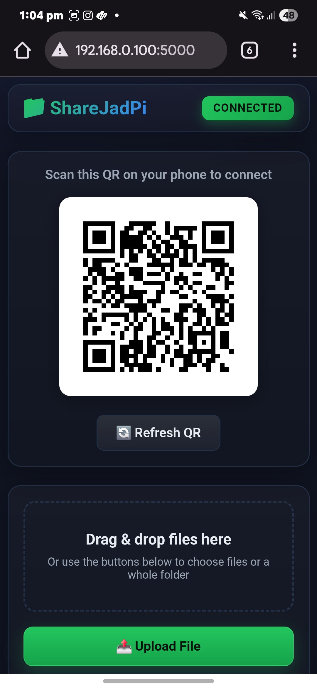
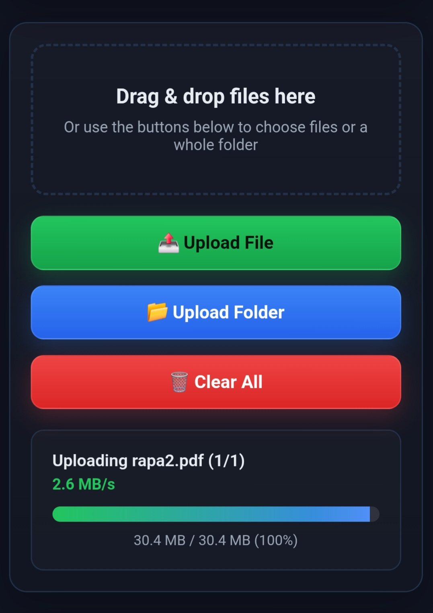
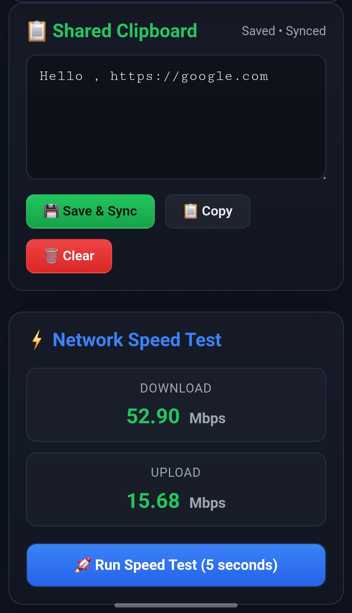
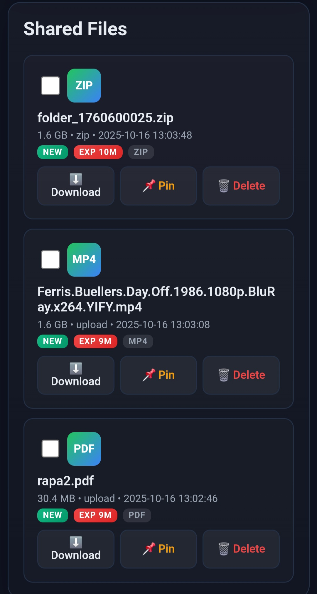
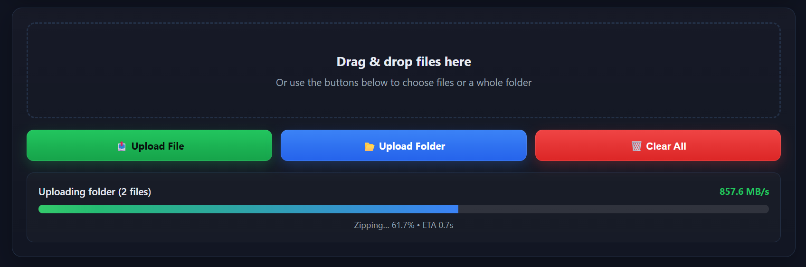

# ShareJadPi v3.0.0

**Fast, secure local file sharing between your PC and mobile devices over WiFi.**

[](https://github.com/hetcharusat/sharejadpi)
[](https://www.python.org/)
[](LICENSE)

<div align="center">
  
### 📥 Download for Windows

<a href="https://github.com/hetcharusat/sharejadpi/releases/download/setup-3.1/ShareJadPi-3.1.1-Setup.exe">
  
</a>

**✨ One-click installer • 🔥 Firewall auto-configured • 🚀 Ready in 30 seconds**

<sub>Windows 10/11 (64-bit) • 20 MB download</sub>

</div>

---

ShareJadPi turns your Windows PC into a local file server accessible from any device on your network. Share files instantly, sync clipboard, upload from mobile, and more—all with a beautiful, modern web interface.

---
## ✨ Key Features

- 🖱️ **One-Click Sharing** - Right-click any file → "Share with ShareJadPi"
- � **Token-Based Security** - Unique 32-char tokens protect your files, no unauthorized access
- 📱 **QR Code Access** - Instant secure mobile connection
- ⚡ **Background Folder Zipping** - Live progress with speed & ETA
- 🎨 **Beautiful Dark UI** - Modern, responsive design
- 📋 **Clipboard Sync** - Share text between devices
- 🚀 **Network Speed Test** - Test local network performance
- � **Large File Support** - Handle files up to 50GB
- 🔥 **Multi-Select Actions** - Zip, pin, delete multiple files
- ⚙️ **System Tray App** - Runs quietly in background

---

## 📸 Screenshots & Demo

### 🖱️ Context Menu Integration
https://github.com/user-attachments/assets/46c6b784-f82c-40e3-9c21-6bab15435278

### 🏠 Mobile Interface


### 📂 System Tray Access
https://github.com/user-attachments/assets/d1145397-81a6-4531-b606-34caf9a6c9b2

### ☑️ Multi-Select & Zip


### 📤 File Upload


### ⚙️ Settings Panel
https://github.com/user-attachments/assets/fb9ed56a-fc1f-459b-abb0-86ee14cc620b

### 📋 Clipboard & Speed Test


### 📁 File Management


### 📦 Folder Zipping Progress


---


## 🎯 Quick Start

### Download & Run (Recommended)
1. **Download** `ShareJadPi-3.0.0.exe` from [Releases](https://github.com/hetcharusat/sharejadpi/releases)
2. **Run** the exe
3. **Allow firewall** when prompted ⚠️ *Important: Don't miss this!*
4. **Right-click tray icon** → "Show QR"
5. **Scan QR** with your phone → Done! 🎉

### Run from Source
```bash
git clone https://github.com/hetcharusat/sharejadpi.git
cd sharejadpi
pip install -r requirements.txt
python sharejadpi.py
```

---

## 📖 Documentation

- **[Contributing Guide](docs/CONTRIBUTING.md)** - How to contribute to the project

---

## 🐛 Can't Connect from Mobile?

**#1 Issue:** Missed the firewall prompt!

**Quick Fix:**
1. Download and run the installer - it configures firewall automatically
2. Or manually allow port 5000 in Windows Firewall
3. Restart ShareJadPi

---

## 🚀 What's New in v3.0

- ⚡ Background folder zipping with live progress
- 🚄 10-20x faster zipping (no compression)
- 💾 Memory-safe streaming for large files
- 🔧 Robust file deletion with Windows API
- 🎨 Aggressive cache-busting for mobile
- 🔼 Fixed network speed test

---

## 📋 Requirements

- Windows 10/11 (64-bit)
- Python 3.8+ (if running from source)
- WiFi or Ethernet
- 100MB disk space + file storage

---

## 🤝 Contributing

See [docs/CONTRIBUTING.md](docs/CONTRIBUTING.md) for development setup and guidelines.

Fork → Branch → Commit → Push → PR — Welcome! 🎉

---

## 📄 License

MIT License - see [LICENSE](LICENSE)

---

## 💬 Support

- [Issues](https://github.com/hetcharusat/sharejadpi/issues)
- [Discussions](https://github.com/hetcharusat/sharejadpi/discussions)

---

Made with ❤️ for easy local file sharing
