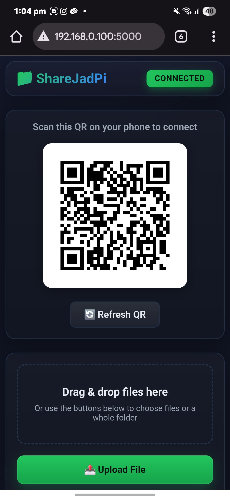
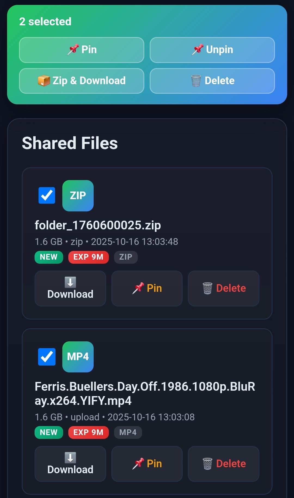
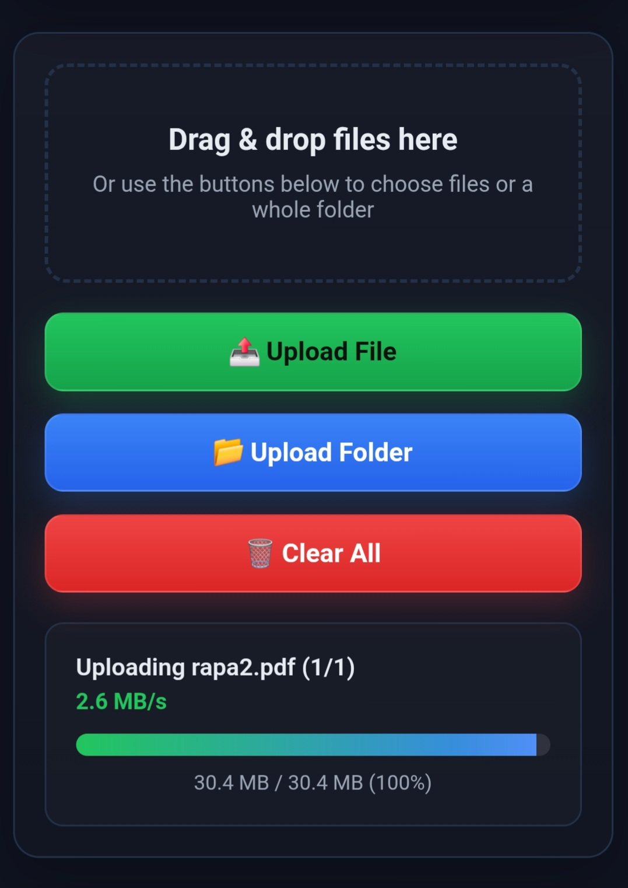
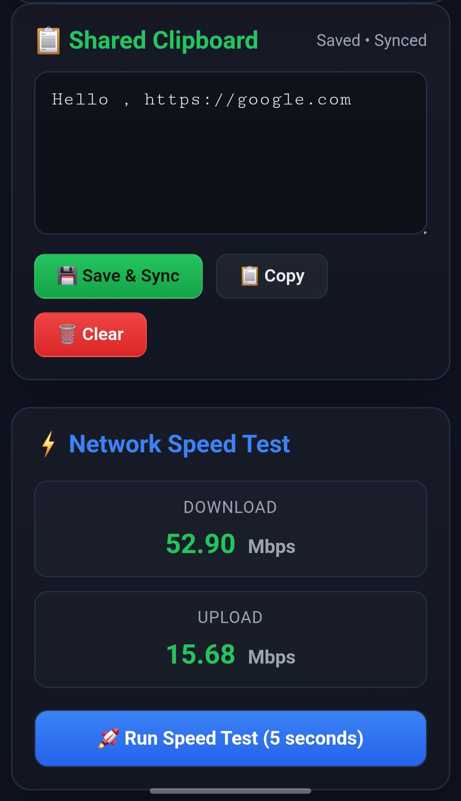
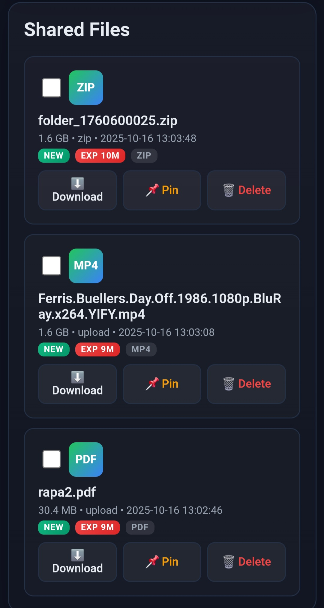
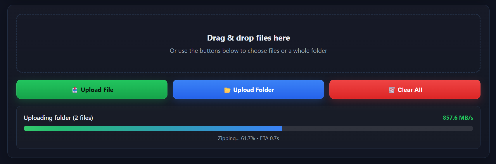

# ShareJadPi v3.0.0

**Fast, secure local file sharing between your PC and mobile devices over WiFi.**

[](https://github.com/hetcharusat/sharejadpi)
[](https://www.python.org/)
[](LICENSE)

ShareJadPi turns your Windows PC into a local file server that you can access from any device on your network. Share files, sync clipboard, upload from mobile, and more—all with a beautiful, modern web interface.

---

## 📸 Screenshots & Demo

> **Visual walkthrough of ShareJadPi's features** - captured from both mobile and PC to show real-world usage!

### 🖱️ Context Menu Integration (PC)
Right-click any file or folder to share instantly:

<video src="vidss/context-menu-share.mp4" width="480" controls></video>

### 🏠 Home Interface (Mobile)
Beautiful dark UI with all features at your fingertips:



### 📂 Opening ShareJadPi (PC)
Quick access from system tray:

<video src="vidss/open_sharejadpi.mp4" width="480" controls></video>

### ☑️ Multi-Select & Zip (Mobile)
Select multiple files to download as a zip:



### 📤 Uploading Files (Mobile)
Drag & drop or choose files with live progress:



### ⚙️ Settings Panel (PC)
Configure autostart, file expiry, and context menu:

<video src="vidss/settings.mp4" width="480" controls></video>

### 📋 Shared Clipboard & Speed Test (Mobile)
Sync text between devices and test network speed:



### 📁 Shared Files Component (Mobile)
View all shared files with pin, download, and delete options:



### 📦 Folder Zipping in Action (PC)
Background zipping with real-time progress and ETA:



---

## ✨ Features

### 🚀 Core Features
- **One-Click Sharing** - Right-click any file/folder → "Share with ShareJadPi"
- **QR Code Access** - Instantly scan with your phone to connect
- **System Tray App** - Runs quietly in background, starts with Windows
- **Token Security** - Only authorized devices can access your files
- **Zero Config** - Works immediately on your local network

### 📱 Mobile-First Interface
- **Beautiful Dark UI** - Modern gradient design with smooth animations
- **Drag & Drop Upload** - Drag files or folders from any device
- **Live Progress** - Real-time upload/download speeds and progress bars
- **Responsive Design** - Perfect on phones, tablets, and desktops
- **Touch Optimized** - Smooth gestures and mobile-friendly controls

### 🔥 Advanced Features
- **Background Folder Zipping** - Upload folders with live progress, speed, and ETA
- **Multi-Select Actions** - Select multiple files to download, zip, pin, or delete
- **Smart File Management** - Pin important files, auto-expiry for temporary shares
- **Shared Clipboard** - Sync text between devices (auto-updates every 2 seconds)
- **Network Speed Test** - Test your local network speed (download + upload)
- **Large File Support** - Handle files up to 50GB with streaming

### 💾 Smart Storage
- **Memory-Safe Zipping** - Streams large folders without loading into RAM
- **Robust Cleanup** - Automatically removes expired files and handles locked files
- **Auto-Recovery** - Scheduled delete on reboot for locked files (Windows API)
- **No Disk Leaks** - Proper file handle management prevents storage buildup

---

## 🎯 Quick Start

### Option 1: Standalone Executable (Recommended)
1. **Download** `ShareJadPi-3.0.0.exe` from [Releases](https://github.com/hetcharusat/sharejadpi/releases)
2. **Run** the executable - double-click or run from command line
3. **Allow network access** - When Windows Firewall prompts, click **"Allow access"**
   - ⚠️ If you miss this prompt, mobile won't connect! Run `fix_firewall.ps1` to fix.
4. **Scan QR** - Right-click the tray icon → "Show QR"
5. **Done!** - Your phone can now access files at the URL

### Option 2: Run from Source
```bash
# Clone repository
git clone https://github.com/hetcharusat/sharejadpi.git
cd sharejadpi

# Install dependencies
pip install -r requirements.txt

# Run the app
python sharejadpi.py
```

---

## 📖 Usage Guide

### First Time Setup

1. **Start the app** (exe or `python sharejadpi.py`)
2. **Look for the system tray icon** (green circle with 'S')
3. **Right-click tray icon** → "Show QR" to get the access URL
4. **Scan QR with your phone** to open the web interface

### Sharing Files

**Method 1: Context Menu (Fastest)**
- Right-click any file or folder
- Select **"Share with ShareJadPi"**
- QR code pops up automatically
- Scan and download on mobile

**Method 2: Direct Upload**
- Open web interface on any device
- Drag & drop files or folders
- Click "Choose Files" or "Choose Folder"

### Managing Files

- **Download** - Click any file to download
- **Multi-Select** - Check boxes to select multiple files
  - **Zip Selected** - Download multiple files as one zip
  - **Pin** - Prevent auto-expiry
  - **Delete** - Remove files
- **Pin** - ⭐ icon keeps files from auto-expiring
- **Clear All** - Remove all shared files at once

### Clipboard Sync

1. Open web interface on mobile
2. Scroll to "Shared Clipboard" section
3. Type text and click **Save**
4. Text syncs automatically across all devices
5. Click **Clear** to remove

### Speed Test

1. Click **"🚀 Run Speed Test (5 seconds)"**
2. See real-time download & upload speeds
3. Helps diagnose network issues

---

## ⚙️ Settings (Host PC Only)

Access settings at `http://127.0.0.1:5000/settings` (only works on host PC)

### Autostart
- ✅ **Enable** - Start ShareJadPi when Windows starts
- ❌ **Disable** - Manual start only

### File Expiry
- Set minutes before files auto-delete (0 = never expire)
- Pinned files never expire
- Useful for temporary shares

### Context Menu
- **Install** - Add "Share with ShareJadPi" to right-click menu
- **Uninstall** - Remove context menu integration

### Cache Management
- View disk usage (shared files, uploads, registry)
- **Clear All** - Remove all files and reset

---

## 🔒 Security

### Token-Based Authentication
- Every session has a unique 32-character token
- Token included in QR code URL
- Cookies stored for 7 days after first scan

### Host-Only Features
- Settings page only accessible from PC running the server
- Context menu and autostart management restricted to host

### Network Isolation
- Only accessible on local network (LAN/WiFi)
- Not exposed to internet
- Host PC IP detection for local-only features

### Content Security
- CSP headers prevent XSS attacks
- NoSniff prevents MIME attacks
- Frame-Deny prevents clickjacking

---

## 🛠️ Advanced

### Build Your Own .exe

```powershell
# Install PyInstaller
pip install pyinstaller

# Build executable
.\build_v3.ps1

# Output: dist\ShareJadPi-3.0.0.exe
```

### Configuration

**Environment Variables:**
- `SHAREJADPI_TOKEN` - Custom security token (auto-generated if not set)
- `SJ_OPEN=1` - Disable token auth (for testing only)

**Data Storage:**
- Windows: `%LOCALAPPDATA%\ShareJadPi\`
  - `shared\` - Files shared from PC
  - `uploads\` - Files uploaded from mobile

### Command Line

```bash
# Normal start
python sharejadpi.py

# Share a file/folder from command line
python sharejadpi.py share "C:\path\to\file.txt"

# Custom port (default 5000)
# Edit sharejadpi.py and change PORT variable
```

---

## 🐛 Troubleshooting

### ⚠️ Mobile Can't Connect ("Site Can't Be Reached")

**This is the #1 most common issue!** Here's the quick fix:

1. **Right-click** `fix_firewall.ps1` → **"Run with PowerShell (Admin)"**
2. **Quit ShareJadPi** (right-click tray icon → Quit)
3. **Run ShareJadPi** again
4. **Try mobile** connection again

**Why this happens:** Windows Firewall blocks network access by default. When you first run ShareJadPi, Windows shows a prompt asking "Allow network access?" If you accidentally click Cancel or close it, Windows blocks all connections.

**See full troubleshooting guide:** [TROUBLESHOOTING.md](TROUBLESHOOTING.md)

---

### App won't start
- **Antivirus blocking?** - Add exception for ShareJadPi.exe
- **Port 5000 in use?** - Close other apps or change PORT in code
- **Python version?** - Requires Python 3.8 or higher

### Can't connect from phone
- **Same WiFi?** - PC and phone must be on same network
- **Firewall?** - Run `fix_firewall.ps1` as Administrator
- **Correct URL?** - Use the URL from QR code (with token)
- **Network type?** - WiFi must be set to "Private" not "Public"

### Context menu not appearing
- Right-click tray icon → **Install Context Menu**
- May need to restart Explorer: `taskkill /f /im explorer.exe && start explorer`

### Slow loading on phone
- Clear browser cache on mobile
- Or just reload page once (v3.0 has aggressive cache-busting)

### Files not deleting / disk space not recovering
- v3.0 has robust delete with retry logic
- Locked files scheduled for delete on next reboot
- Check tray icon → "Clear Cache" for manual cleanup

### Large folder upload fails
- Increase `MAX_FILE_SIZE` in `sharejadpi.py` (default 50GB)
- Check available disk space in `%LOCALAPPDATA%\ShareJadPi\`

---

## 📋 Requirements

### Python Version
- Python 3.8 or higher

### Dependencies
```
flask>=3.0.0
qrcode[pil]>=7.4.2
pillow>=10.0.0
pystray>=0.19.5
werkzeug>=3.0.0
```

### System Requirements
- **OS:** Windows 10/11 (64-bit)
- **RAM:** 2GB minimum, 4GB+ recommended for large files
- **Disk:** 100MB for app, plus space for shared files
- **Network:** WiFi or Ethernet connection

---

## 🚀 What's New in v3.0.0

### Performance
- ⚡ **Background Folder Zipping** - No more UI freezing on large folders
- 📊 **Live Zipping Progress** - Real-time percent, speed, and ETA
- 🚄 **10-20x Faster Zipping** - ZIP_STORED (no compression) for speed
- 💾 **Memory-Safe** - Streams files in 1MB chunks (no RAM spikes)

### Reliability
- 🔧 **Robust File Deletion** - Retry logic + Windows reboot-delete API
- 🧹 **No Disk Leaks** - Proper handle closure prevents locked files
- 🛡️ **Crash-Proof QR** - Handles permission errors gracefully

### User Experience
- 🎨 **Aggressive Cache-Busting** - Mobile browsers always load fresh
- 🧼 **Auto-Clear Service Workers** - Removes stale cached content
- 📱 **Instant Mobile Load** - Fixed 40-50 second cache delay
- 🔼 **Network Speed Test** - Upload + download test (was broken)

### Developer
- 📦 **Production Build Script** - `build_v3.ps1` for clean releases
- 📝 **Comprehensive README** - Everything in one place
- 🧪 **Error-Free Codebase** - All lint errors resolved

---

## 🤝 Contributing

Contributions are welcome! Here's how:

1. Fork the repository
2. Create a feature branch (`git checkout -b feature/amazing-feature`)
3. Commit changes (`git commit -m 'Add amazing feature'`)
4. Push to branch (`git push origin feature/amazing-feature`)
5. Open a Pull Request

---

## 📄 License

This project is licensed under the MIT License - see the [LICENSE](LICENSE) file for details.

---

## 💬 Support

- **Issues:** [GitHub Issues](https://github.com/hetcharusat/sharejadpi/issues)
- **Discussions:** [GitHub Discussions](https://github.com/hetcharusat/sharejadpi/discussions)

---

## 🙏 Acknowledgments

- Built with [Flask](https://flask.palletsprojects.com/)
- QR codes by [qrcode](https://github.com/lincolnloop/python-qrcode)
- Tray icon by [pystray](https://github.com/moses-palmer/pystray)
- Icons from system defaults

---

## 📊 Project Stats

- **Version:** 3.0.0
- **Release Date:** October 2025
- **Language:** Python
- **Framework:** Flask
- **Platform:** Windows

---

Made with ❤️ for easy local file sharing
