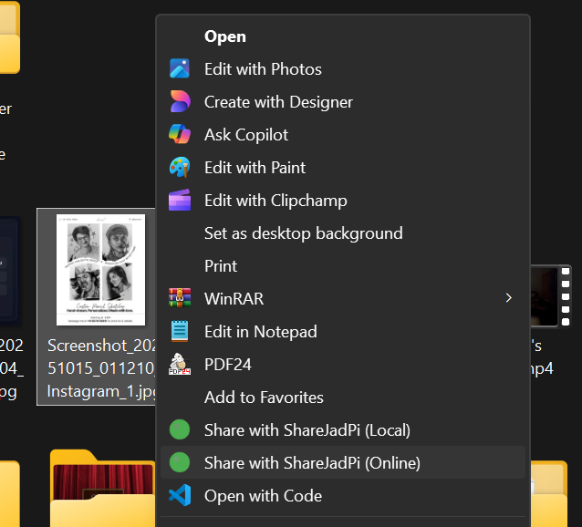
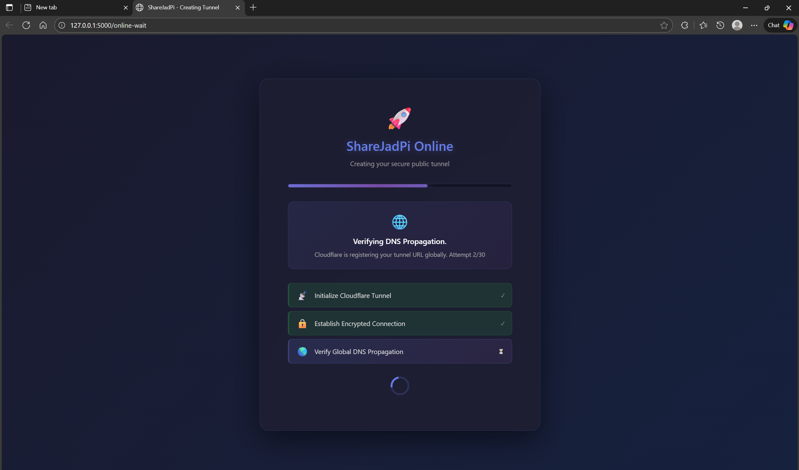
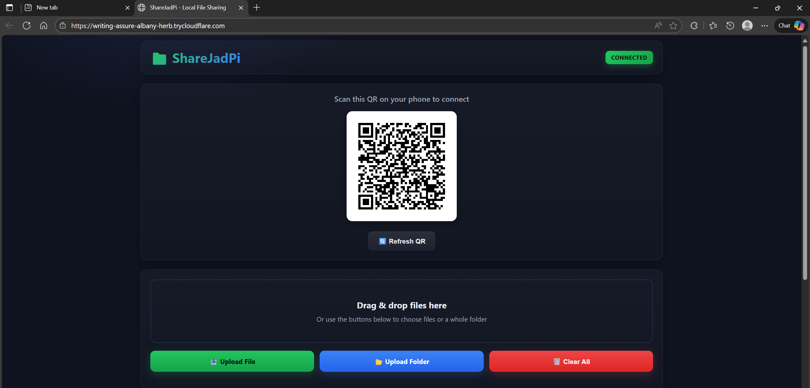
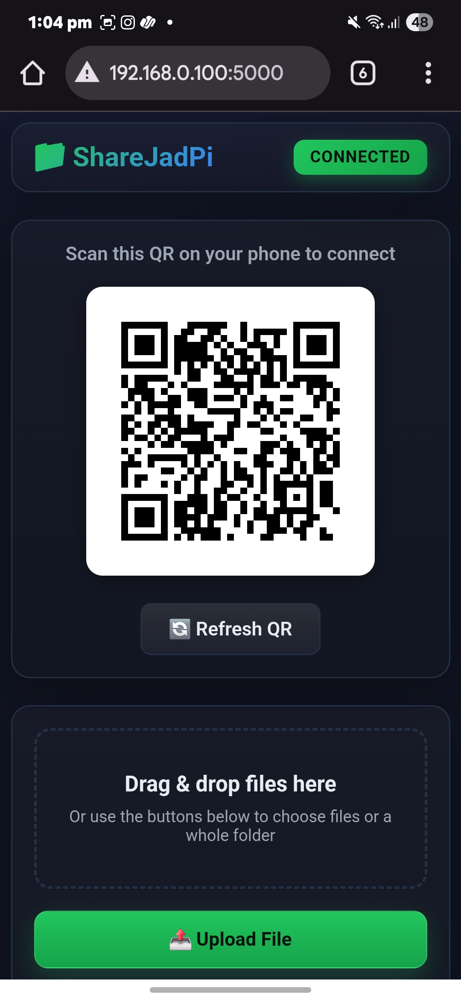
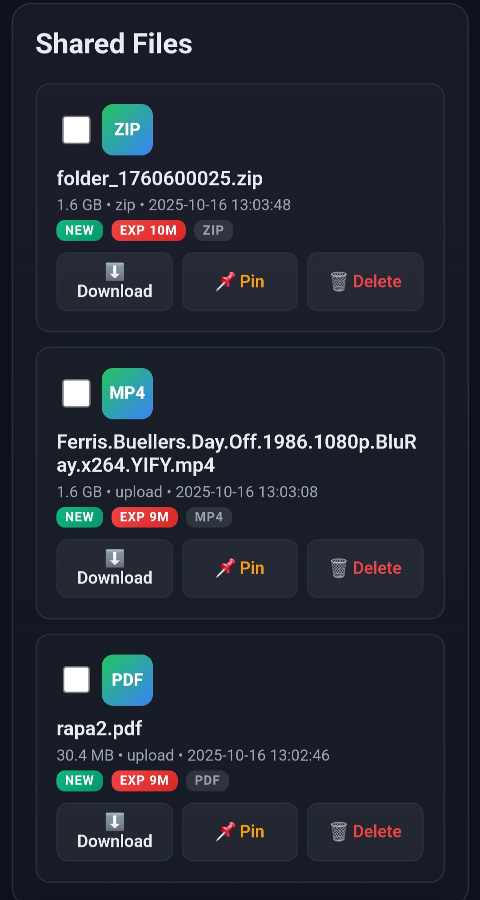
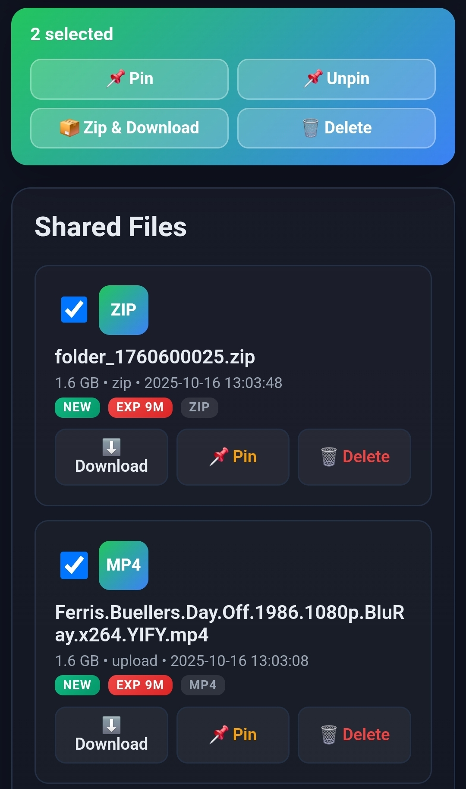
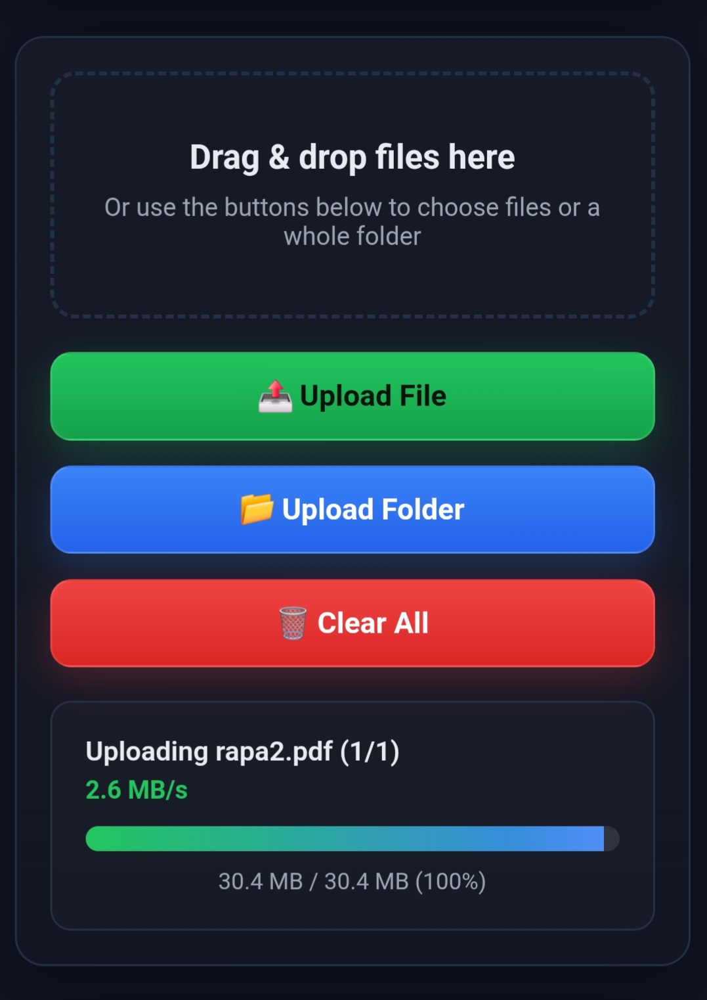
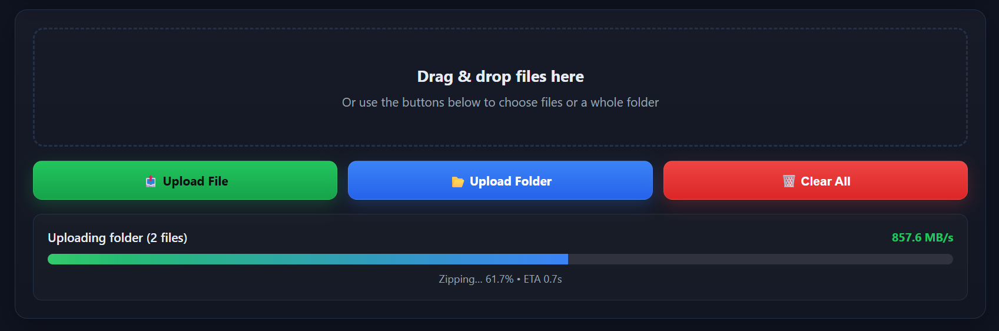
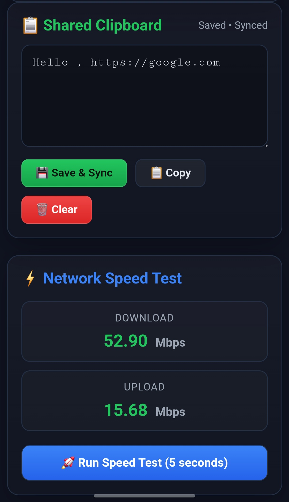

# ShareJadPi v4.5.4

Share files ANYWHERE with just one click — Local WiFi AND Public Internet.

[](https://github.com/hetcharusat/sharejadpi)
[](https://www.python.org/)
[](LICENSE)

<div align="center">

### Download for Windows

<a href="https://github.com/hetcharusat/sharejadpi/releases/latest">
  
 </a>

<sub>Windows 10/11 (64‑bit) • One‑click installer. • Firewall auto‑config.</sub>

</div>

---

## ✨ Key Features

- 🖱️ One‑Click Sharing — Right‑click any file → “Share with ShareJadPi”
- 🔒 Token‑Based Security — 32‑char tokens protect access, no unauthorized use
- 📱 QR Code Access — Instant secure mobile connection (Local mode)
- ⚡ Background Folder Zipping — Live progress with speed & ETA
- 🌑 Beautiful Dark UI — Modern, responsive design
 - 📋 Clipboard Sync — Share text between devices
- 📶 Network Speed Test — Check your network performance
- 📦 Large File Support — Handle files up to 50GB
 - 🔥 Multi‑Select Actions — Zip, pin, delete multiple files
- 🧰 System Tray App — Runs quietly in background; optional auto‑start

Online Share (UNIQUE): Send files over the public internet in ~10–15s with Cloudflare Tunnel — zero setup, no port forwarding, no DDNS, no VPN.

---

## Online Share 

<div align="center">
  
  <p><i>Right‑click any file/folder → “Share with ShareJadPi (Online)” → get a public https link.</i></p>
  
  <p><i>Clean waiting page while the secure tunnel spins up.</i></p>
  
  <p><i>The recipient gets a simple web page to download or upload (if enabled).</i></p>
</div>

---

## Screenshots & Demo

### Video demos

<div align="center">

<details>
  <summary>⚙️ Settings Overview (expand to play)</summary>

  https://github.com/user-attachments/assets/62325df0-b18f-4106-847e-3807825160e3

  <br/>
  <sub>If the preview doesn’t load, open the link above directly.</sub>
</details>

<details>
  <summary>🖱️ Context Menu Share (expand to play)</summary>

  https://github.com/user-attachments/assets/e3642d5a-b051-4c72-9e5e-9fe42629bb75

  <br/>
  <sub>If the preview doesn’t load, open the link above directly.</sub>
</details>

<details>
  <summary>🧰 Tray Icon → Open Share Page (expand to play)</summary>

  https://github.com/user-attachments/assets/db1e52f6-c7d5-42ab-81ec-7b327f92b3aa

  <br/>
  <sub>If the preview doesn’t load, open the link above directly.</sub>
</details>

</div>

### Home Preview
<div align="center">
  
</div>

### Shared Files Component
<div align="center">
  
</div>

### Select Files and Zip
<div align="center">
  
</div>

### Uploading Files
<div align="center">
  
</div>

### Zipping the Folder
<div align="center">
  
</div>

### Clipboard and Speed Test
<div align="center">
  
</div>

### Tray Icon Features
<div align="center">
  
</div>

---

## Quick Start

1) Download and run the v4.5.4 setup (above).
2) Right‑click a file/folder → "Share with ShareJadPi (Local/Online)".
3) For Online Share, keep internet on; tunnel opens **instantly** when ready!
4) Click the notification to open ShareJadPi in your browser!

Run from source (optional):
```bash
git clone https://github.com/hetcharusat/sharejadpi.git
cd sharejadpi
pip install -r requirements.txt
python sharejadpi.py
```

For Online Share from source, place `cloudflared.exe` in the project root.

---

## Features

- 📦 Large files, folder zipping with progress
- 📱 QR code for quick mobile access (Local mode)
- 🔔 System tray app; optional auto‑start
- 📋 Clipboard sync and built‑in speed test
- 🌑 Modern dark UI, mobile‑friendly

---

## What's New in v4.5.4

**⚡ Faster & More Reliable Online Redirects**

- ✅ Redirect only when the Cloudflare tunnel truly answers `GET /health` (no more early NXDOMAIN)
- ✅ Token never appears in the URL — secure POST to `/auth/enter` sets cookie then redirects to clean path
- ✅ Fixed double-token in redirect edge cases
- ✅ Caching for speed: 2‑minute server + client cache to skip the wait page when reopening the same tunnel
- ✅ DoH (dns.google) assists the status messaging while waiting

**Previous versions:**
- v4.5.0: Fixed crash (stdout flush), infinite DNS wait, enhanced cloudflared paths
- v4.1.3: Final reliability pass for online sharing
- v4.0.0: Enhanced security, smarter QR codes

---

## Requirements

- Windows 10/11 (64‑bit)
- Python 3.8+ only if running from source

---

## License and Support

- MIT License — see `LICENSE`
- Issues and feature requests: GitHub Issues/Discussions

Made with ❤️ — Share locally. Share globally.
