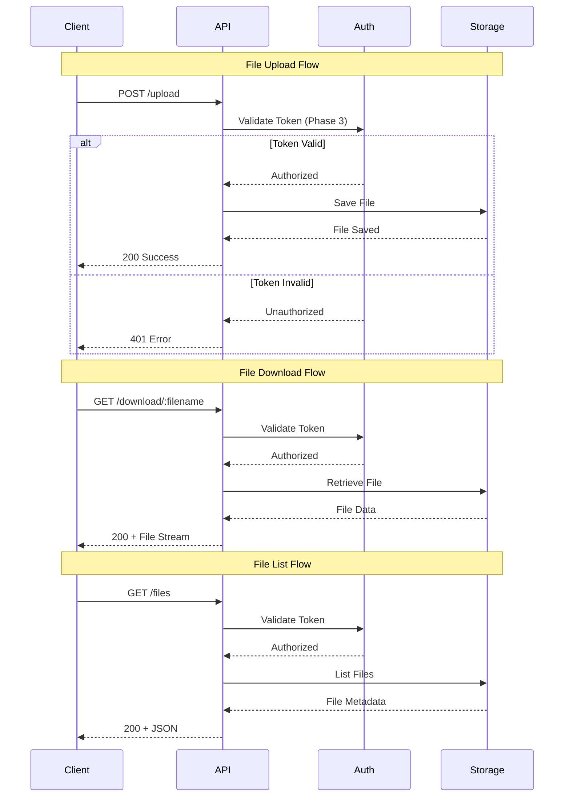
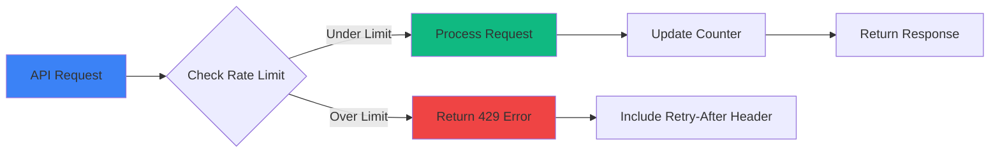

# API Documentation

## REST API Endpoints

### Base URL
```
http://<local-ip>:5000/api
```

## File Operations

### Upload File

**Endpoint:** `POST /upload`

**Description:** Upload a file to the server

**Request:**
```http
POST /upload HTTP/1.1
Content-Type: multipart/form-data
```

**Parameters:**
| Parameter | Type | Required | Description |
|-----------|------|----------|-------------|
| file | File | Yes | The file to upload |

**Example Request:**
```javascript
const formData = new FormData();
formData.append('file', fileInput.files[0]);

fetch('/upload', {
    method: 'POST',
    body: formData
})
.then(response => response.json())
.then(data => console.log(data));
```

**Success Response (200):**
```json
{
    "success": true,
    "filename": "example.pdf",
    "size": 1048576,
    "upload_time": "2024-03-15T10:30:00Z"
}
```

**Error Response (400):**
```json
{
    "error": "No file provided",
    "code": "MISSING_FILE"
}
```

---

### Download File

**Endpoint:** `GET /download/<filename>`

**Description:** Download a previously uploaded file

**Parameters:**
| Parameter | Type | Required | Description |
|-----------|------|----------|-------------|
| filename | String | Yes | Name of the file to download |

**Example Request:**
```javascript
fetch('/download/example.pdf')
    .then(response => response.blob())
    .then(blob => {
        const url = window.URL.createObjectURL(blob);
        const a = document.createElement('a');
        a.href = url;
        a.download = 'example.pdf';
        a.click();
    });
```

**Success Response (200):**
- Returns file binary data with appropriate Content-Type header

**Error Response (404):**
```json
{
    "error": "File not found",
    "code": "FILE_NOT_FOUND"
}
```

---

### List Files

**Endpoint:** `GET /files`

**Description:** Get a list of all uploaded files

**Example Request:**
```javascript
fetch('/files')
    .then(response => response.json())
    .then(data => console.log(data));
```

**Success Response (200):**
```json
{
    "files": [
        {
            "name": "example.pdf",
            "size": 1048576,
            "uploaded": "2024-03-15T10:30:00Z",
            "type": "application/pdf"
        },
        {
            "name": "image.png",
            "size": 524288,
            "uploaded": "2024-03-15T11:00:00Z",
            "type": "image/png"
        }
    ],
    "total": 2,
    "storage_used": 1572864
}
```

---

### Delete File

**Endpoint:** `DELETE /delete/<filename>`

**Description:** Delete a previously uploaded file

**Parameters:**
| Parameter | Type | Required | Description |
|-----------|------|----------|-------------|
| filename | String | Yes | Name of the file to delete |

**Example Request:**
```javascript
fetch('/delete/example.pdf', {
    method: 'DELETE'
})
.then(response => response.json())
.then(data => console.log(data));
```

**Success Response (200):**
```json
{
    "success": true,
    "message": "File deleted successfully"
}
```

**Error Response (404):**
```json
{
    "error": "File not found",
    "code": "FILE_NOT_FOUND"
}
```

---

## Authentication API (Phase 3)

### Get Access Token

**Endpoint:** `POST /auth/token`

**Description:** Generate an access token for API authentication (Planned for Phase 3)

**Request Body:**
```json
{
    "username": "user@example.com",
    "password": "securepassword"
}
```

**Success Response (200):**
```json
{
    "access_token": "eyJhbGciOiJIUzI1NiIsInR5cCI6IkpXVCJ9...",
    "token_type": "bearer",
    "expires_in": 86400
}
```

---

### Validate Token

**Endpoint:** `GET /auth/validate`

**Description:** Validate an existing access token (Planned for Phase 3)

**Headers:**
```http
Authorization: Bearer <access_token>
```

**Success Response (200):**
```json
{
    "valid": true,
    "user_id": "user123",
    "expires_at": "2024-03-16T10:30:00Z"
}
```

---

### Revoke Token

**Endpoint:** `POST /auth/revoke`

**Description:** Revoke an access token (Planned for Phase 3)

**Headers:**
```http
Authorization: Bearer <access_token>
```

**Success Response (200):**
```json
{
    "success": true,
    "message": "Token revoked successfully"
}
```

---

## API Flow Diagram



## Error Codes Reference

| Code | HTTP Status | Description | Solution |
|------|-------------|-------------|----------|
| MISSING_FILE | 400 | No file in request | Include file in FormData |
| FILE_TOO_LARGE | 413 | File exceeds size limit | Reduce file size |
| INVALID_FILE_TYPE | 415 | File type not allowed | Check allowed types |
| FILE_NOT_FOUND | 404 | File doesn't exist | Verify filename |
| STORAGE_FULL | 507 | Server storage full | Free up space |
| INVALID_CREDENTIALS | 401 | Wrong username/password | Check credentials |
| TOKEN_EXPIRED | 401 | Auth token expired | Request new token |
| INSUFFICIENT_PERMISSIONS | 403 | No access permission | Contact admin |
| RATE_LIMIT_EXCEEDED | 429 | Too many requests | Wait and retry |
| INTERNAL_ERROR | 500 | Server error | Report to admin |

## Rate Limiting (Phase 3)



**Rate Limits (Planned):**
- Upload: 10 files per minute
- Download: 50 files per minute
- List Files: 30 requests per minute
- Authentication: 5 attempts per minute

**Headers:**
```
X-RateLimit-Limit: 10
X-RateLimit-Remaining: 7
X-RateLimit-Reset: 1647345600
```

---

## WebSocket API (Phase 4)

### Real-time File Updates

**Endpoint:** `ws://<local-ip>:5000/ws`

**Description:** WebSocket connection for real-time file updates (Planned)

**Connection:**
```javascript
const socket = new WebSocket('ws://192.168.1.100:5000/ws');

socket.onopen = () => {
    console.log('Connected to ShareJadPi');
};

socket.onmessage = (event) => {
    const data = JSON.parse(event.data);
    console.log('Update:', data);
};
```

**Event Types:**
| Event | Description |
|-------|-------------|
| `file_uploaded` | A new file was uploaded |
| `file_deleted` | A file was deleted |
| `file_downloaded` | A file was downloaded |
| `storage_update` | Storage status changed |

**Example Message:**
```json
{
    "event": "file_uploaded",
    "data": {
        "filename": "document.pdf",
        "size": 1048576,
        "uploaded_by": "192.168.1.50",
        "timestamp": "2024-03-15T10:30:00Z"
    }
}
```

---

## SDK Examples

### Python SDK

```python
import requests

class ShareJadPiClient:
    def __init__(self, base_url):
        self.base_url = base_url
        self.session = requests.Session()
    
    def upload_file(self, file_path):
        with open(file_path, 'rb') as f:
            files = {'file': f}
            response = self.session.post(
                f"{self.base_url}/upload",
                files=files
            )
        return response.json()
    
    def download_file(self, filename, save_path):
        response = self.session.get(
            f"{self.base_url}/download/{filename}",
            stream=True
        )
        with open(save_path, 'wb') as f:
            for chunk in response.iter_content(chunk_size=8192):
                f.write(chunk)
        return save_path
    
    def list_files(self):
        response = self.session.get(f"{self.base_url}/files")
        return response.json()
    
    def delete_file(self, filename):
        response = self.session.delete(
            f"{self.base_url}/delete/{filename}"
        )
        return response.json()

# Usage
client = ShareJadPiClient('http://192.168.1.100:5000')
client.upload_file('document.pdf')
files = client.list_files()
client.download_file('document.pdf', './downloads/document.pdf')
```

### JavaScript SDK

```javascript
class ShareJadPiClient {
    constructor(baseUrl) {
        this.baseUrl = baseUrl;
    }
    
    async uploadFile(file) {
        const formData = new FormData();
        formData.append('file', file);
        
        const response = await fetch(`${this.baseUrl}/upload`, {
            method: 'POST',
            body: formData
        });
        
        return response.json();
    }
    
    async downloadFile(filename) {
        const response = await fetch(
            `${this.baseUrl}/download/${filename}`
        );
        return response.blob();
    }
    
    async listFiles() {
        const response = await fetch(`${this.baseUrl}/files`);
        return response.json();
    }
    
    async deleteFile(filename) {
        const response = await fetch(
            `${this.baseUrl}/delete/${filename}`,
            { method: 'DELETE' }
        );
        return response.json();
    }
}

// Usage
const client = new ShareJadPiClient('http://192.168.1.100:5000');

// Upload
const fileInput = document.querySelector('#fileInput');
await client.uploadFile(fileInput.files[0]);

// List files
const files = await client.listFiles();
console.log(files);

// Download
const blob = await client.downloadFile('document.pdf');
```

---

## cURL Examples

### Upload a File
```bash
curl -X POST -F "file=@document.pdf" http://192.168.1.100:5000/upload
```

### Download a File
```bash
curl -O http://192.168.1.100:5000/download/document.pdf
```

### List All Files
```bash
curl http://192.168.1.100:5000/files
```

### Delete a File
```bash
curl -X DELETE http://192.168.1.100:5000/delete/document.pdf
```

### With Authentication (Phase 3)
```bash
# Get token
curl -X POST -H "Content-Type: application/json" \
    -d '{"username":"user","password":"pass"}' \
    http://192.168.1.100:5000/auth/token

# Use token
curl -H "Authorization: Bearer <token>" \
    http://192.168.1.100:5000/files
```

---

## Postman Collection

Import this collection into Postman for easy API testing:

```json
{
    "info": {
        "name": "ShareJadPi API",
        "schema": "https://schema.getpostman.com/json/collection/v2.1.0/collection.json"
    },
    "variable": [
        {
            "key": "base_url",
            "value": "http://192.168.1.100:5000"
        }
    ],
    "item": [
        {
            "name": "Upload File",
            "request": {
                "method": "POST",
                "url": "{{base_url}}/upload",
                "body": {
                    "mode": "formdata",
                    "formdata": [
                        {
                            "key": "file",
                            "type": "file"
                        }
                    ]
                }
            }
        },
        {
            "name": "List Files",
            "request": {
                "method": "GET",
                "url": "{{base_url}}/files"
            }
        },
        {
            "name": "Download File",
            "request": {
                "method": "GET",
                "url": "{{base_url}}/download/example.pdf"
            }
        },
        {
            "name": "Delete File",
            "request": {
                "method": "DELETE",
                "url": "{{base_url}}/delete/example.pdf"
            }
        }
    ]
}
```
