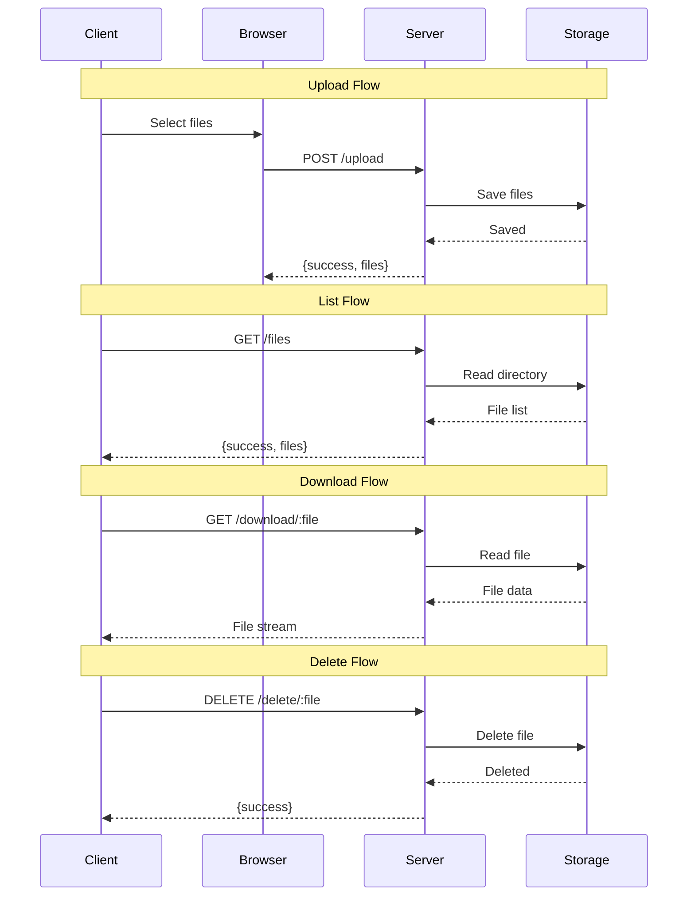

# 🔌 API Reference

<div class="api-hero">
  <h2>ShareJadPi Dev API Documentation</h2>
  <p>Simple REST API for file sharing operations. All endpoints return JSON responses.</p>
</div>

## 📋 Quick Reference

<div class="endpoint-grid">
  <div class="endpoint-card">
    <span class="method post">POST</span>
    <span class="route">/upload</span>
    <span class="desc">Upload files</span>
  </div>
  <div class="endpoint-card">
    <span class="method get">GET</span>
    <span class="route">/files</span>
    <span class="desc">List all files</span>
  </div>
  <div class="endpoint-card">
    <span class="method get">GET</span>
    <span class="route">/download/:filename</span>
    <span class="desc">Download file</span>
  </div>
  <div class="endpoint-card">
    <span class="method delete">DELETE</span>
    <span class="route">/delete/:filename</span>
    <span class="desc">Delete file</span>
  </div>
  <div class="endpoint-card">
    <span class="method get">GET</span>
    <span class="route">/api/status</span>
    <span class="desc">Server status</span>
  </div>
  <div class="endpoint-card">
    <span class="method get">GET</span>
    <span class="route">/</span>
    <span class="desc">Web interface</span>
  </div>
</div>

---

## 🔗 Base URL

```
http://localhost:5000
```

Or use your network IP:
```
http://192.168.1.100:5000
```

---

## 📤 Upload Files

### `POST /upload`

Upload one or more files to the server.

#### Request

**Content-Type:** `multipart/form-data`

**Form Fields:**
- `file` (file, required): One or more files to upload

#### Example (JavaScript)

```javascript
// Upload single file
const formData = new FormData();
formData.append('file', fileInput.files[0]);

const response = await fetch('/upload', {
  method: 'POST',
  body: formData
});

const result = await response.json();
console.log(result);
```

#### Example (cURL)

```bash
# Upload single file
curl -X POST http://localhost:5000/upload \
  -F "file=@document.pdf"

# Upload multiple files
curl -X POST http://localhost:5000/upload \
  -F "file=@photo1.jpg" \
  -F "file=@photo2.jpg" \
  -F "file=@photo3.jpg"
```

#### Response (Success)

```json
{
  "success": true,
  "files": [
    {
      "name": "document.pdf",
      "size": 1048576
    },
    {
      "name": "photo.jpg",
      "size": 524288
    }
  ]
}
```

#### Response (Error)

```json
{
  "error": "No file provided"
}
```

**Status Codes:**
- `200 OK` - Files uploaded successfully
- `400 Bad Request` - No file provided or invalid request
- `413 Payload Too Large` - File exceeds size limit (500MB)

---

## 📋 List Files

### `GET /files`

Get a list of all uploaded files with metadata.

#### Request

No parameters required.

#### Example (JavaScript)

```javascript
const response = await fetch('/files');
const data = await response.json();

if (data.success) {
  data.files.forEach(file => {
    console.log(`${file.name} - ${file.size} bytes`);
  });
}
```

#### Example (cURL)

```bash
curl http://localhost:5000/files
```

#### Response (Success)

```json
{
  "success": true,
  "files": [
    {
      "name": "document.pdf",
      "size": 1048576,
      "modified": "2024-01-31T10:30:00Z"
    },
    {
      "name": "photo.jpg",
      "size": 524288,
      "modified": "2024-01-31T11:15:00Z"
    },
    {
      "name": "presentation.pptx",
      "size": 2097152,
      "modified": "2024-01-31T14:45:00Z"
    }
  ]
}
```

#### Response (Empty)

```json
{
  "success": true,
  "files": []
}
```

**Status Codes:**
- `200 OK` - Files listed successfully

---

## 📥 Download File

### `GET /download/:filename`

Download a specific file by filename.

#### Parameters

- `filename` (string, required): The name of the file to download

#### Example (JavaScript)

```javascript
// Download and save file
async function downloadFile(filename) {
  const response = await fetch(`/download/${filename}`);
  const blob = await response.blob();
  
  const url = window.URL.createObjectURL(blob);
  const a = document.createElement('a');
  a.href = url;
  a.download = filename;
  a.click();
  window.URL.revokeObjectURL(url);
}

downloadFile('document.pdf');
```

#### Example (cURL)

```bash
# Download file
curl -O http://localhost:5000/download/document.pdf

# Download with custom name
curl -o myfile.pdf http://localhost:5000/download/document.pdf
```

#### Response

The file is streamed directly with appropriate headers:

**Headers:**
- `Content-Type`: Detected MIME type (e.g., `application/pdf`)
- `Content-Disposition`: `attachment; filename="document.pdf"`

**Status Codes:**
- `200 OK` - File downloaded successfully
- `404 Not Found` - File doesn't exist

---

## 🗑️ Delete File

### `DELETE /delete/:filename`

Delete a specific file from the server.

#### Parameters

- `filename` (string, required): The name of the file to delete

#### Example (JavaScript)

```javascript
async function deleteFile(filename) {
  const response = await fetch(`/delete/${filename}`, {
    method: 'DELETE'
  });
  
  const result = await response.json();
  
  if (result.success) {
    console.log('File deleted successfully');
  }
}

deleteFile('document.pdf');
```

#### Example (cURL)

```bash
curl -X DELETE http://localhost:5000/delete/document.pdf
```

#### Response (Success)

```json
{
  "success": true,
  "message": "File deleted successfully"
}
```

#### Response (Error)

```json
{
  "error": "File not found"
}
```

**Status Codes:**
- `200 OK` - File deleted successfully
- `404 Not Found` - File doesn't exist
- `500 Internal Server Error` - Failed to delete file

---

## ✅ Server Status

### `GET /api/status`

Check server status and get version information.

#### Request

No parameters required.

#### Example (JavaScript)

```javascript
const response = await fetch('/api/status');
const status = await response.json();

console.log(`Server: ${status.server} v${status.version}`);
console.log(`Status: ${status.status}`);
```

#### Example (cURL)

```bash
curl http://localhost:5000/api/status
```

#### Response

```json
{
  "status": "running",
  "server": "ShareJadPi Dev",
  "version": "4.5.4-dev",
  "upload_folder": "/Users/username/ShareJadPi-Dev/uploads"
}
```

**Status Codes:**
- `200 OK` - Server is running

---

## 🌐 Web Interface

### `GET /`

Access the web-based user interface.

#### Request

Open in a web browser:

```
http://localhost:5000
```

Or from another device on your network:

```
http://192.168.1.100:5000
```

#### Response

HTML page with:
- File upload interface (drag & drop)
- File list with download/delete buttons
- Network information
- Dark theme UI

---

## 🔄 API Flow Diagram



---

## ⚠️ Error Codes

| Code | Error | Description |
|------|-------|-------------|
| `400` | Bad Request | Missing required parameters or invalid request |
| `404` | Not Found | Requested file doesn't exist |
| `413` | Payload Too Large | File exceeds 500MB limit |
| `500` | Internal Server Error | Server-side error occurred |

---

## 🎯 Rate Limits

**None** - This is a development server for local networks. No rate limiting is applied.

For production use, consider implementing:
- Request rate limiting per IP
- Upload bandwidth throttling
- Concurrent upload limits

---

## 📦 Response Format

All API endpoints (except file downloads and the web interface) return JSON responses with this structure:

### Success Response

```json
{
  "success": true,
  "data": { /* endpoint-specific data */ }
}
```

### Error Response

```json
{
  "error": "Error message description",
  "details": "Optional additional details"
}
```

---

## 🔒 Security Notes

### Development Mode

This is a **development server** designed for local networks. Security features are minimal:

- ❌ No authentication required
- ❌ No HTTPS/TLS encryption
- ❌ No rate limiting
- ❌ No CORS restrictions

### Best Practices

For development use:
- ✅ Use only on trusted local networks
- ✅ Don't expose to the internet
- ✅ Don't store sensitive files
- ✅ Clear uploads regularly

For production use, consider adding:
- 🔐 Token-based authentication
- 🔒 HTTPS/TLS encryption
- 🚦 Rate limiting
- 🛡️ CORS configuration
- 📊 Audit logging

---

## 💡 Usage Examples

### Complete Upload Workflow

```javascript
// Complete file upload with progress
async function uploadWithProgress(file) {
  const formData = new FormData();
  formData.append('file', file);
  
  const xhr = new XMLHttpRequest();
  
  // Track progress
  xhr.upload.addEventListener('progress', (e) => {
    if (e.lengthComputable) {
      const percent = (e.loaded / e.total) * 100;
      console.log(`Upload: ${percent.toFixed(0)}%`);
    }
  });
  
  // Handle completion
  xhr.addEventListener('load', () => {
    if (xhr.status === 200) {
      const result = JSON.parse(xhr.responseText);
      console.log('✅ Upload complete:', result);
    }
  });
  
  xhr.open('POST', '/upload');
  xhr.send(formData);
}
```

### Complete File Manager

```javascript
class FileManager {
  async uploadFile(file) {
    const formData = new FormData();
    formData.append('file', file);
    
    const response = await fetch('/upload', {
      method: 'POST',
      body: formData
    });
    
    return await response.json();
  }
  
  async listFiles() {
    const response = await fetch('/files');
    return await response.json();
  }
  
  async downloadFile(filename) {
    const response = await fetch(`/download/${filename}`);
    const blob = await response.blob();
    
    const url = window.URL.createObjectURL(blob);
    const a = document.createElement('a');
    a.href = url;
    a.download = filename;
    a.click();
    window.URL.revokeObjectURL(url);
  }
  
  async deleteFile(filename) {
    const response = await fetch(`/delete/${filename}`, {
      method: 'DELETE'
    });
    
    return await response.json();
  }
  
  async getStatus() {
    const response = await fetch('/api/status');
    return await response.json();
  }
}

// Usage
const manager = new FileManager();

// Upload
await manager.uploadFile(fileInput.files[0]);

// List
const { files } = await manager.listFiles();
files.forEach(f => console.log(f.name));

// Download
await manager.downloadFile('document.pdf');

// Delete
await manager.deleteFile('old-file.txt');

// Status
const status = await manager.getStatus();
console.log(`Server version: ${status.version}`);
```

---

<style>
.api-hero {
  text-align: center;
  padding: 3rem 1.5rem;
  background: linear-gradient(135deg, rgba(16, 185, 129, 0.1), rgba(5, 150, 105, 0.05));
  border-radius: 16px;
  margin-bottom: 3rem;
}

.api-hero h2 {
  font-size: 2.5rem;
  background: linear-gradient(135deg, #10b981, #059669);
  -webkit-background-clip: text;
  -webkit-text-fill-color: transparent;
  margin-bottom: 1rem;
}

.endpoint-grid {
  display: grid;
  grid-template-columns: repeat(auto-fit, minmax(300px, 1fr));
  gap: 1rem;
  margin: 2rem 0;
}

.endpoint-card {
  display: flex;
  align-items: center;
  gap: 1rem;
  padding: 1rem 1.5rem;
  background: rgba(255, 255, 255, 0.02);
  border: 1px solid rgba(16, 185, 129, 0.2);
  border-radius: 12px;
  transition: all 0.3s ease;
}

.endpoint-card:hover {
  transform: translateY(-2px);
  border-color: rgba(16, 185, 129, 0.4);
  background: rgba(16, 185, 129, 0.05);
}

.method {
  padding: 4px 12px;
  border-radius: 6px;
  font-size: 0.75rem;
  font-weight: 700;
  text-transform: uppercase;
  letter-spacing: 0.5px;
}

.method.get {
  background: #3b82f6;
  color: white;
}

.method.post {
  background: #10b981;
  color: white;
}

.method.delete {
  background: #ef4444;
  color: white;
}

.route {
  font-family: 'Monaco', 'Courier New', monospace;
  color: #10b981;
  font-weight: 600;
  flex: 1;
}

.desc {
  color: rgba(255, 255, 255, 0.6);
  font-size: 0.9rem;
}

.vp-doc h3 {
  color: #10b981;
  margin-top: 2rem;
}

.vp-doc code {
  background: rgba(16, 185, 129, 0.1) !important;
  border: 1px solid rgba(16, 185, 129, 0.2);
}

.vp-doc pre {
  background: rgba(0, 0, 0, 0.3) !important;
  border: 1px solid rgba(16, 185, 129, 0.2);
  border-radius: 12px;
}
</style>
