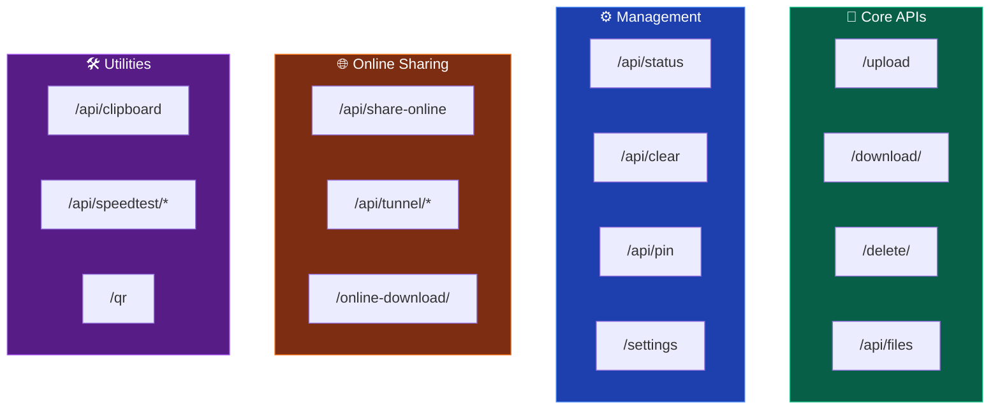

# 📡 API Reference

<div class="api-hero">
  <h2>Complete REST API Documentation</h2>
  <p>ShareJadPi exposes a powerful REST API for all file operations. Build integrations, automate workflows, or create custom clients.</p>
</div>

## 🌐 Base URL

```
http://<your-ip>:5000
```

Replace `<your-ip>` with your server's IP address or `localhost` for local development.

---

## 📋 API Overview



---

## 📤 File Upload

### `POST /upload`

Upload one or more files to the server.

<div class="endpoint-card">

**Request**
```http
POST /upload HTTP/1.1
Content-Type: multipart/form-data
```

**Form Data**
| Field | Type | Required | Description |
|-------|------|----------|-------------|
| `file` | File | ✅ | File(s) to upload. Can send multiple. |

**Example (JavaScript)**
```javascript
const formData = new FormData();
formData.append('file', fileInput.files[0]);
formData.append('file', fileInput.files[1]); // Multiple files

const response = await fetch('/upload', {
    method: 'POST',
    body: formData
});

const result = await response.json();
console.log(result);
```

**Example (cURL)**
```bash
curl -X POST http://localhost:5000/upload \
  -F "file=@/path/to/document.pdf" \
  -F "file=@/path/to/image.png"
```

**Success Response** `200 OK`
```json
{
    "success": true,
    "files": [
        {
            "name": "document.pdf",
            "size": 1048576,
            "id": "abc123"
        }
    ]
}
```

**Error Response** `400 Bad Request`
```json
{
    "error": "No file provided",
    "code": "MISSING_FILE"
}
```

</div>

---

### `POST /upload_folder`

Upload an entire folder with preserved structure.

<div class="endpoint-card">

**Request**
```http
POST /upload_folder HTTP/1.1
Content-Type: multipart/form-data
```

**Form Data**
| Field | Type | Required | Description |
|-------|------|----------|-------------|
| `files` | File[] | ✅ | Files with relative paths |
| `paths` | String[] | ✅ | Relative path for each file |

**Success Response** `200 OK`
```json
{
    "success": true,
    "uploaded": 15,
    "folder": "my-project"
}
```

</div>

---

## 📥 File Download

### `GET /download/<entry_id>`

Download a specific file.

<div class="endpoint-card">

**URL Parameters**
| Parameter | Type | Description |
|-----------|------|-------------|
| `entry_id` | String | Unique file identifier |

**Example**
```javascript
// Direct download
window.location.href = '/download/abc123';

// Fetch as blob
const response = await fetch('/download/abc123');
const blob = await response.blob();
const url = URL.createObjectURL(blob);
```

**Success Response** `200 OK`
- Returns file binary with appropriate `Content-Type` header
- `Content-Disposition: attachment; filename="example.pdf"`

**Error Response** `404 Not Found`
```json
{
    "error": "File not found",
    "code": "FILE_NOT_FOUND"
}
```

</div>

---

## 📁 File Listing

### `GET /api/files`

Get a list of all uploaded files.

<div class="endpoint-card">

**Example**
```javascript
const response = await fetch('/api/files');
const data = await response.json();
console.log(data.files);
```

**Success Response** `200 OK`
```json
{
    "files": [
        {
            "id": "abc123",
            "name": "document.pdf",
            "size": 1048576,
            "size_formatted": "1.0 MB",
            "ext": "PDF",
            "modified": "2024-01-15 10:30",
            "pinned": false
        },
        {
            "id": "def456",
            "name": "image.png",
            "size": 524288,
            "size_formatted": "512 KB",
            "ext": "PNG",
            "modified": "2024-01-15 11:00",
            "pinned": true
        }
    ],
    "total": 2,
    "total_size": 1572864,
    "total_size_formatted": "1.5 MB"
}
```

</div>

---

## 🗑️ File Deletion

### `POST /delete/<entry_id>`

Delete a specific file.

<div class="endpoint-card">

**URL Parameters**
| Parameter | Type | Description |
|-----------|------|-------------|
| `entry_id` | String | File to delete |

**Example**
```javascript
const response = await fetch('/delete/abc123', {
    method: 'POST'
});
const result = await response.json();
```

**Success Response** `200 OK`
```json
{
    "success": true,
    "deleted": "document.pdf"
}
```

</div>

---

### `POST /delete_bulk`

Delete multiple files at once.

<div class="endpoint-card">

**Request Body**
```json
{
    "ids": ["abc123", "def456", "ghi789"]
}
```

**Success Response** `200 OK`
```json
{
    "success": true,
    "deleted": 3
}
```

</div>

---

### `POST /api/clear`

Delete all files.

<div class="endpoint-card">

**⚠️ Warning:** This action is irreversible!

**Example**
```javascript
if (confirm('Delete ALL files?')) {
    await fetch('/api/clear', { method: 'POST' });
}
```

**Success Response** `200 OK`
```json
{
    "success": true,
    "deleted": 15
}
```

</div>

---

## 📌 Pin Files

### `POST /api/pin`

Pin or unpin a file (prevents accidental deletion).

<div class="endpoint-card">

**Request Body**
```json
{
    "id": "abc123",
    "pinned": true
}
```

**Success Response** `200 OK`
```json
{
    "success": true,
    "pinned": true
}
```

</div>

---

## 🗜️ ZIP Downloads

### `POST /zip_selected`

Create a ZIP archive of selected files.

<div class="endpoint-card">

**Request Body**
```json
{
    "ids": ["abc123", "def456", "ghi789"]
}
```

**Success Response** `200 OK`
```json
{
    "success": true,
    "job_id": "zip_12345",
    "status": "processing"
}
```

</div>

---

### `GET /api/zip_jobs/<job_id>`

Check ZIP job status.

<div class="endpoint-card">

**Response (Processing)**
```json
{
    "status": "processing",
    "progress": 45
}
```

**Response (Complete)**
```json
{
    "status": "complete",
    "download_url": "/download/zip_12345.zip"
}
```

</div>

---

## 🌐 Online Sharing

### `POST /api/share-online`

Create an internet-accessible share link via Cloudflare tunnel.

<div class="endpoint-card highlight">

**Request Body**
```json
{
    "file_id": "abc123"
}
```

**Success Response** `200 OK`
```json
{
    "success": true,
    "url": "https://random-words.trycloudflare.com",
    "token": "a1b2c3d4e5f6",
    "qr_code": "data:image/png;base64,iVBORw0KG...",
    "expires_at": "2024-01-15T12:00:00Z"
}
```

**Error Response** `503 Service Unavailable`
```json
{
    "error": "Cloudflare tunnel not available",
    "code": "TUNNEL_UNAVAILABLE"
}
```

</div>

---

### `POST /api/tunnel/start`

Manually start the Cloudflare tunnel.

<div class="endpoint-card">

**Request Body**
```json
{
    "port": 5000,
    "file_size": 10485760
}
```

**Success Response** `200 OK`
```json
{
    "success": true,
    "url": "https://random-words.trycloudflare.com",
    "status": "running"
}
```

</div>

---

### `GET /api/tunnel/status`

Check tunnel status.

<div class="endpoint-card">

**Response (Active)**
```json
{
    "active": true,
    "url": "https://random-words.trycloudflare.com",
    "uptime": 3600,
    "shares": 3
}
```

**Response (Inactive)**
```json
{
    "active": false,
    "url": null
}
```

</div>

---

### `POST /api/tunnel/stop`

Stop the Cloudflare tunnel.

<div class="endpoint-card">

**Success Response** `200 OK`
```json
{
    "success": true,
    "message": "Tunnel stopped"
}
```

</div>

---

### `POST /auth/enter`

Authenticate with a share token.

<div class="endpoint-card">

**Request Body**
```json
{
    "token": "a1b2c3d4e5f6"
}
```

**Success Response** `200 OK`
```json
{
    "success": true,
    "file": "document.pdf",
    "size": 1048576
}
```

**Error Response** `403 Forbidden`
```json
{
    "error": "Invalid or expired token",
    "code": "INVALID_TOKEN"
}
```

</div>

---

## 📋 Shared Clipboard

### `GET /api/clipboard`

Get current clipboard content.

<div class="endpoint-card">

**Success Response** `200 OK`
```json
{
    "content": "Hello, World!",
    "timestamp": "2024-01-15T10:30:00Z"
}
```

</div>

---

### `POST /api/clipboard`

Set clipboard content.

<div class="endpoint-card">

**Request Body**
```json
{
    "content": "Text to copy across devices"
}
```

**Success Response** `200 OK`
```json
{
    "success": true
}
```

</div>

---

### `DELETE /api/clipboard`

Clear clipboard.

<div class="endpoint-card">

**Success Response** `200 OK`
```json
{
    "success": true,
    "message": "Clipboard cleared"
}
```

</div>

---

## ⚡ Speed Test

### `GET /api/speedtest/down`

Download test data for speed testing.

<div class="endpoint-card">

**Response**
- Returns 10MB of random binary data
- Use to measure download speed

**Example**
```javascript
const startTime = Date.now();
const response = await fetch('/api/speedtest/down');
const data = await response.arrayBuffer();
const duration = (Date.now() - startTime) / 1000;
const speedMbps = (data.byteLength * 8) / duration / 1000000;
console.log(`Download: ${speedMbps.toFixed(2)} Mbps`);
```

</div>

---

### `POST /api/speedtest/up`

Upload test data for speed testing.

<div class="endpoint-card">

**Request Body**
- Binary data (any size)

**Success Response** `200 OK`
```json
{
    "received": 10485760,
    "success": true
}
```

</div>

---

## 📱 QR Code

### `GET /qr`

Get QR code for the current server URL.

<div class="endpoint-card">

**Response**
- Returns PNG image of QR code
- Encodes: `http://<server-ip>:5000`

**Usage in HTML**
```html

```

</div>

---

## ⚙️ Status & Settings

### `GET /api/status`

Get server status and statistics.

<div class="endpoint-card">

**Success Response** `200 OK`
```json
{
    "status": "running",
    "version": "4.5.4",
    "uptime": 3600,
    "files": 15,
    "total_size": "150.5 MB",
    "network": {
        "ip": "192.168.1.100",
        "port": 5000
    }
}
```

</div>

---

### `GET /settings`

Get settings page HTML.

### `GET /api/autostart`

Get autostart status.

<div class="endpoint-card">

**Success Response** `200 OK`
```json
{
    "enabled": true
}
```

</div>

---

### `POST /api/autostart`

Toggle autostart on Windows startup.

<div class="endpoint-card">

**Request Body**
```json
{
    "enabled": true
}
```

**Success Response** `200 OK`
```json
{
    "success": true,
    "enabled": true
}
```

</div>

---

## 🔍 API Flow Diagram

```mermaid
sequenceDiagram
    participant Client
    participant API
    participant Storage
    participant Cloudflare
    
    rect rgb(6, 95, 70)
        Note over Client,Storage: Upload Flow
        Client->>API: POST /upload
        API->>Storage: Save file
        Storage-->>API: File ID
        API-->>Client: { success, files }
    end
    
    rect rgb(30, 64, 175)
        Note over Client,Storage: Download Flow
        Client->>API: GET /api/files
        API->>Storage: List files
        Storage-->>API: File list
        API-->>Client: { files }
        Client->>API: GET /download/<id>
        API->>Storage: Read file
        Storage-->>API: File bytes
        API-->>Client: File stream
    end
    
    rect rgb(124, 45, 18)
        Note over Client,Cloudflare: Online Sharing
        Client->>API: POST /api/share-online
        API->>Cloudflare: Start tunnel
        Cloudflare-->>API: Public URL
        API-->>Client: { url, token, qr }
    end
```



---

## 📦 Error Codes

| Code | HTTP Status | Description |
|------|-------------|-------------|
| `MISSING_FILE` | 400 | No file in upload request |
| `FILE_NOT_FOUND` | 404 | Requested file doesn't exist |
| `FILE_TOO_LARGE` | 413 | File exceeds size limit |
| `INVALID_TOKEN` | 403 | Token expired or invalid |
| `TUNNEL_UNAVAILABLE` | 503 | Cloudflare not available |
| `SERVER_ERROR` | 500 | Internal server error |

---

## 🔧 Rate Limits

| Endpoint | Limit | Window |
|----------|-------|--------|
| `POST /upload` | 100 | 1 hour |
| `GET /download/*` | 1000 | 1 hour |
| `POST /api/share-online` | 10 | 1 hour |
| `GET /api/speedtest/*` | 20 | 1 hour |

---

<div class="api-footer">
  <p>📖 Need help? Check out the <a href="/guide/getting-started">Getting Started Guide</a> or <a href="/development/contributing">contribute</a> to the project!</p>
</div>

<style>
.api-hero {
  text-align: center;
  padding: 40px 20px;
  background: linear-gradient(135deg, rgba(34,197,94,0.1), rgba(59,130,246,0.1));
  border-radius: 16px;
  margin-bottom: 40px;
}

.api-hero h2 {
  margin: 0 0 12px 0;
  font-size: 1.8rem;
}

.api-hero p {
  color: var(--vp-c-text-2);
  font-size: 1.1rem;
  margin: 0;
}

.endpoint-card {
  background: var(--vp-c-bg-soft);
  border: 1px solid var(--vp-c-divider);
  border-left: 4px solid var(--vp-c-brand);
  border-radius: 0 12px 12px 0;
  padding: 20px;
  margin: 16px 0;
}

.endpoint-card.highlight {
  border-left-color: #f97316;
  background: linear-gradient(135deg, var(--vp-c-bg-soft), rgba(249,115,22,0.05));
}

.api-footer {
  text-align: center;
  padding: 40px;
  background: var(--vp-c-bg-soft);
  border-radius: 12px;
  margin-top: 40px;
}
</style>
