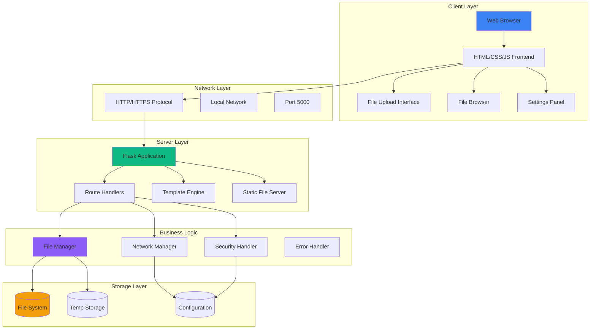
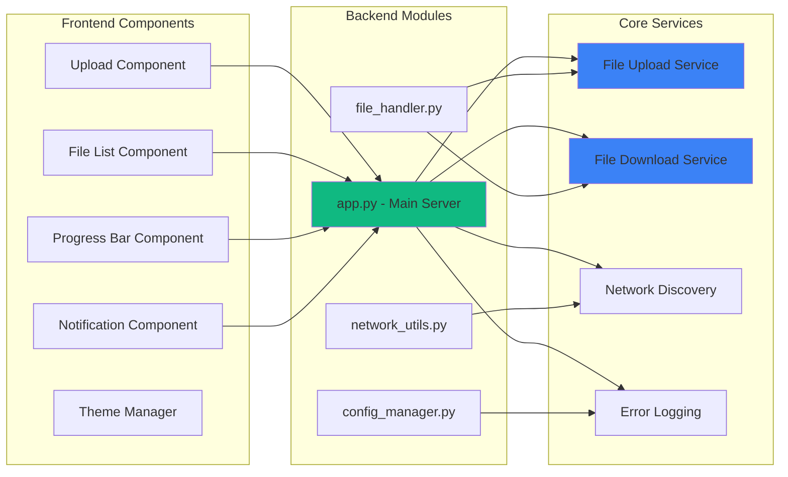
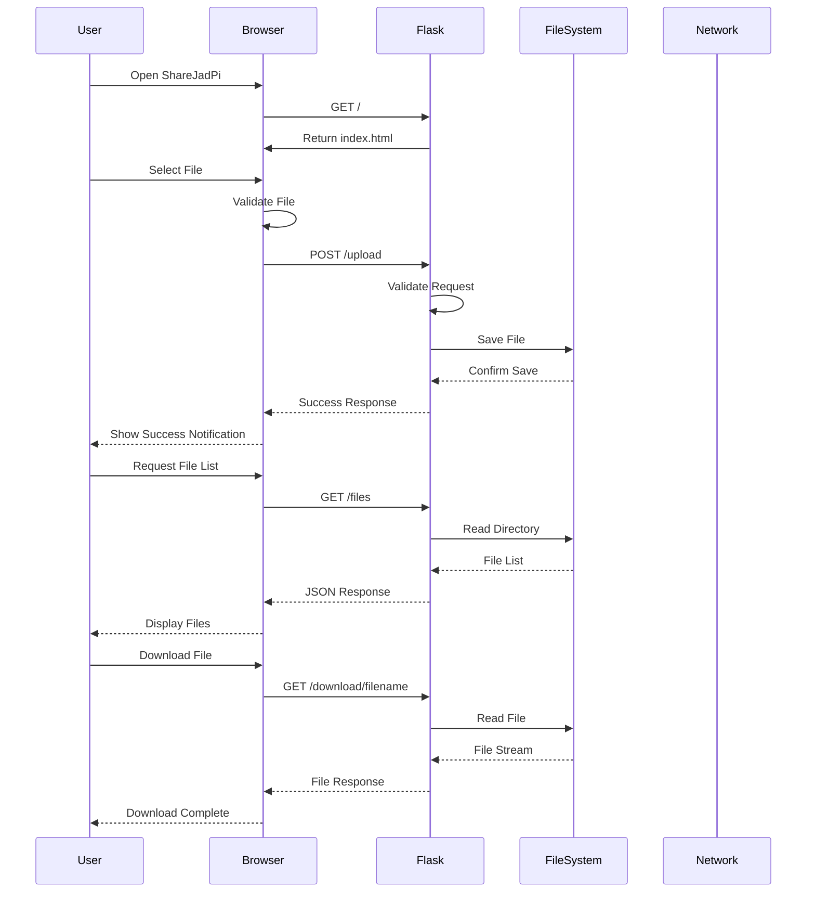
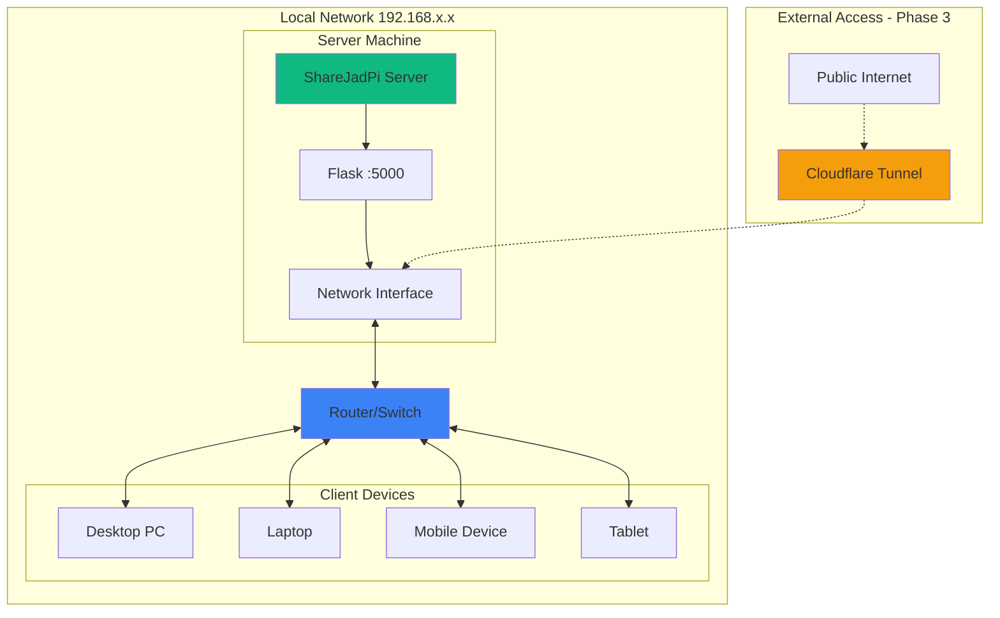
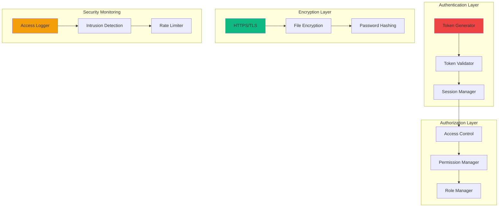
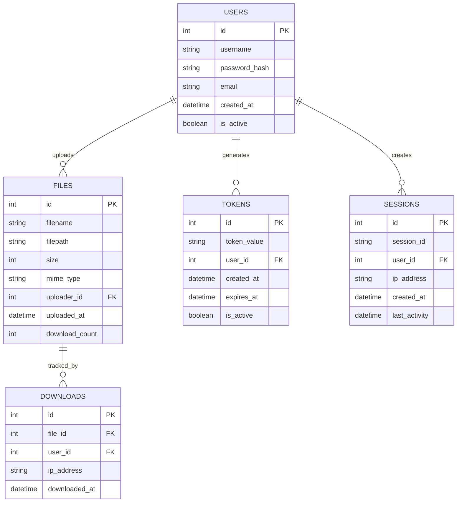
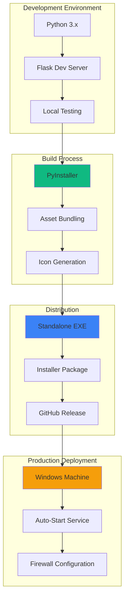
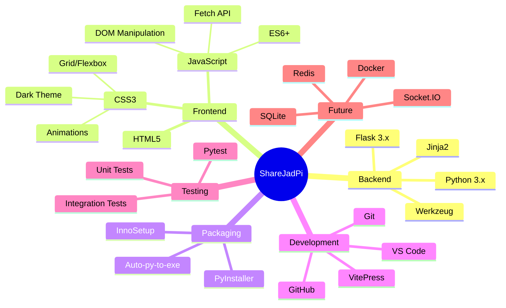
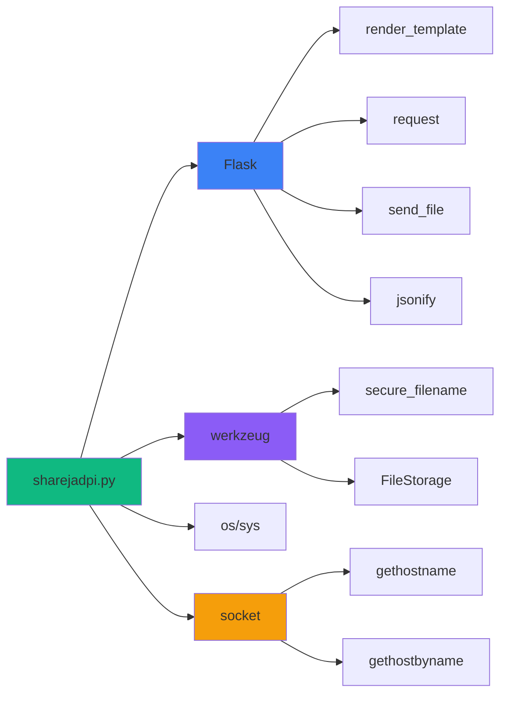

# System Architecture

## Overview

ShareJadPi follows a modern client-server architecture with Flask backend and responsive web frontend.

## Component Architecture

## Data Flow Architecture

## Network Architecture

## Security Architecture (Phase 3)

## Database Schema (Phase 3)

## Deployment Architecture

## Technology Stack

## Module Dependency Graph

## Performance Optimization Strategy

```mermaid
graph TB
    subgraph "Frontend Optimization"
        A1[Code Minification]
        A2[Image Optimization]
        A3[Lazy Loading]
        A4[Browser Caching]
    end
    
    subgraph "Backend Optimization"
        B1[File Streaming]
        B2[Memory Management]
        B3[Connection Pooling]
        B4[Response Compression]
    end
    
    subgraph "Network Optimization"
        C1[HTTP/2 Support]
        C2[Keep-Alive]
        C3[CDN Integration]
        C4[Load Balancing]
    end
    
    subgraph "Database Optimization"
        D1[Query Optimization]
        D2[Indexing]
        D3[Caching Layer]
        D4[Connection Pooling]
    end
    
    A1 --> E[Faster Page Load]
    A2 --> E
    B1 --> F[Reduced Memory Usage]
    B2 --> F
    C1 --> G[Lower Latency]
    C2 --> G
    D1 --> H[Faster Queries]
    D2 --> H
    
    style E fill:#10b981
    style F fill:#3b82f6
    style G fill:#8b5cf6
    style H fill:#f59e0b
```

::: tip Interactive Diagrams
All diagrams above are rendered with Mermaid and support interactive features when viewed in the documentation.
:::
