# 🏗️ Architecture & Design

*Page 8 of 16: Understanding ShareJadPi → How It Works*

[← Previous: Managing Files](/guide/managing-files) | [Next: Features →](/features)

---

<div class="arch-hero">
  <h2>Under the Hood</h2>
  <p>A complete technical deep-dive into ShareJadPi Dev's architecture, design patterns, and implementation</p>
</div>

## 🎯 Architecture Overview

ShareJadPi Dev follows a **simple monolithic architecture** - everything runs in one Python process for maximum simplicity and ease of development.

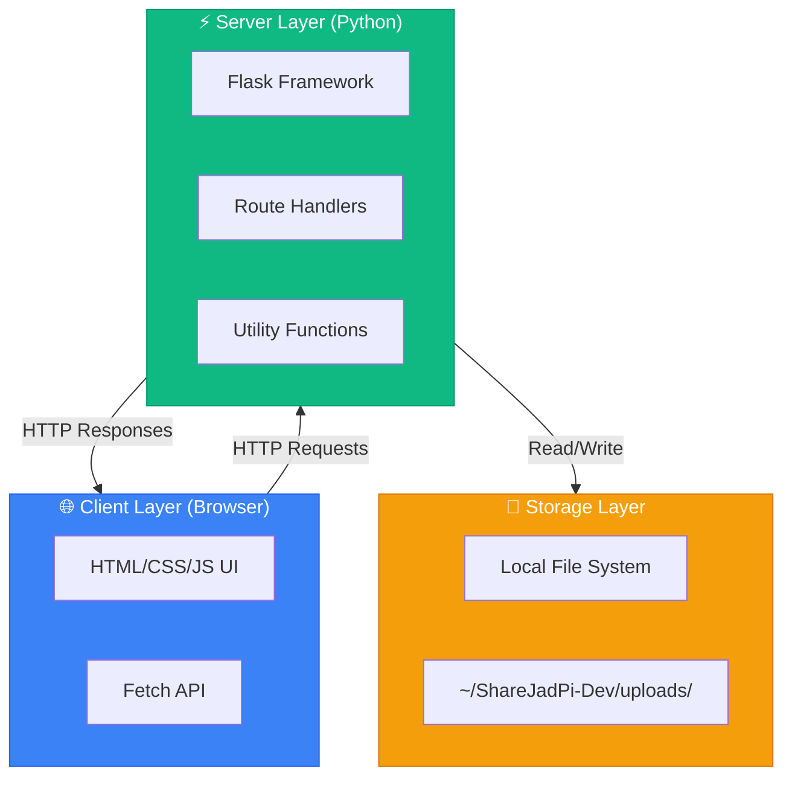

### Why Monolithic?

<div class="why-section">

**Advantages for Development:**
- ✅ **Simple** - One file, one process, easy to understand
- ✅ **Fast Development** - No microservices complexity
- ✅ **Easy Debugging** - All code in one place
- ✅ **Portable** - Just copy the file
- ✅ **Low Resources** - Minimal memory/CPU usage

**Trade-offs:**
- ⚠️ **Scalability** - Can't scale horizontally easily
- ⚠️ **Single Point of Failure** - If process crashes, everything stops
- ⚠️ **Restart Required** - Code changes need full restart

*These are acceptable for a development/local network tool!*

</div>

---

## 📁 Code Structure

### File Organization (813 Lines)

```
sharejadpi-dev.py
├── 📦 Imports (lines 1-32)
│   ├── Standard library (os, sys, socket, etc.)
│   ├── Flask framework
│   └── Werkzeug utilities
│
├── ⚙️ Configuration (lines 34-52)
│   ├── APP_VERSION
│   ├── UPLOAD_FOLDER path
│   ├── MAX_CONTENT_LENGTH
│   └── Flask app initialization
│
├── 🛠️ Utility Functions (lines 54-102)
│   ├── get_local_ip() - Network detection
│   ├── format_size() - File size formatting
│   ├── get_file_extension() - Extension parsing
│   └── get_file_list() - Directory scanning
│
├── 🌐 Route Handlers (lines 104-770)
│   ├── GET  / - Web interface
│   ├── POST /upload - File upload
│   ├── GET  /files - List files
│   ├── GET  /download/<file> - Download
│   ├── DELETE /delete/<file> - Delete
│   └── GET  /api/status - Server status
│
├── 🎨 HTML Template (lines 105-702)
│   ├── Inline HTML (no separate template files)
│   ├── Modern dark theme CSS
│   ├── Drag-and-drop JavaScript
│   └── Progress bars and animations
│
└── 🚀 Main Entry Point (lines 772-813)
    ├── Argument parsing
    ├── Network display
    ├── Browser auto-launch
    └── Flask server start
```

---

## 🔄 Request-Response Flow

### Complete Request Lifecycle

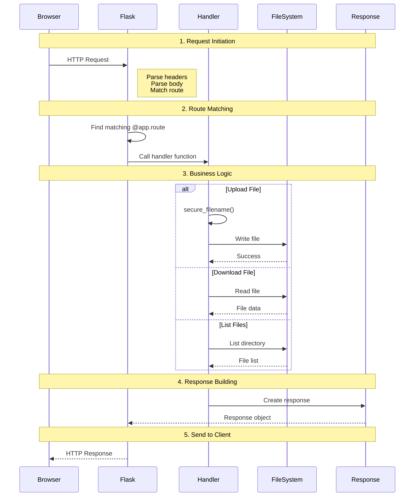

### HTTP Methods Used

| Method | Routes | Purpose |
|--------|--------|---------|
| **GET** | `/`, `/files`, `/download/<file>`, `/api/status` | Read operations |
| **POST** | `/upload` | Create operations |
| **DELETE** | `/delete/<file>` | Delete operations |

---

## 🎨 Design Patterns

### 1. **MVC Pattern** (Modified)

ShareJadPi uses a **simplified MVC** pattern:

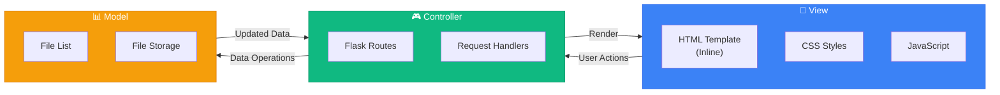

**Implementation:**

- **View**: HTML template with CSS/JS (lines 105-702)
- **Controller**: Flask route handlers (lines 704-770)
- **Model**: File system operations via utility functions (lines 54-102)

### 2. **RESTful API Design**

All endpoints follow REST principles:

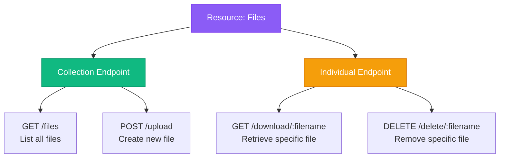

### 3. **Decorator Pattern**

Flask uses decorators for routing:

```python
@app.route('/upload', methods=['POST'])
def upload_file():
    # Handler logic
    pass
```

**Why decorators?**
- Clean syntax
- Separates routing from logic
- Easy to add middleware
- Standard Flask pattern

### 4. **Singleton Pattern**

Flask app is a singleton - only one instance:

```python
app = Flask(__name__)  # Single app instance
```

---

## 🔀 Data Flow Diagrams

### Upload Workflow

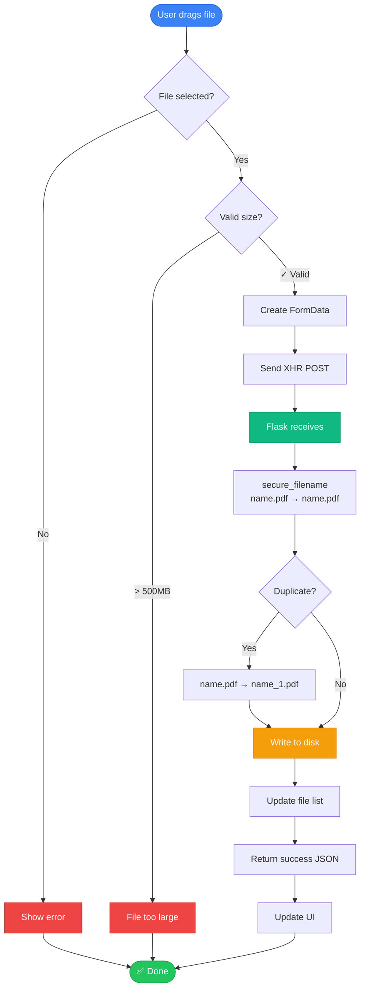

### Download Workflow

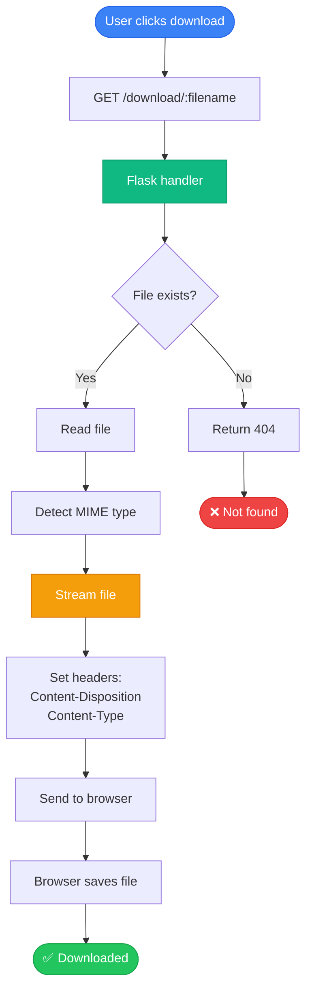

### Delete Workflow

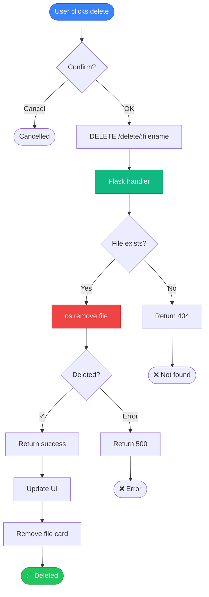

---

## 🧩 Component Breakdown

### 1. Flask Application

```python
# Initialization
app = Flask(__name__)
app.config['MAX_CONTENT_LENGTH'] = 500 * 1024 * 1024
app.config['SECRET_KEY'] = 'dev-secret-key'

# What Flask provides:
# ✅ HTTP server
# ✅ Request parsing
# ✅ Response building
# ✅ Routing
# ✅ Error handling
# ✅ JSON serialization
```

### 2. File Manager (Utility Functions)

```python
def get_file_list():
    """Scans uploads folder and returns metadata"""
    files = []
    for filename in os.listdir(UPLOAD_FOLDER):
        stat = os.stat(filepath)
        files.append({
            'name': filename,
            'size': stat.st_size,
            'modified': datetime.fromtimestamp(stat.st_mtime)
        })
    return files

# Responsibilities:
# ✅ Directory scanning
# ✅ Metadata extraction
# ✅ Size formatting
# ✅ Extension detection
```

### 3. Network Manager

```python
def get_local_ip():
    """Detects local IP using socket"""
    s = socket.socket(socket.AF_INET, socket.SOCK_DGRAM)
    s.connect(("8.8.8.8", 80))
    ip = s.getsockname()[0]
    return ip

# How it works:
# 1. Create UDP socket
# 2. Connect to public DNS (no data sent)
# 3. Read local endpoint IP
# 4. This is the IP others use to connect
```

### 4. Web Interface (Embedded HTML)

```python
@app.route('/')
def index():
    return '''
    <!DOCTYPE html>
    <html>
        <!-- 600 lines of HTML/CSS/JS -->
    </html>
    '''

# Why embedded?
# ✅ Single-file deployment
# ✅ No template engine overhead
# ✅ Easy to distribute
# ✅ No external dependencies
```

---

## 🔐 Security Architecture

### Current Security Model

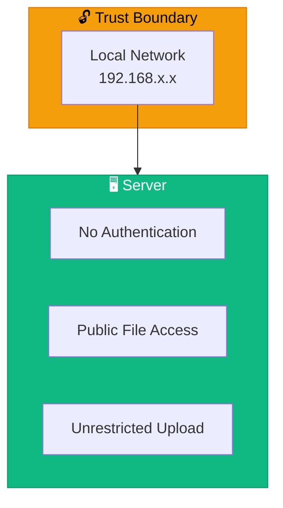

**Current Approach:**
- 🟡 **Trust-based** - Anyone on local network has full access
- 🟡 **No encryption** - HTTP (not HTTPS)
- 🟡 **No authentication** - No passwords or tokens
- 🟡 **File validation** - Size limits only

**Why this is OK for dev:**
- Used on trusted local networks
- Development/testing environment
- Simplicity > Security for this use case

**Production improvements (Phase 3):**
- ✅ Token authentication
- ✅ HTTPS encryption
- ✅ Rate limiting
- ✅ IP whitelisting

### Security Features Implemented

<div class="security-features">

**1. Filename Sanitization**
```python
from werkzeug.utils import secure_filename
safe_name = secure_filename(user_filename)
# "../../../etc/passwd" → "etc_passwd"
# "file<script>.js" → "filescript.js"
```

**2. File Size Limits**
```python
app.config['MAX_CONTENT_LENGTH'] = 500 * 1024 * 1024
# Uploads > 500MB automatically rejected
# Prevents disk space exhaustion
```

**3. Path Validation**
```python
# All files must be in UPLOAD_FOLDER
filepath = os.path.join(UPLOAD_FOLDER, safe_name)
# Prevents directory traversal attacks
```

</div>

---

## 🌐 Network Architecture

### Local Network Topology

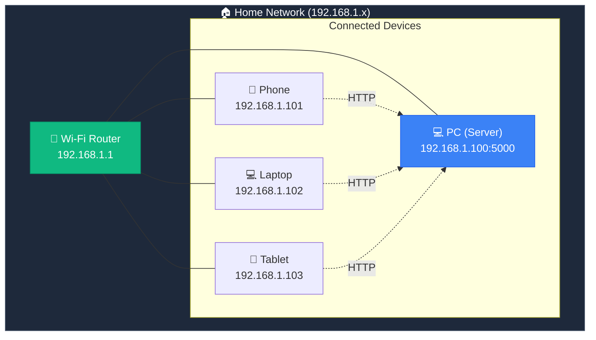

### How Devices Connect

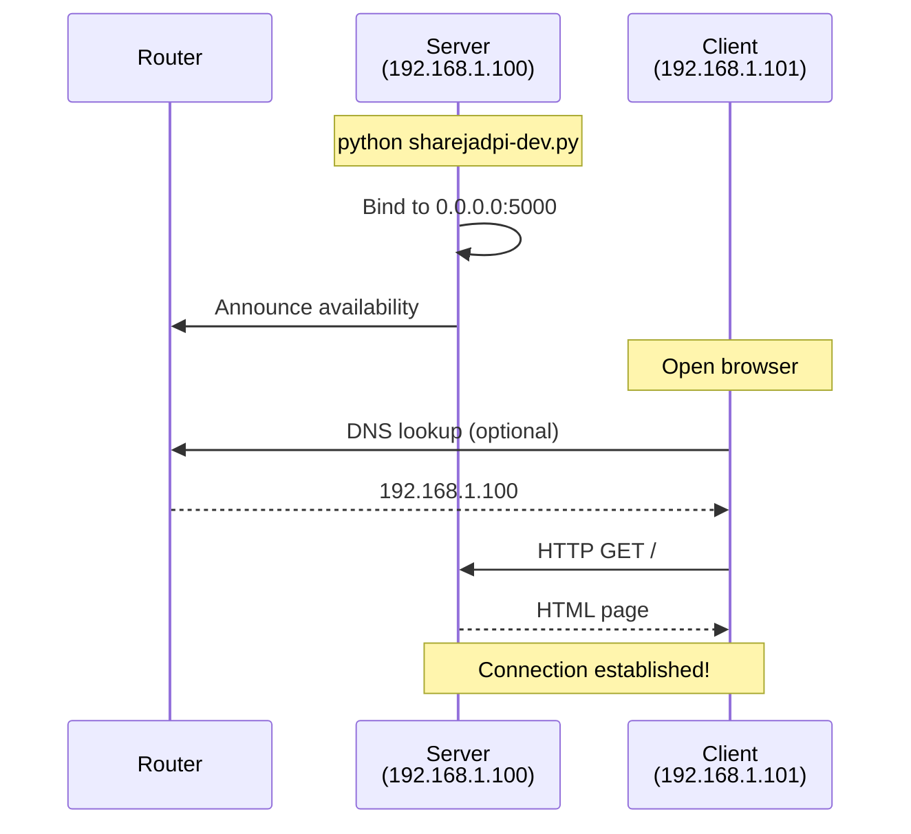

### Port Binding

```python
# 0.0.0.0 = Listen on ALL network interfaces
app.run(host='0.0.0.0', port=5000)

# Why 0.0.0.0?
# ✅ localhost (127.0.0.1) accessible
# ✅ LAN IP (192.168.1.100) accessible
# ✅ All other IPs on machine accessible
```

---

## 💾 Storage Architecture

### File System Layout

```
~/ShareJadPi-Dev/
└── uploads/
    ├── document.pdf (1.2 MB)
    ├── photo.jpg (850 KB)
    ├── video.mp4 (45 MB)
    ├── presentation.pptx (3.4 MB)
    └── archive.zip (12 MB)
```

### Storage Operations

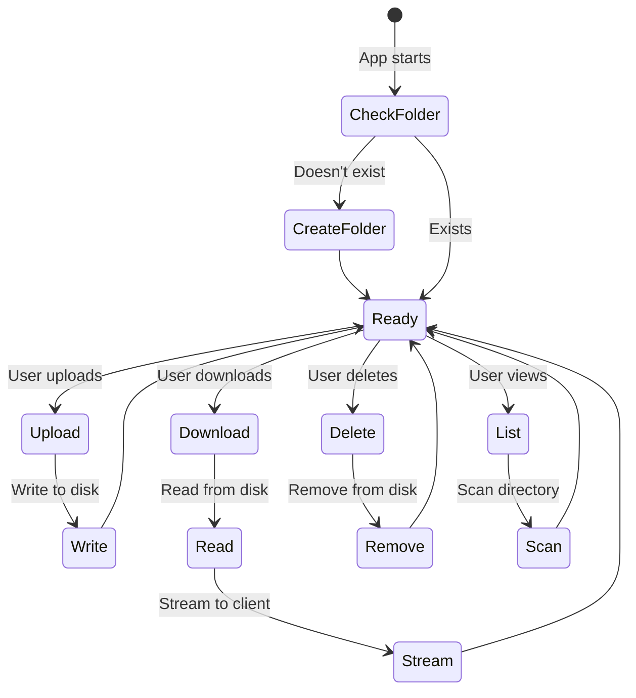

### File Metadata

```python
file_info = {
    'name': 'document.pdf',              # Original filename
    'size': 1234567,                     # Bytes
    'size_formatted': '1.2 MB',          # Human-readable
    'ext': 'PDF',                        # Extension (uppercase)
    'modified': '2024-01-31 10:30',      # Last modified
    'path': '/full/path/to/file'         # Absolute path
}
```

---

## ⚡ Performance & Optimization

### Performance Characteristics

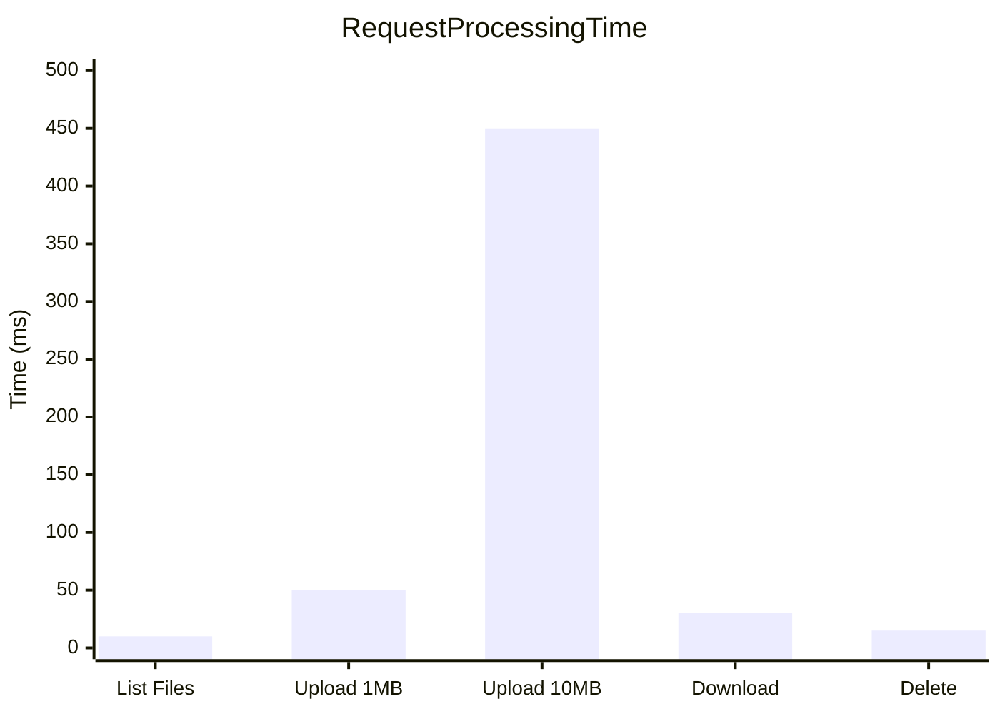

### Optimization Techniques

<div class="optimization-grid">

**1. File Streaming**
```python
# Don't load entire file into memory
return send_file(filepath, as_attachment=True)
# Flask streams in chunks automatically
```

**2. In-Memory Caching**
```python
# File list cached temporarily (future improvement)
# Current: Scans directory every time
# Better: Cache + invalidate on changes
```

**3. Minimal Dependencies**
```
flask==3.1.2       (HTTP framework)
werkzeug==3.1.3    (Utilities)
Total size: ~2 MB
```

**4. Single-Threaded (Default)**
```python
# Flask dev server uses one thread per request
# Good enough for local network use
# Production: Use gunicorn/waitress for threading
```

</div>

### Bottlenecks

| Operation | Bottleneck | Solution |
|-----------|------------|----------|
| **Large uploads** | Disk write speed | Use SSD, compress files |
| **Many files** | Directory listing | Add pagination (future) |
| **Concurrent uploads** | Single-threaded | Use production WSGI server |
| **Large downloads** | Network bandwidth | Upgrade to Gigabit LAN |

---

## 🔧 Technology Stack Deep-Dive

### Core Dependencies

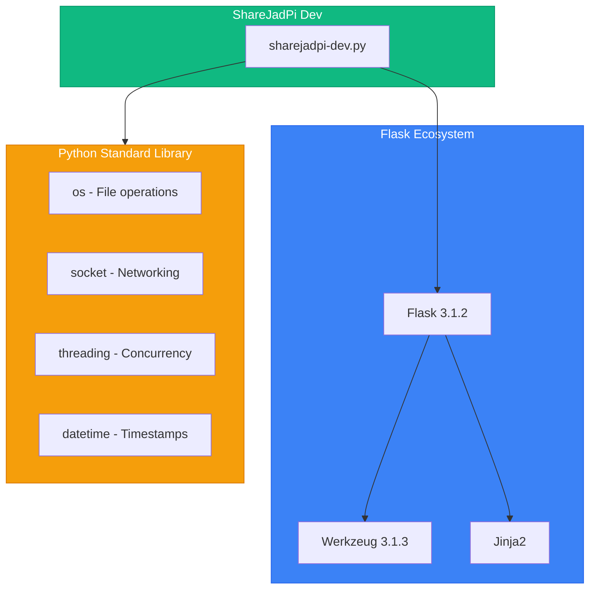

### Why Flask?

<div class="why-flask">

**Pros:**
- ✅ Lightweight - minimal overhead
- ✅ Easy to learn - simple API
- ✅ Flexible - no forced structure
- ✅ Great docs - excellent documentation
- ✅ WSGI standard - production-ready

**Cons:**
- ⚠️ Not async - blocking I/O
- ⚠️ Manual setup - no batteries included
- ⚠️ Single-threaded dev server

**Alternatives considered:**
- FastAPI - Too complex for simple needs
- Django - Way too heavyweight
- Bottle - Similar, but Flask more popular

</div>

---

## 🎓 Design Decisions

### Key Architectural Choices

<div class="decision-log">

**Decision 1: Monolithic vs Microservices**
- ✅ **Chose:** Monolithic
- **Why:** Simplicity, single-file deployment, local network use
- **Trade-off:** Limited scalability (acceptable)

**Decision 2: Embedded HTML vs Templates**
- ✅ **Chose:** Embedded HTML
- **Why:** Single-file distribution, no template engine
- **Trade-off:** Harder to maintain (but only 600 lines)

**Decision 3: No Database**
- ✅ **Chose:** File system only
- **Why:** Simple, no setup, direct access
- **Trade-off:** No advanced queries (not needed)

**Decision 4: HTTP vs HTTPS**
- ✅ **Chose:** HTTP
- **Why:** Local network, development use, certificate complexity
- **Trade-off:** No encryption (Phase 3 will add HTTPS)

**Decision 5: No Authentication**
- ✅ **Chose:** Open access
- **Why:** Trusted local network, simplicity
- **Trade-off:** Anyone on network can access (Phase 3 will add auth)

</div>

---

## 🚀 Future Architecture (Roadmap)

### Phase 3: Security Layer

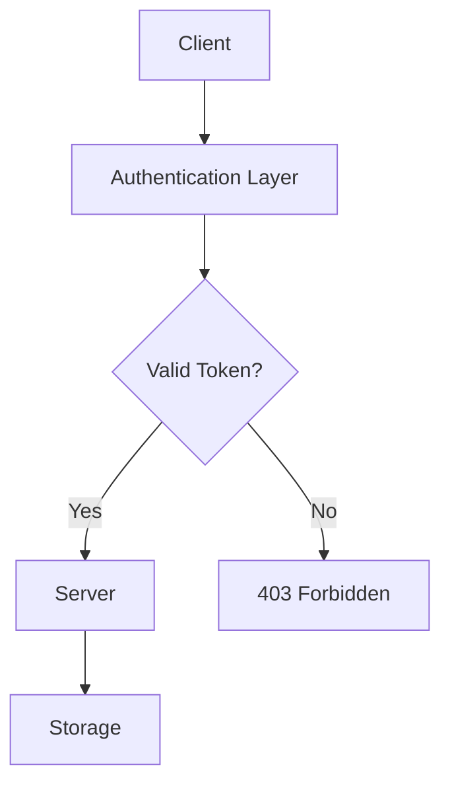

### Phase 4: Caching Layer

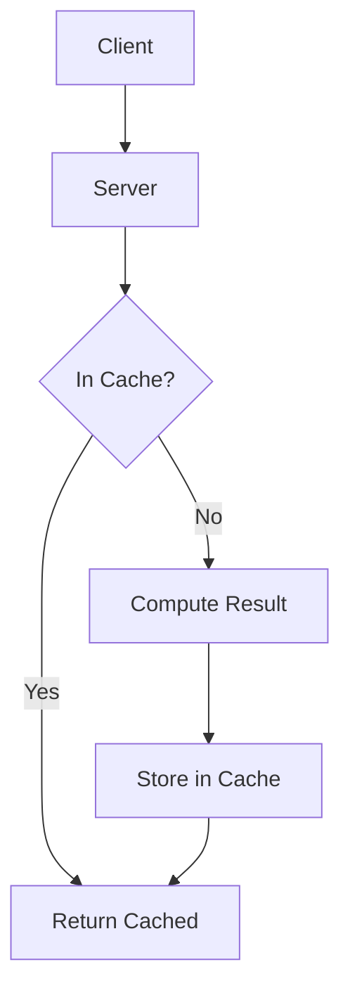

### Phase 5: Microservices (Maybe)

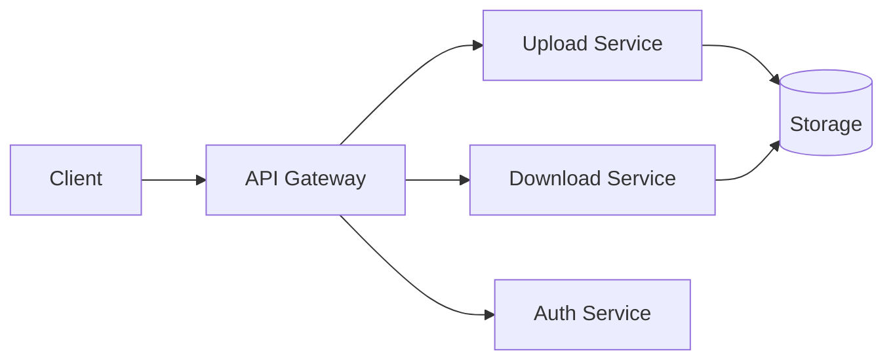

---

## 📚 Related Documentation

<div class="related-docs">

**For Users:**
- [Installation Guide](/guide/installation) - Get started
- [Uploading Tutorial](/guide/uploading) - Learn uploads
- [API Reference](/api) - HTTP endpoints

**For Developers:**
- [Development Server](/development/dev-server) - Dev setup
- [Contributing](/development/contributing) - Contribute code
- [Configuration](/guide/configuration) - Customize settings

</div>

---

[Continue to Features Breakdown →](/features){.cta-button}

---

<style>
.arch-hero {
  text-align: center;
  padding: 3rem 2rem;
  background: linear-gradient(135deg, rgba(59, 130, 246, 0.1), rgba(37, 99, 235, 0.05));
  border-radius: 16px;
  margin-bottom: 3rem;
}

.arch-hero h2 {
  font-size: 2.5rem;
  background: linear-gradient(135deg, #3b82f6, #2563eb);
  -webkit-background-clip: text;
  -webkit-text-fill-color: transparent;
  margin-bottom: 1rem;
}

.why-section {
  background: rgba(16, 185, 129, 0.1);
  border-left: 4px solid #10b981;
  padding: 2rem;
  border-radius: 8px;
  margin: 2rem 0;
}

.security-features {
  background: rgba(239, 68, 68, 0.1);
  border: 1px solid rgba(239, 68, 68, 0.3);
  border-radius: 12px;
  padding: 2rem;
  margin: 2rem 0;
}

.optimization-grid {
  display: grid;
  gap: 1.5rem;
  margin: 2rem 0;
}

.why-flask {
  background: rgba(59, 130, 246, 0.1);
  border: 1px solid rgba(59, 130, 246, 0.3);
  border-radius: 12px;
  padding: 2rem;
  margin: 2rem 0;
}

.decision-log {
  background: rgba(139, 92, 246, 0.1);
  border: 1px solid rgba(139, 92, 246, 0.3);
  border-radius: 12px;
  padding: 2rem;
  margin: 2rem 0;
}

.related-docs {
  background: rgba(245, 158, 11, 0.1);
  border: 1px solid rgba(245, 158, 11, 0.3);
  border-radius: 12px;
  padding: 2rem;
  margin: 2rem 0;
}

.cta-button {
  display: inline-block;
  padding: 1rem 2rem;
  background: linear-gradient(135deg, #10b981, #059669);
  color: white !important;
  text-decoration: none;
  border-radius: 8px;
  font-weight: 600;
  margin-top: 1rem;
  transition: all 0.3s ease;
}

.cta-button:hover {
  transform: translateY(-2px);
  box-shadow: 0 8px 24px rgba(16, 185, 129, 0.3);
}
</style>
