# 🏗️ System Architecture

<div class="arch-hero">
  <h2>Under the Hood of ShareJadPi</h2>
  <p>A deep dive into the technical architecture, design patterns, and system components that power ShareJadPi.</p>
</div>

## 🎯 Architecture Overview

ShareJadPi follows a **monolithic architecture** optimized for simplicity and performance. A single Python application handles everything from HTTP routing to file management.

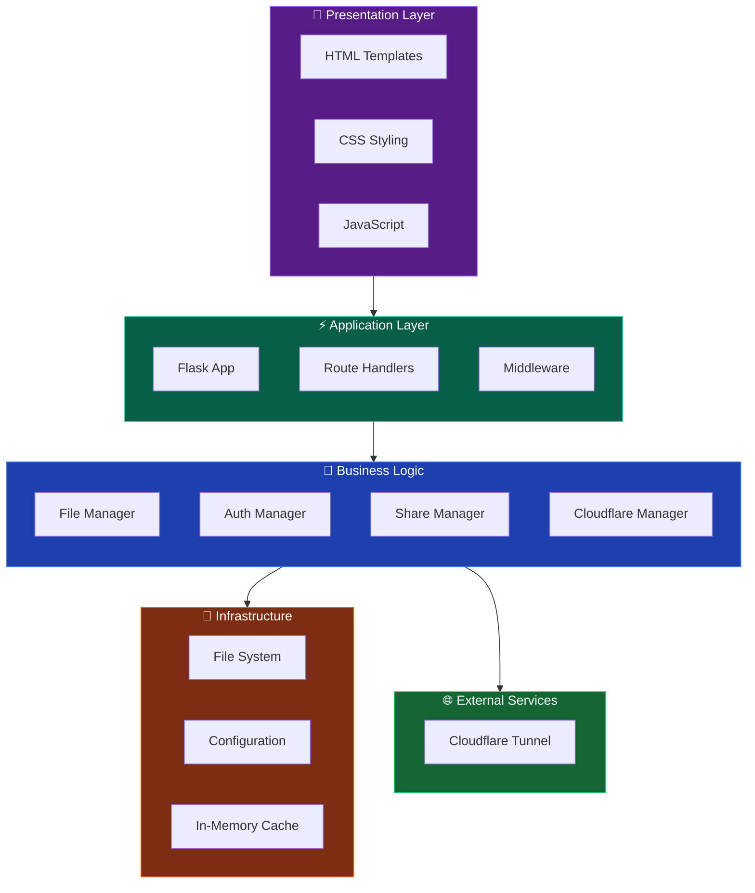

---

## 📁 Project Structure

```
sharejadpi/
├── 📄 sharejadpi.py          # Main application (3000+ lines)
├── 📄 requirements.txt       # Python dependencies
├── 📁 templates/             # HTML templates
│   └── index.html           # Main UI template
├── 📁 static/                # Static assets
│   ├── css/
│   ├── js/
│   └── images/
├── 📁 SGP_phase1/            # Development tools
│   ├── sharejadpi-dev.py    # Dev server
│   └── docs/                # This documentation
├── 📁 build_tools/           # Build configurations
│   ├── *.spec               # PyInstaller specs
│   └── *.iss                # Installer scripts
└── 📁 scripts/               # Utility scripts
    ├── fix_firewall.ps1
    └── show_connection_info.ps1
```

---

## 🔄 Request Flow

How a request travels through ShareJadPi:

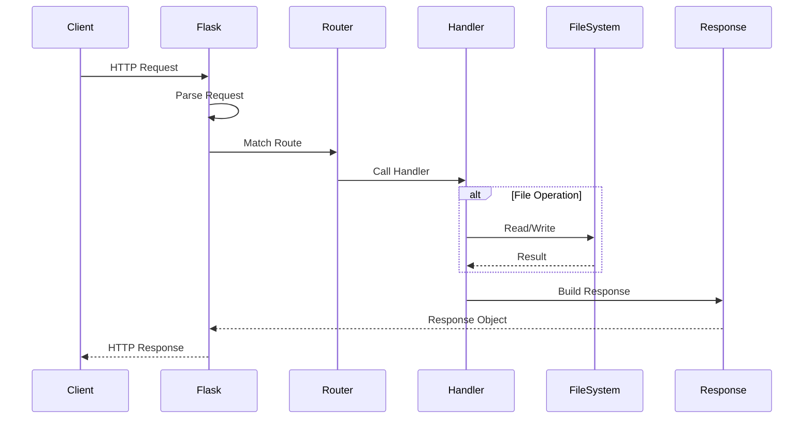

---

## 🧩 Core Components

### 1. Flask Application

The heart of ShareJadPi - a Flask application that handles all HTTP requests.

```python
# Application setup
app = Flask(__name__)
app.config['MAX_CONTENT_LENGTH'] = 500 * 1024 * 1024  # 500MB
app.config['SECRET_KEY'] = secrets.token_hex(32)
```

**Key Features:**
- Multi-threaded request handling
- Automatic content negotiation
- Built-in development server
- Extension ecosystem

---

### 2. File Manager

Handles all file operations with safety and performance optimizations.

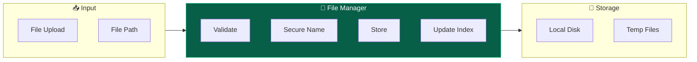

**Responsibilities:**
- Secure filename handling
- Duplicate file naming
- File type detection
- Size validation
- Directory management

---

### 3. Cloudflare Manager

Manages Cloudflare tunnel connections for internet sharing.

```python
class CloudflareManager:
    def __init__(self):
        self.process = None
        self.url = None
        self.active = False
        
    def start_tunnel(self, port=5000, file_size=0):
        """Start Cloudflare tunnel with dynamic timeout"""
        timeout = self.calculate_timeout(file_size)
        # Launch cloudflared process
        # Parse URL from output
        # Monitor for idle
        
    def stop_tunnel(self):
        """Stop the tunnel and cleanup"""
```

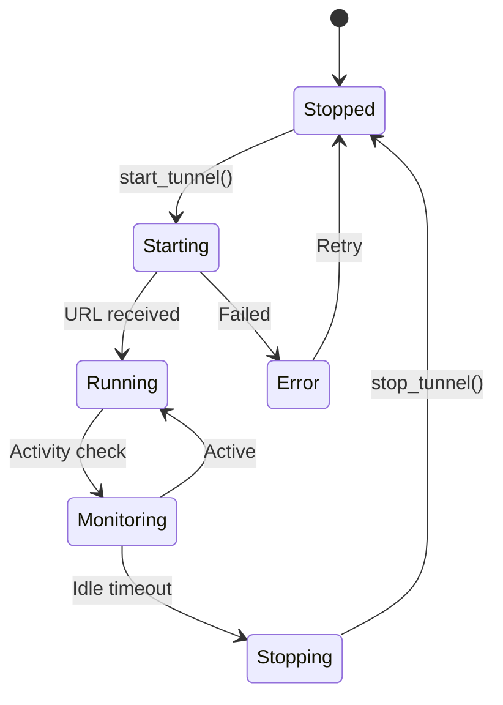

---

### 4. Online Share Manager

Manages share tokens and access control for public links.

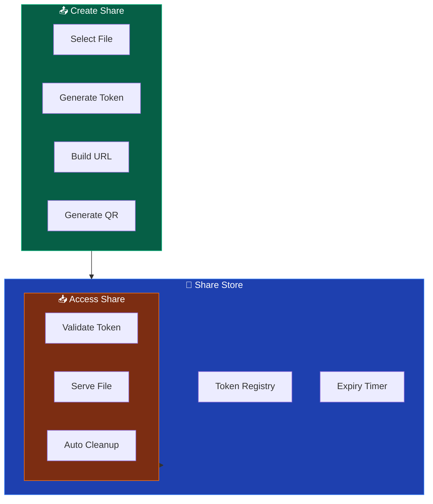

---

## 🔐 Security Architecture

### Authentication Flow

```mermaid
sequenceDiagram
    participant User
    participant Server
    participant TokenStore
    
    rect rgb(6, 95, 70)
        Note over User,TokenStore: Token Generation
        User->>Server: Request Share
        Server->>Server: Generate Token
        Server->>TokenStore: Store Token + Metadata
        Server-->>User: Token + URL
    end
    
    rect rgb(30, 64, 175)
        Note over User,TokenStore: Token Validation
        User->>Server: Access with Token
        Server->>TokenStore: Validate Token
        TokenStore-->>Server: Valid/Invalid
        alt Valid
            Server-->>User: Serve Content
        else Invalid
            Server-->>User: 403 Forbidden
        end
    end
    
    rect rgb(124, 45, 18)
        Note over User,TokenStore: Cleanup
        Server->>TokenStore: Check Expiry
        TokenStore-->>Server: Expired Tokens
        Server->>Server: Cleanup Resources
    end
```

### Security Measures

| Layer | Protection |
|-------|------------|
| **Network** | Local network by default |
| **Authentication** | Token-based access |
| **Files** | Secure filename sanitization |
| **Upload** | Size limits, type validation |
| **Tunnel** | Cloudflare encryption |

---

## 🌐 Network Architecture

### Local Network Mode

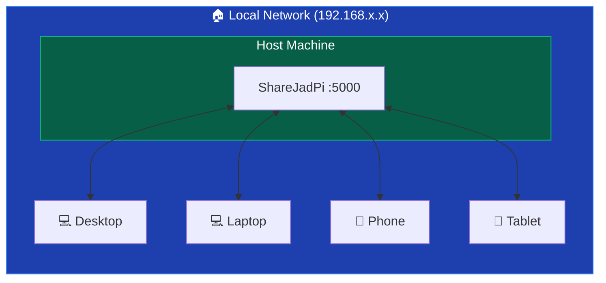

### Internet Sharing Mode

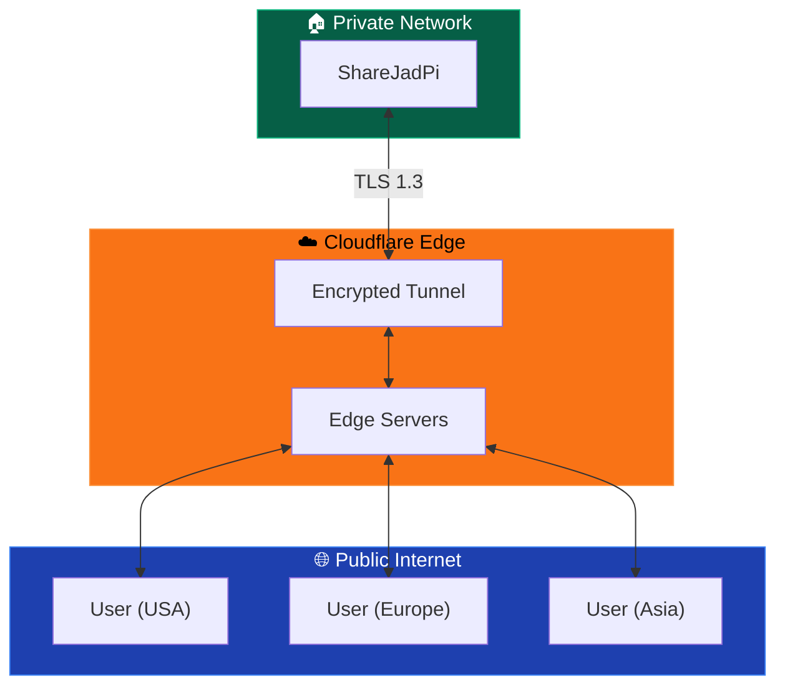

---

## 💾 Data Flow

### Upload Flow

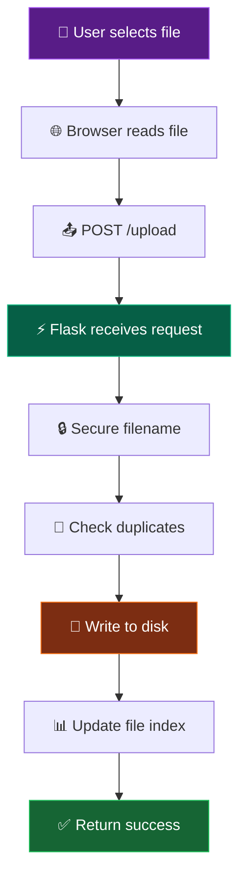

### Download Flow

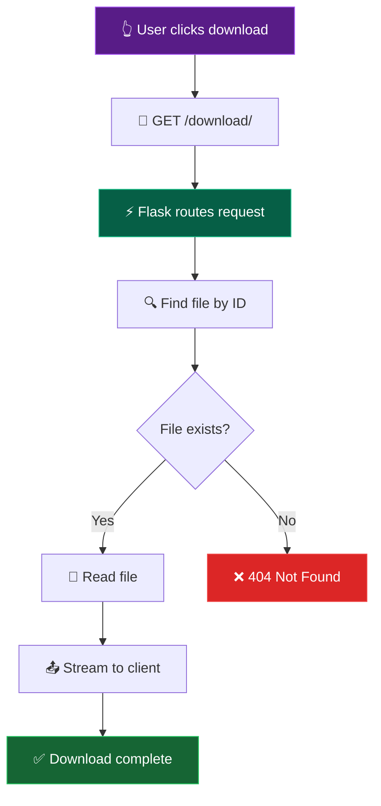

---

## ⚙️ Configuration

### Application Config

```python
# Core settings
UPLOAD_FOLDER = os.path.join(os.path.expanduser('~'), 'ShareJadPi', 'uploads')
MAX_CONTENT_LENGTH = 500 * 1024 * 1024  # 500MB
SECRET_KEY = secrets.token_hex(32)

# Server settings
HOST = '0.0.0.0'  # Listen on all interfaces
PORT = 5000
DEBUG = False
THREADED = True

# Cloudflare settings
TUNNEL_IDLE_TIMEOUT = 300  # 5 minutes
TUNNEL_MAX_RUNTIME = 3600  # 1 hour
```

---

## 🔄 State Management

ShareJadPi uses in-memory state for performance:

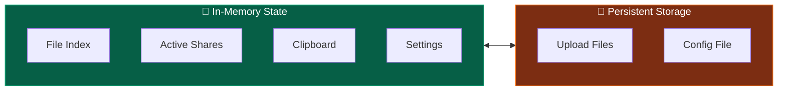

---

## 📊 Performance Considerations

### Optimizations

| Area | Optimization |
|------|-------------|
| **File I/O** | Streaming for large files |
| **Memory** | Chunked uploads |
| **Network** | Keep-alive connections |
| **UI** | Lazy loading, virtual scrolling |
| **Cache** | In-memory file index |

### Benchmarks

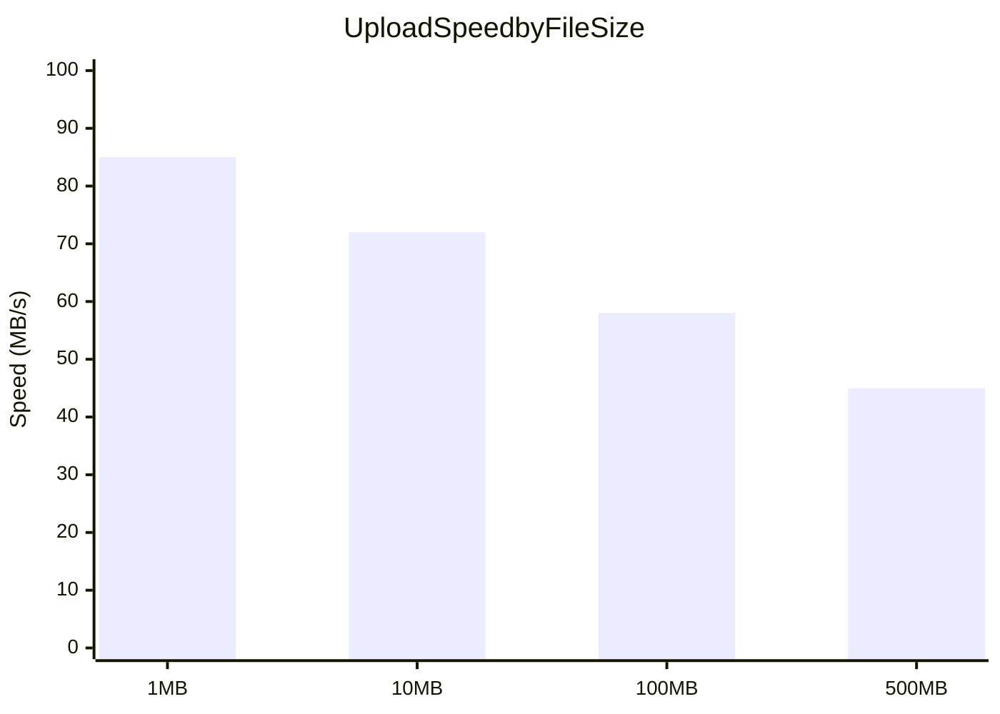

---

## 🔧 Technology Stack

| Component | Technology | Purpose |
|-----------|------------|---------|
| **Backend** | Python 3.8+ | Core language |
| **Framework** | Flask 3.x | HTTP routing |
| **File Handling** | Werkzeug | Secure uploads |
| **QR Codes** | qrcode + Pillow | QR generation |
| **Tunneling** | cloudflared | Internet access |
| **Build** | PyInstaller | Executable creation |
| **Installer** | Inno Setup | Windows installer |

---

## 🚀 Deployment Options

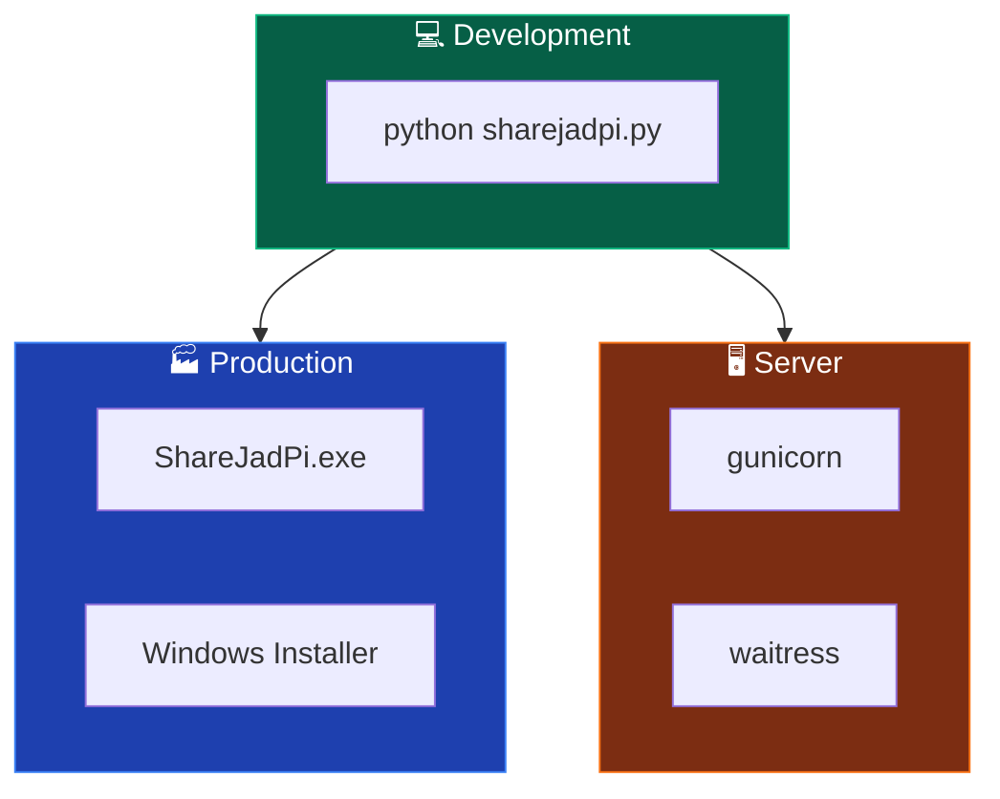

<style>
.arch-hero {
  text-align: center;
  padding: 40px 20px;
  background: linear-gradient(135deg, rgba(34,197,94,0.1), rgba(59,130,246,0.1));
  border-radius: 16px;
  margin-bottom: 40px;
}

.arch-hero h2 {
  margin: 0 0 12px 0;
}

.arch-hero p {
  color: var(--vp-c-text-2);
  margin: 0;
}
</style>
