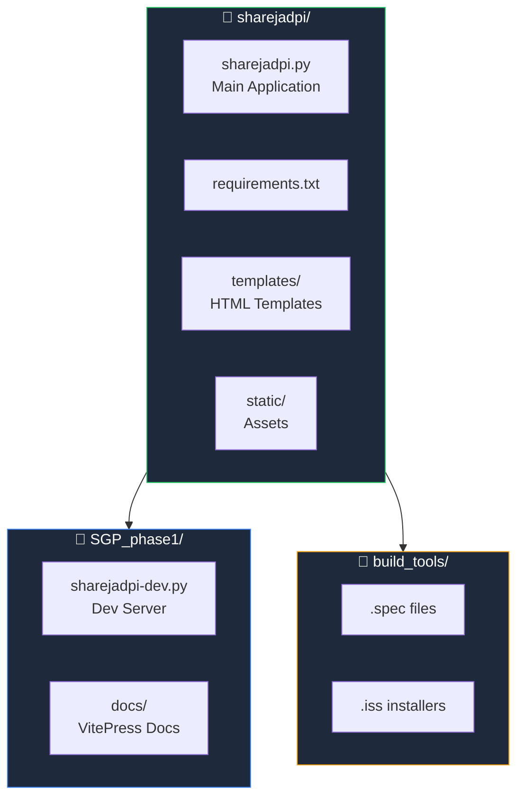

# Contributing to ShareJadPi

Thank you for your interest in contributing to ShareJadPi! This guide will help you get started.

## Getting Started

### Fork & Clone

```bash
# Fork on GitHub, then clone your fork
git clone https://github.com/YOUR_USERNAME/sharejadpi.git
cd sharejadpi
```

### Set Up Development Environment

```bash
# Create virtual environment
python -m venv .venv

# Activate it
# Windows:
.venv\Scripts\activate
# macOS/Linux:
source .venv/bin/activate

# Install dependencies
pip install -r requirements.txt
```

### Run Development Server

```bash
cd SGP_phase1
python sharejadpi-dev.py
```

## Project Structure



## Making Changes

### 1. Create a Branch

```bash
git checkout -b feature/your-feature-name
```

### 2. Make Your Changes

- Follow the existing code style
- Add comments for complex logic
- Update documentation if needed

### 3. Test Your Changes

```bash
# Run the dev server and test manually
python SGP_phase1/sharejadpi-dev.py

# Run tests (if available)
python -m pytest tests/
```

### 4. Commit Your Changes

```bash
git add .
git commit -m "feat: add your feature description"
```

#### Commit Message Format

```
type: description

Types:
- feat: New feature
- fix: Bug fix
- docs: Documentation
- style: Formatting
- refactor: Code restructuring
- test: Adding tests
- chore: Maintenance
```

### 5. Push & Create PR

```bash
git push origin feature/your-feature-name
```

Then create a Pull Request on GitHub.

## Code Style Guidelines

### Python

```python
# Use descriptive variable names
upload_folder = '/path/to/uploads'  # ✅ Good
uf = '/path/to/uploads'              # ❌ Bad

# Add docstrings to functions
def upload_file(file):
    """
    Handle file upload.
    
    Args:
        file: The file object to upload
        
    Returns:
        dict: Upload result with filename
    """
    pass

# Use type hints where helpful
def format_size(size_bytes: int) -> str:
    ...
```

### JavaScript

```javascript
// Use const/let, not var
const uploadZone = document.getElementById('dropZone');

// Use template literals
const message = `Uploaded ${count} files`;

// Use arrow functions for callbacks
files.forEach((file) => {
    console.log(file.name);
});
```

### CSS

```css
/* Use CSS custom properties */
.button {
    background: var(--primary);
    border-radius: var(--radius);
}

/* Mobile-first approach */
.container {
    padding: 10px;
}

@media (min-width: 768px) {
    .container {
        padding: 20px;
    }
}
```

## What Can You Contribute?

### 🐛 Bug Fixes

Found a bug? Fix it and submit a PR!

### ✨ New Features

Ideas for new features:
- File preview
- Folder upload
- File compression
- Share links with expiry

### 📚 Documentation

- Fix typos
- Add examples
- Improve explanations
- Translate to other languages

### 🎨 UI Improvements

- Better mobile experience
- Accessibility improvements
- Animation enhancements
- Theme variations

### 🧪 Tests

- Unit tests
- Integration tests
- End-to-end tests

## Development Workflow


## Questions?

- Open an [issue on GitHub](https://github.com/hetcharusat/sharejadpi/issues)
- Check existing issues for similar questions
- Be patient and respectful

## Code of Conduct

- Be respectful and inclusive
- Welcome newcomers
- Provide constructive feedback
- Focus on the code, not the person

Thank you for contributing! 🎉
