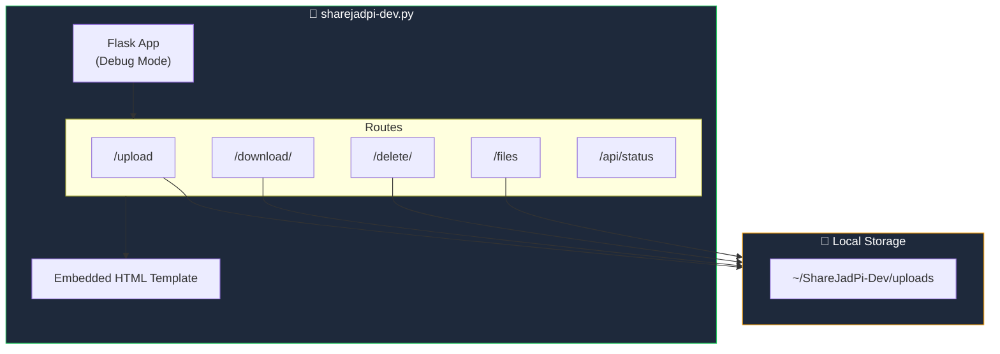
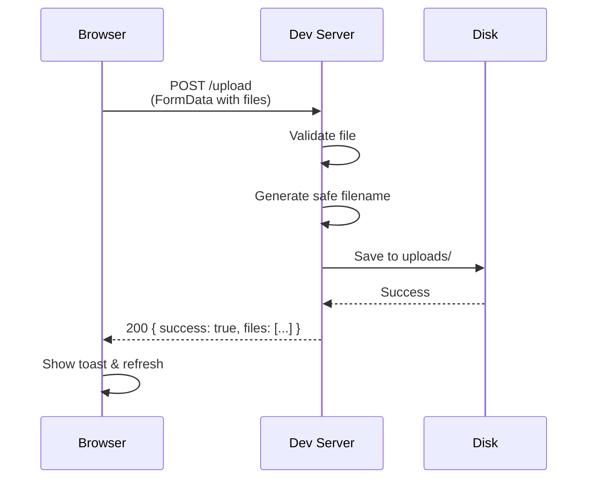
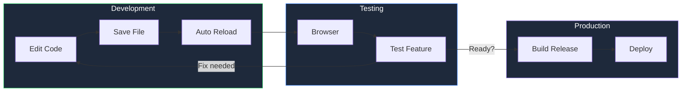

# Development Server

The ShareJadPi Development Server is a lightweight version designed for local development and testing.

## Overview

The dev server (`sharejadpi-dev.py`) provides:

- ✅ **Core file operations** - Upload, download, delete, list
- ✅ **Production UI styling** - Same look as main app
- ✅ **Debug mode** - Detailed error messages
- ✅ **Hot reload** - Changes apply instantly
- ❌ **No advanced features** - Simplified for development

## Quick Start

```bash
# Navigate to SGP_phase1
cd SGP_phase1

# Run the dev server
python sharejadpi-dev.py
```

The server starts on `http://localhost:5000` and opens automatically in your browser.

## Command Line Options

```bash
# Custom port
python sharejadpi-dev.py --port 8080

# Don't open browser
python sharejadpi-dev.py --no-browser

# Custom host
python sharejadpi-dev.py --host 127.0.0.1
```

## Architecture



## API Endpoints

| Method | Endpoint | Description |
|--------|----------|-------------|
| `GET` | `/` | Main UI page |
| `POST` | `/upload` | Upload files (multipart/form-data) |
| `GET` | `/files` | List all files as JSON |
| `GET` | `/download/<name>` | Download a specific file |
| `DELETE` | `/delete/<name>` | Delete a specific file |
| `GET` | `/api/status` | Server status JSON |

## File Upload Flow



## Differences from Production

| Feature | Production | Dev Server |
|---------|------------|------------|
| QR Code Sharing | ✅ | ❌ |
| Shared Clipboard | ✅ | ❌ |
| Token Auth | ✅ | ❌ |
| Speed Test | ✅ | ❌ |
| Cloudflare Tunnel | ✅ | ❌ |
| Debug Mode | ❌ | ✅ |
| Hot Reload | ❌ | ✅ |
| Single File | ❌ | ✅ |

## Code Structure

The dev server is a single self-contained Python file:

```python
# sharejadpi-dev.py structure

# Imports & Dependencies
from flask import Flask, request, send_file, jsonify

# Configuration
APP_VERSION = "4.5.4-dev"
UPLOAD_FOLDER = ~/ShareJadPi-Dev/uploads

# Flask App Setup
app = Flask(__name__)

# Utility Functions
def get_local_ip(): ...
def format_size(bytes): ...
def get_file_list(): ...

# HTML Template
def get_html_template(): ...  # Embedded HTML/CSS/JS

# Routes
@app.route('/')
@app.route('/upload', methods=['POST'])
@app.route('/files')
@app.route('/download/<filename>')
@app.route('/delete/<filename>')
@app.route('/api/status')

# Main Entry
if __name__ == '__main__':
    main()
```

## Customization

### Change Upload Folder

```python
# Edit in sharejadpi-dev.py
UPLOAD_FOLDER = '/path/to/custom/folder'
```

### Modify Max File Size

```python
# Default is 500MB
MAX_CONTENT_LENGTH = 1024 * 1024 * 1024  # 1GB
```

### Add Custom Routes

```python
@app.route('/custom')
def custom_route():
    return jsonify({'message': 'Hello from custom route!'})
```

## Development Workflow



## Requirements

The dev server requires minimal dependencies:

```txt
flask>=3.0.0
werkzeug>=3.0.0
```

Install with:
```bash
pip install flask werkzeug
```

## Troubleshooting

### Port Already in Use

```bash
# Find process using port 5000
netstat -ano | findstr :5000

# Use a different port
python sharejadpi-dev.py --port 8080
```

### Permission Denied

- Check file/folder permissions
- Run terminal as administrator (Windows)
- Use sudo (Linux/macOS)

### Browser Doesn't Open

```bash
# Manually open in browser
python sharejadpi-dev.py --no-browser
# Then navigate to http://localhost:5000
```

## Next Steps

- [Contributing Guide](/development/contributing) - How to contribute
- [Architecture](/architecture) - Full system design
- [API Documentation](/api) - Complete API reference
