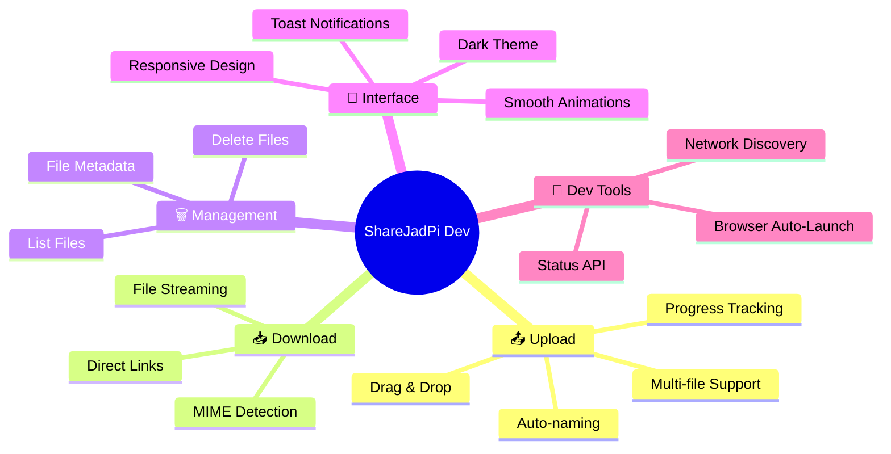
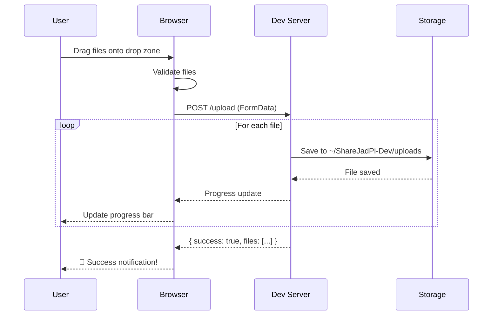
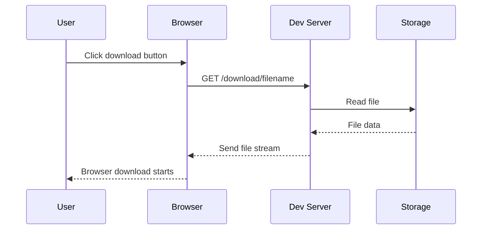

# ✨ Features

<div class="feature-hero">
  <h2>Development Server Features</h2>
  <p>ShareJadPi Dev is designed for local development and testing with core file sharing functionality.</p>
</div>

## 🎯 Feature Overview



---

## 📤 Smart Upload System

<div class="feature-section">

### The Most Intuitive Way to Share Files

Upload files with zero friction. Just drag, drop, and you're done.



### Upload Features

| Feature | Description | Status |
|---------|-------------|--------|
| **Drag & Drop** | Simply drag files from your file explorer | ✅ |
| **Click to Browse** | Traditional file picker dialog | ✅ |
| **Multi-file** | Upload multiple files simultaneously | ✅ |
| **Progress Bars** | Real-time upload progress with shimmer animation | ✅ |
| **Auto-naming** | Automatically handles duplicate filenames | ✅ |
| **Size Limit** | Configurable max file size (default 500MB) | ✅ |
| **Storage Path** | Files saved to ~/ShareJadPi-Dev/uploads | ✅ |

### Technical Implementation

```python
@app.route('/upload', methods=['POST'])
def upload_file():
    """Handle file uploads from the web interface."""
    if 'file' not in request.files:
        return jsonify({'error': 'No file provided'}), 400
    
    uploaded = []
    for file in request.files.getlist('file'):
        if file.filename:
            filename = secure_filename(file.filename)
            filepath = os.path.join(UPLOAD_FOLDER, filename)
            file.save(filepath)
            uploaded.append({
                'name': filename,
                'size': os.path.getsize(filepath)
            })
    
    return jsonify({
        'success': True,
        'files': uploaded
    })
```

</div>

---

## 📥 Efficient Download System

<div class="feature-section">

### Direct File Access

Download any file with a single click. No complicated links or expiration timers.



### Download Features

| Feature | Description | Status |
|---------|-------------|--------|
| **Direct Links** | Simple `/download/filename` URLs | ✅ |
| **Streaming** | Efficient file streaming for large files | ✅ |
| **MIME Detection** | Automatic content-type detection | ✅ |
| **Download Headers** | Proper attachment headers for browser downloads | ✅ |

### API Example

```javascript
// Download a file
fetch('/download/myfile.pdf')
  .then(response => response.blob())
  .then(blob => {
    const url = window.URL.createObjectURL(blob);
    const a = document.createElement('a');
    a.href = url;
    a.download = 'myfile.pdf';
    a.click();
  });
```

</div>

---

## 🗑️ File Management

<div class="feature-section">

### Complete Control Over Your Files

List, view, and delete files through a clean API interface.

### Management Features

| Feature | Description | Status |
|---------|-------------|--------|
| **List Files** | Get all uploaded files with metadata | ✅ |
| **File Metadata** | Name, size, and modification time | ✅ |
| **Delete Files** | Remove files via DELETE endpoint | ✅ |
| **Status API** | Check server status and version | ✅ |

### API Endpoints

```bash
# List all files
curl http://localhost:5000/files

# Delete a file
curl -X DELETE http://localhost:5000/delete/filename

# Check server status
curl http://localhost:5000/api/status
```

### Response Format

```json
{
  "success": true,
  "files": [
    {
      "name": "document.pdf",
      "size": 1048576,
      "modified": "2024-01-31T10:30:00Z"
    }
  ]
}
```

</div>

---

## 🎨 Beautiful User Interface

<div class="feature-section">

### Modern Dark Theme Design

A stunning interface that developers love. Every detail crafted with care.

### UI Features

| Feature | Description | Status |
|---------|-------------|--------|
| **Dark Theme** | Eye-friendly dark color scheme | ✅ |
| **Gradient Accents** | Green gradient highlights | ✅ |
| **Smooth Animations** | Transitions and hover effects | ✅ |
| **Responsive Layout** | Works on desktop, tablet, and mobile | ✅ |
| **Toast Notifications** | Non-intrusive feedback messages | ✅ |
| **Shimmer Effects** | Loading state animations | ✅ |
| **Modern Typography** | Clean, readable fonts | ✅ |

### Design System

```css
/* Color Palette */
--bg-primary: #0a0a0a;
--bg-secondary: #1a1a1a;
--text-primary: #ffffff;
--accent-green: #10b981;
--gradient: linear-gradient(135deg, #10b981, #059669);
```

</div>

---

## 🔧 Developer Experience

<div class="feature-section">

### Built for Development

Clean code, simple APIs, and easy customization.

### Dev Features

| Feature | Description | Status |
|---------|-------------|--------|
| **Auto Browser Launch** | Automatically opens browser on start | ✅ |
| **Network Discovery** | Shows all available network URLs | ✅ |
| **Custom Port** | `--port` flag to change port | ✅ |
| **No Browser Mode** | `--no-browser` flag for headless operation | ✅ |
| **Clean Architecture** | Well-organized, readable code | ✅ |
| **Minimal Dependencies** | Just Flask and Werkzeug | ✅ |

### Command Line Usage

```bash
# Start on default port 5000
python sharejadpi-dev.py

# Use custom port
python sharejadpi-dev.py --port 8080

# Don't auto-open browser
python sharejadpi-dev.py --no-browser

# Combine flags
python sharejadpi-dev.py --port 3000 --no-browser
```

</div>

---

## 📊 Comparison Matrix

<div class="comparison-table">

| Feature | ShareJadPi Dev | Google Drive | WeTransfer | AirDrop |
|---------|----------------|--------------|-------------|---------|
| **Offline Operation** | ✅ Full | ❌ No | ❌ No | ✅ Yes |
| **File Size Limit** | ✅ 500MB+ | ⚠️ 15GB (free) | ⚠️ 2GB (free) | ✅ No limit |
| **Speed** | ✅ LAN speed | ⚠️ Internet | ⚠️ Internet | ✅ Peer-to-peer |
| **Privacy** | ✅ Local only | ❌ Cloud | ❌ Cloud | ✅ Private |
| **Cross-platform** | ✅ Any browser | ✅ Web | ✅ Web | ❌ Apple only |
| **No Account Needed** | ✅ Yes | ❌ Required | ❌ For 2GB+ | ❌ Apple ID |
| **Open Source** | ✅ 100% | ❌ No | ❌ No | ❌ No |
| **Self-hosted** | ✅ Yes | ❌ No | ❌ No | ❌ No |
| **Cost** | ✅ Free | ⚠️ Freemium | ⚠️ Freemium | ✅ Free |

</div>

---

## 🚀 What's Next?

### Phase 3: Advanced Features (Planned)

These features are planned for future development:

- 🔐 **Token Authentication** - Secure access with token-based auth
- 🌐 **Cloudflare Tunnel** - Share files over the internet securely
- 📱 **QR Code Generation** - Instant mobile access with QR codes
- 📋 **Shared Clipboard** - Sync clipboard across devices
- ⚡ **Speed Test Utility** - Test network speed
- 🖱️ **Context Menu Integration** - Right-click to share on Windows

### Phase 4: Polish & Performance (Planned)

- ⚙️ **Settings Panel** - Customizable configuration
- 📊 **Activity Logs** - Track all file operations
- 🎯 **Advanced Search** - Find files quickly
- 🔄 **Auto Updates** - Built-in update mechanism

### Phase 5: Enterprise Features (Planned)

- 👥 **User Management** - Multi-user support
- 📈 **Analytics Dashboard** - Usage statistics
- 📱 **Mobile Apps** - Native iOS/Android apps
- 🔌 **Plugin System** - Extend functionality

---

<style>
.feature-hero {
  text-align: center;
  padding: 3rem 1.5rem;
  background: linear-gradient(135deg, rgba(16, 185, 129, 0.1), rgba(5, 150, 105, 0.05));
  border-radius: 16px;
  margin-bottom: 3rem;
}

.feature-hero h2 {
  font-size: 2.5rem;
  background: linear-gradient(135deg, #10b981, #059669);
  -webkit-background-clip: text;
  -webkit-text-fill-color: transparent;
  margin-bottom: 1rem;
}

.feature-section {
  margin: 3rem 0;
  padding: 2rem;
  background: rgba(255, 255, 255, 0.02);
  border-radius: 12px;
  border: 1px solid rgba(16, 185, 129, 0.1);
}

.feature-section h3 {
  color: #10b981;
  margin-bottom: 1rem;
}

.comparison-table {
  margin: 2rem 0;
  overflow-x: auto;
}

.comparison-table table {
  width: 100%;
  border-collapse: collapse;
}

.comparison-table th {
  background: linear-gradient(135deg, #10b981, #059669) !important;
  color: white !important;
  padding: 12px;
  text-align: left;
}

.comparison-table td {
  padding: 10px 12px;
  border-bottom: 1px solid rgba(255, 255, 255, 0.1);
}

.comparison-table tr:hover {
  background: rgba(16, 185, 129, 0.05);
}
</style>
