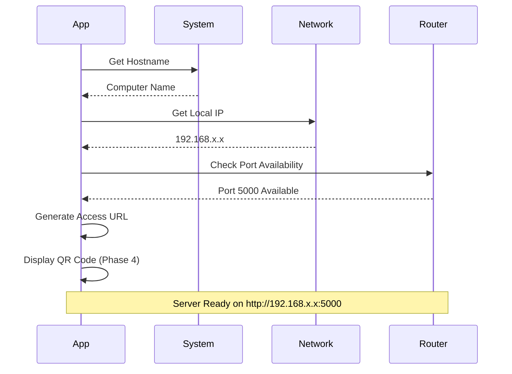
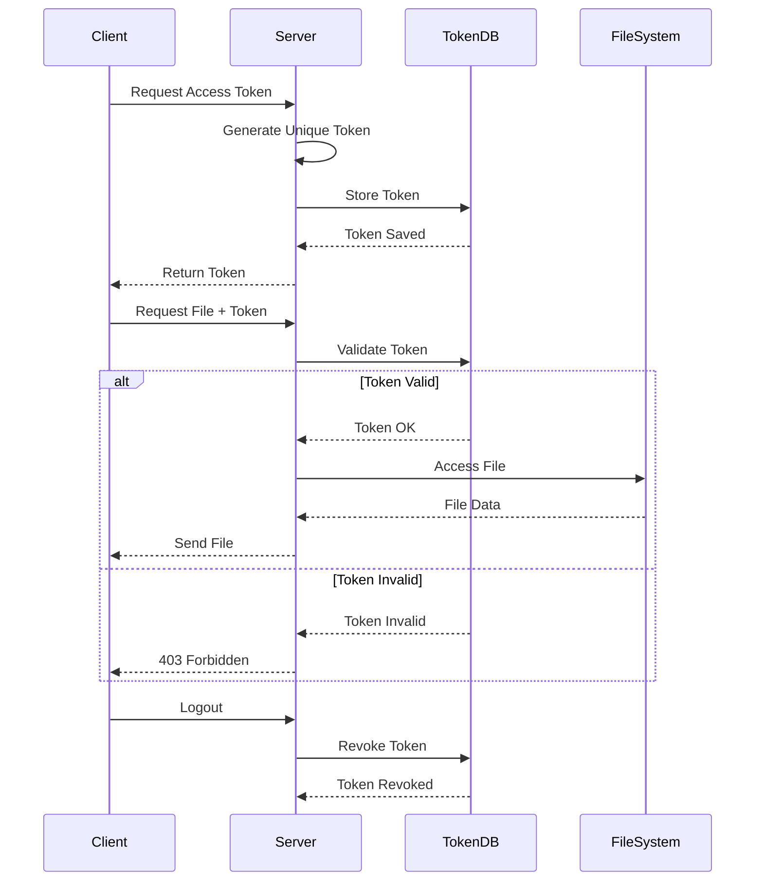
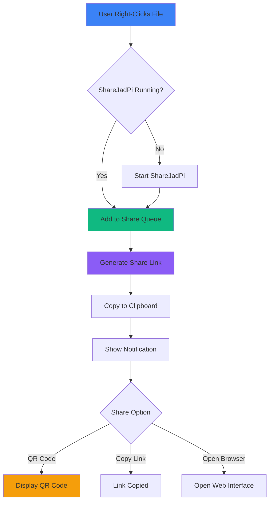
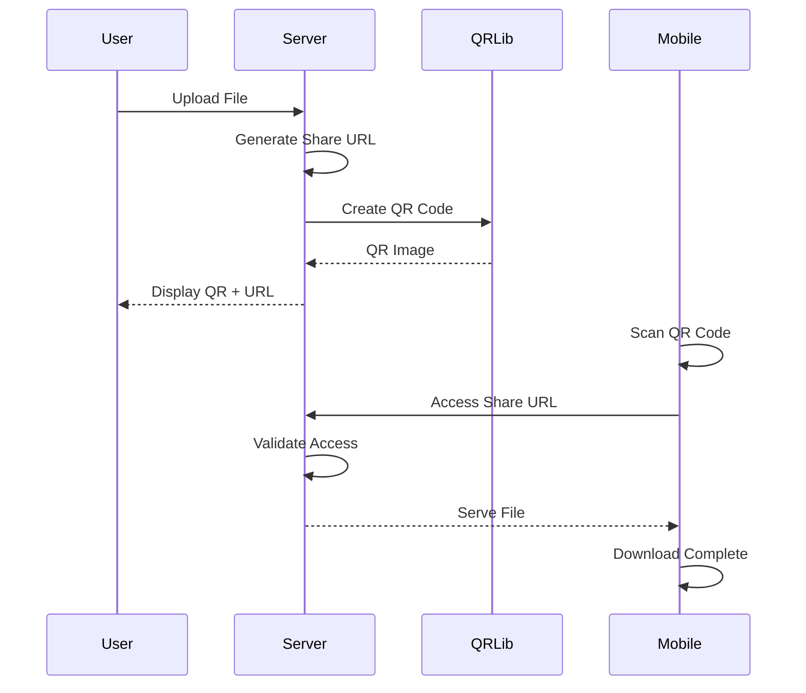

# Features Documentation

## Core Features

### 1. Web-Based File Sharing ✅

#### Overview
ShareJadPi provides seamless file sharing through an intuitive web interface accessible from any device on your local network.

#### Technical Implementation
```python
@app.route('/upload', methods=['POST'])
def upload_file():
    if 'file' not in request.files:
        return jsonify({'error': 'No file provided'}), 400
    
    file = request.files['file']
    if file.filename == '':
        return jsonify({'error': 'No file selected'}), 400
    
    if file:
        filename = secure_filename(file.filename)
        filepath = os.path.join(app.config['UPLOAD_FOLDER'], filename)
        file.save(filepath)
        return jsonify({'success': True, 'filename': filename}), 200
```

#### Features
- 📤 Drag-and-drop file upload
- 📥 Direct download links
- 📁 Multiple file support
- 🔄 Real-time progress tracking
- ⚡ Fast transfer speeds

#### Status: **Production Ready** (Phase 1)

---

### 2. Modern Dark UI ✅

#### Overview
Beautiful, responsive interface with smooth animations and modern design patterns.

#### Key Design Elements

```mermaid
graph LR
    A[Design System] --> B[Color Palette]
    A --> C[Typography]
    A --> D[Spacing System]
    A --> E[Components]
    
    B --> F[Dark Theme]
    B --> G[Accent Colors]
    B --> H[Gradients]
    
    C --> I[Inter Font]
    C --> J[Font Scales]
    
    D --> K[8px Grid]
    D --> L[Consistent Margins]
    
    E --> M[Buttons]
    E --> N[Cards]
    E --> O[Modals]
    
    style A fill:#10b981
    style F fill:#1f2937
    style M fill:#3b82f6
```



#### CSS Variables
```css
:root {
  --primary-color: #3b82f6;
  --secondary-color: #8b5cf6;
  --success-color: #10b981;
  --error-color: #ef4444;
  --bg-dark: #1f2937;
  --bg-darker: #111827;
  --text-light: #f9fafb;
}
```

#### Animation System
- 🎭 Smooth transitions (0.3s ease)
- 💫 Hover effects on interactive elements
- 📊 Progress bar animations
- 🌊 Loading state animations
- ✨ Notification slide-ins

#### Status: **Production Ready** (Phase 2)

---

### 3. Network Discovery ✅

#### Overview
Automatic network configuration and IP detection for hassle-free setup.

#### Network Flow



#### Implementation
```python
def get_local_ip():
    try:
        hostname = socket.gethostname()
        local_ip = socket.gethostbyname(hostname)
        return local_ip
    except Exception as e:
        return "127.0.0.1"

def start_server():
    ip = get_local_ip()
    port = 5000
    print(f"Server running on http://{ip}:{port}")
    app.run(host='0.0.0.0', port=port, debug=False)
```

#### Status: **Production Ready** (Phase 1)

---

### 4. Token Authentication System 📅

#### Overview
Secure token-based authentication for controlled access to shared files.

#### Authentication Flow



#### Planned Features
- 🔐 JWT-based authentication
- ⏱️ Token expiration (configurable)
- 🔄 Token refresh mechanism
- 👥 User role management
- 📊 Access logging and auditing
- 🚫 Token revocation
- 📱 Multi-device support

#### Security Measures
```python
# Token Generation (Planned)
def generate_token(user_id):
    payload = {
        'user_id': user_id,
        'exp': datetime.utcnow() + timedelta(hours=24),
        'iat': datetime.utcnow()
    }
    return jwt.encode(payload, SECRET_KEY, algorithm='HS256')

# Token Validation (Planned)
def validate_token(token):
    try:
        payload = jwt.decode(token, SECRET_KEY, algorithms=['HS256'])
        return payload['user_id']
    except jwt.ExpiredSignatureError:
        return None
    except jwt.InvalidTokenError:
        return None
```

#### Status: **Planned** (Phase 3 - April 2024)

---

### 5. Windows Context Menu Integration 📅

#### Overview
Right-click any file in Windows Explorer to instantly share it via ShareJadPi.

#### Integration Flow



#### Registry Integration (Planned)
```python
# Windows Registry Modification
import winreg

def add_context_menu():
    key_path = r"*\\shell\\ShareJadPi"
    
    # Create main key
    key = winreg.CreateKey(winreg.HKEY_CLASSES_ROOT, key_path)
    winreg.SetValue(key, "", winreg.REG_SZ, "Share with ShareJadPi")
    
    # Create command subkey
    command_key = winreg.CreateKey(key, "command")
    command = f'"{EXECUTABLE_PATH}" --share "%1"'
    winreg.SetValue(command_key, "", winreg.REG_SZ, command)
    
    winreg.CloseKey(command_key)
    winreg.CloseKey(key)
```

#### Planned Features
- 🖱️ Context menu integration
- 📋 Auto-copy share links
- 🔔 Desktop notifications
- 📊 Share statistics
- ⚡ Quick share mode
- 🎯 Multi-file selection support

#### Status: **Planned** (Phase 3 - May 2024)

---

### 6. QR Code Generation 📅

#### Overview
Generate QR codes for quick mobile device access to shared files.

#### QR Code Flow



#### Implementation (Planned)
```python
import qrcode
from io import BytesIO
import base64

def generate_qr_code(url):
    qr = qrcode.QRCode(
        version=1,
        error_correction=qrcode.constants.ERROR_CORRECT_L,
        box_size=10,
        border=4,
    )
    qr.add_data(url)
    qr.make(fit=True)
    
    img = qr.make_image(fill_color="black", back_color="white")
    buffer = BytesIO()
    img.save(buffer, format='PNG')
    img_str = base64.b64encode(buffer.getvalue()).decode()
    
    return f"data:image/png;base64,{img_str}"
```

#### Planned Features
- 📱 Mobile-optimized QR codes
- 🎨 Customizable QR code styles
- ⏱️ Expiring QR codes
- 📊 Scan tracking
- 🔒 Password-protected QR codes
- 💾 Save/Share QR images

#### Status: **Planned** (Phase 4 - June 2024)

---

## Feature Comparison Matrix

| Feature | Phase 1 | Phase 2 | Phase 3 | Phase 4 | Phase 5 |
|---------|---------|---------|---------|---------|---------|
| Basic File Upload | ✅ | ✅ | ✅ | ✅ | ✅ |
| Download Files | ✅ | ✅ | ✅ | ✅ | ✅ |
| Modern UI | ⚠️ | ✅ | ✅ | ✅ | ✅ |
| Dark Theme | ⚠️ | ✅ | ✅ | ✅ | ✅ |
| Responsive Design | ⚠️ | ✅ | ✅ | ✅ | ✅ |
| Animations | ❌ | ✅ | ✅ | ✅ | ✅ |
| Token Auth | ❌ | ❌ | ✅ | ✅ | ✅ |
| Context Menu | ❌ | ❌ | ✅ | ✅ | ✅ |
| QR Codes | ❌ | ❌ | ❌ | ✅ | ✅ |
| Analytics | ❌ | ❌ | ❌ | ❌ | ✅ |
| API Documentation | ❌ | ❌ | ✅ | ✅ | ✅ |

## Performance Metrics

```mermaid
gantt
    title Feature Performance Benchmarks
    dateFormat X
    axisFormat %s
    
    section Upload Speed
    1MB File    :0, 100
    10MB File   :0, 850
    100MB File  :0, 7200
    
    section UI Response
    Page Load   :0, 450
    File List   :0, 120
    Upload Start:0, 80
    
    section Network
    Discovery   :0, 250
    Connection  :0, 50
    Heartbeat   :0, 30
```



## Browser Compatibility

| Browser | Version | Status | Notes |
|---------|---------|--------|-------|
| Chrome | 90+ | ✅ Full Support | Recommended |
| Firefox | 88+ | ✅ Full Support | All features work |
| Edge | 90+ | ✅ Full Support | Chromium-based |
| Safari | 14+ | ⚠️ Partial | Some animations limited |
| Opera | 76+ | ✅ Full Support | Chromium-based |
| Mobile Chrome | Latest | ✅ Full Support | Responsive design |
| Mobile Safari | Latest | ⚠️ Partial | Some limitations |
