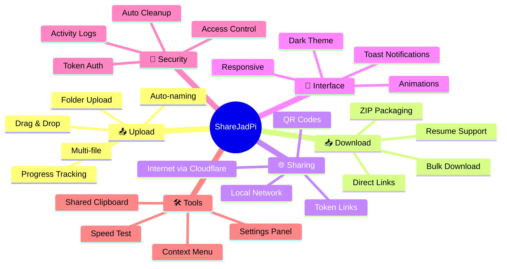
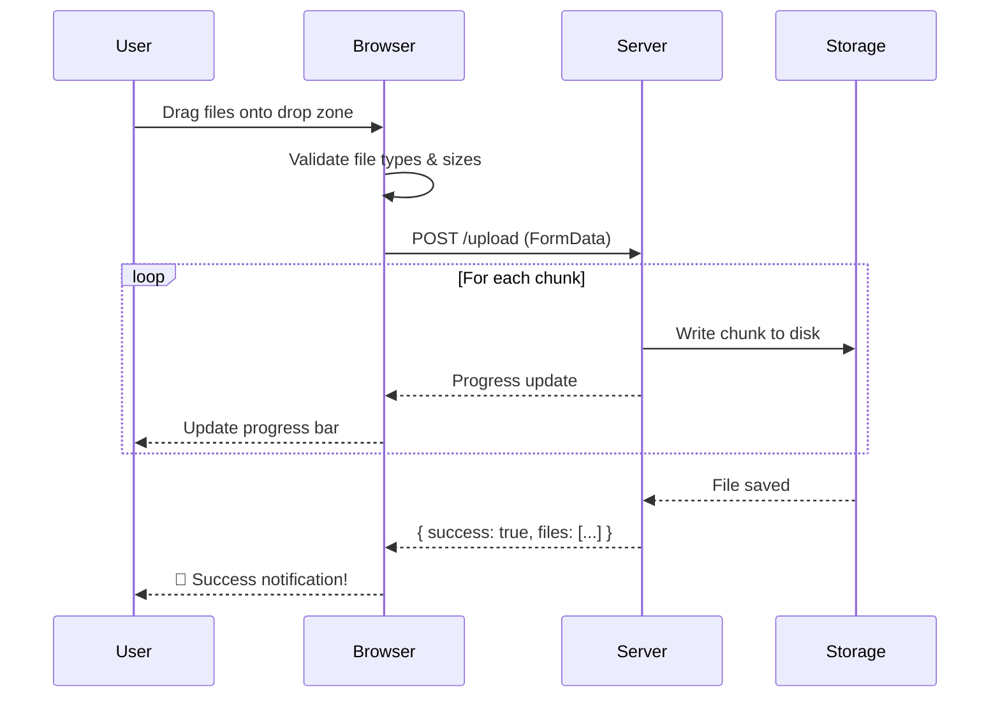
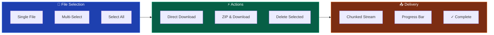
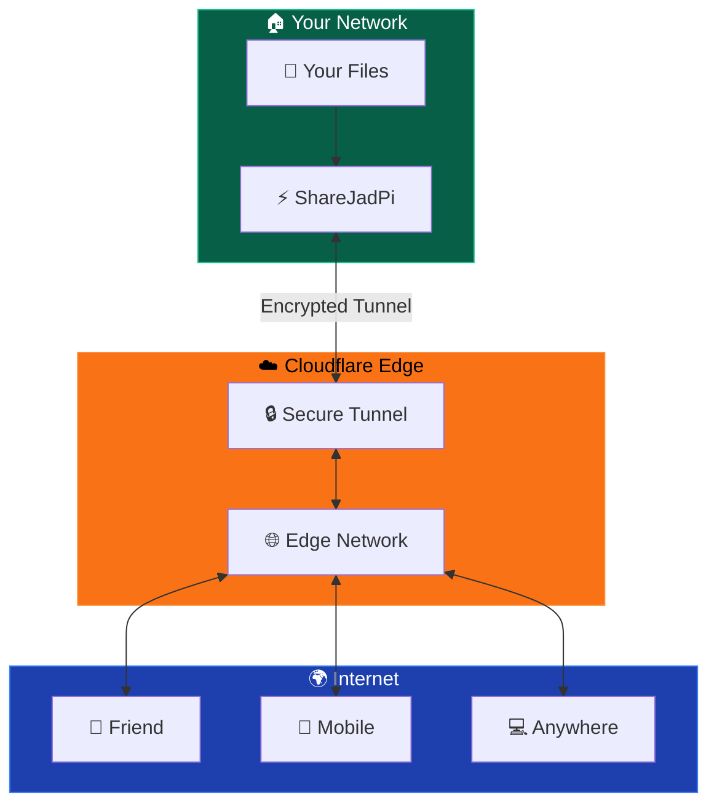
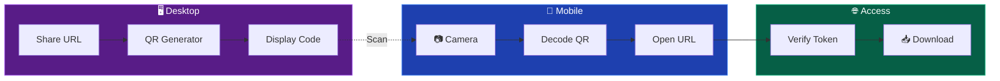
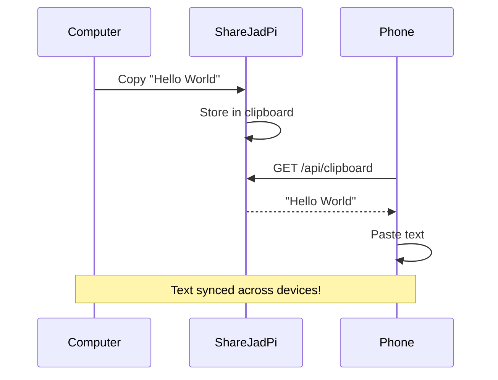
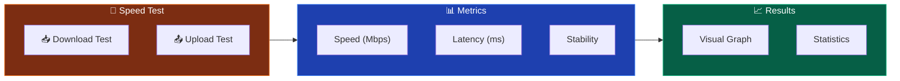
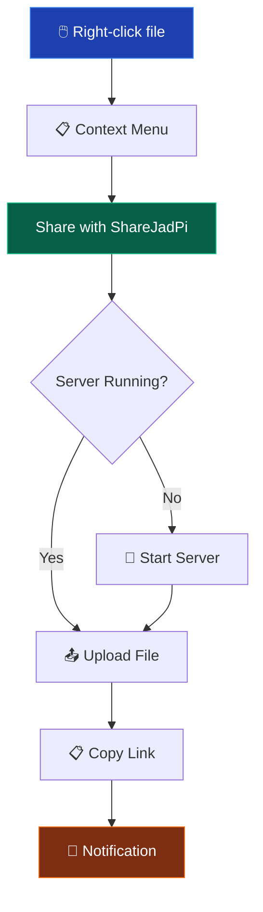
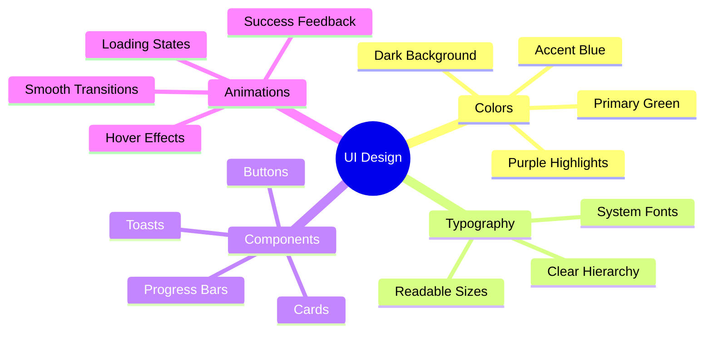

# ✨ Features

<div class="feature-hero">
  <h2>Everything You Need for Seamless File Sharing</h2>
  <p>ShareJadPi comes packed with powerful features designed to make file sharing effortless, secure, and beautiful.</p>
</div>

## 🎯 Feature Overview



---

## 📤 Smart Upload System

<div class="feature-section">

### The Most Intuitive Way to Share Files

Upload files with zero friction. Just drag, drop, and you're done.



### Upload Features

| Feature | Description | Status |
|---------|-------------|--------|
| **Drag & Drop** | Simply drag files from your file explorer | ✅ |
| **Click to Browse** | Traditional file picker dialog | ✅ |
| **Multi-file** | Upload multiple files simultaneously | ✅ |
| **Folder Upload** | Upload entire folders with structure | ✅ |
| **Progress Bars** | Real-time upload progress with shimmer animation | ✅ |
| **Auto-naming** | Automatically handles duplicate filenames | ✅ |
| **Size Validation** | Configurable max file size (default 500MB) | ✅ |
| **Type Filtering** | Optional file type restrictions | ✅ |

### Technical Implementation

```python
@app.route('/upload', methods=['POST'])
def upload_file():
    if 'file' not in request.files:
        return jsonify({'error': 'No file provided'}), 400
    
    uploaded = []
    for file in request.files.getlist('file'):
        if file.filename == '':
            continue
        
        # Secure the filename
        filename = secure_filename(file.filename)
        filepath = os.path.join(UPLOAD_FOLDER, filename)
        
        # Handle duplicates intelligently
        counter = 1
        base, ext = os.path.splitext(filename)
        while os.path.exists(filepath):
            filename = f"{base}_{counter}{ext}"
            filepath = os.path.join(UPLOAD_FOLDER, filename)
            counter += 1
        
        file.save(filepath)
        uploaded.append({'name': filename, 'size': os.path.getsize(filepath)})
    
    return jsonify({'success': True, 'files': uploaded}), 200
```

</div>

---

## 📥 Powerful Download Manager

<div class="feature-section">

### Download Anything, Anytime

One-click downloads with bulk selection and ZIP packaging.

### Download Features

| Feature | Description | Status |
|---------|-------------|--------|
| **Direct Download** | Click and download instantly | ✅ |
| **Bulk Selection** | Select multiple files with checkboxes | ✅ |
| **ZIP Packaging** | Compress selected files on-the-fly | ✅ |
| **Resume Support** | Resume interrupted downloads | ✅ |
| **Streaming** | Efficient chunked transfer for large files | ✅ |



</div>

---

## 🌐 Internet Sharing with Cloudflare

<div class="feature-section highlight">

### Share Files Globally - No Port Forwarding Required

The killer feature that sets ShareJadPi apart. Share files securely over the internet using Cloudflare tunnels.



### How It Works

1. **Start Tunnel** - Click "Share Online" in ShareJadPi
2. **Get URL** - Receive a unique public URL (e.g., `https://abc123.trycloudflare.com`)
3. **Share** - Send the link + token to anyone
4. **Access** - They can download from anywhere in the world
5. **Auto-Cleanup** - Links expire automatically for security

### Security Features

| Feature | Description |
|---------|-------------|
| **Token Authentication** | Every share requires a unique token |
| **Auto-Expiry** | Shares expire after configurable time |
| **One-Time Downloads** | Optional single-download mode |
| **Activity Monitoring** | Track who accessed your files |
| **Instant Revocation** | Cancel any share immediately |

</div>

---

## 📱 QR Code Generation

<div class="feature-section">

### Scan and Connect in Seconds

No typing URLs. Just scan the QR code and you're in.



### QR Features

- 📱 **Instant Access** - Scan with any phone camera
- 🎨 **Branded Codes** - ShareJadPi styled QR codes
- 📊 **Scan Tracking** - Know when codes are scanned
- ⏱️ **Expiring Codes** - Auto-expire for security
- 💾 **Save/Share** - Download QR images

</div>

---

## 📋 Shared Clipboard

<div class="feature-section">

### Universal Copy-Paste Across Devices

Copy text on your computer, paste on your phone. It just works.



### Clipboard Features

| Feature | Status |
|---------|--------|
| Cross-device sync | ✅ |
| Rich text support | ✅ |
| One-click copy | ✅ |
| Auto-clear option | ✅ |
| Local network only | ✅ |

</div>

---

## ⚡ Speed Test Utility

<div class="feature-section">

### Measure Your Network Performance

Built-in speed testing to measure upload and download speeds on your local network.



### API Endpoints

```python
@app.route('/api/speedtest/down')
def speedtest_download():
    """Generate random data for download speed testing"""
    size = 10 * 1024 * 1024  # 10MB
    data = os.urandom(size)
    return data, 200, {'Content-Type': 'application/octet-stream'}

@app.route('/api/speedtest/up', methods=['POST'])
def speedtest_upload():
    """Receive data for upload speed testing"""
    data = request.get_data()
    return jsonify({'received': len(data), 'success': True})
```

</div>

---

## 🖱️ Windows Context Menu

<div class="feature-section">

### Right-Click to Share

Seamless Windows integration. Right-click any file and share instantly.



### How It Works

1. **Install ShareJadPi** using the Windows installer
2. **Right-click** any file in Explorer
3. **Select** "Share with ShareJadPi"
4. **Get link** copied to clipboard automatically
5. **Share** the link with anyone!

</div>

---

## 🎨 Modern UI Design

<div class="feature-section">

### Beautiful, Responsive, and Fast

Every pixel is crafted for the best user experience.

### Design System



### CSS Variables

```css
:root {
  /* Colors */
  --bg: #0f1320;
  --card: #14192b;
  --text: #e7ecf3;
  --muted: #9aa4b2;
  --border: #233046;
  --primary: #22c55e;
  --blue: #3b82f6;
  --purple: #a78bfa;
  --danger: #ef4444;
  --warning: #f59e0b;
  
  /* Shadows */
  --shadow: 0 10px 30px rgba(0,0,0,.25);
  
  /* Animations */
  --transition: all 0.3s ease;
}
```

### Responsive Design

| Breakpoint | Layout |
|------------|--------|
| Mobile (<640px) | Single column, touch-optimized |
| Tablet (640-1024px) | Two columns, larger touch targets |
| Desktop (>1024px) | Full layout, hover effects |

</div>

---

## 📊 Feature Comparison

<div class="comparison-table">

| Feature | ShareJadPi | Google Drive | WeTransfer | AirDrop |
|---------|------------|--------------|------------|---------|
| **Local Network** | ✅ | ❌ | ❌ | ✅ |
| **Internet Sharing** | ✅ | ✅ | ✅ | ❌ |
| **No Account Needed** | ✅ | ❌ | ✅ | ✅ |
| **Cross-Platform** | ✅ | ✅ | ✅ | ❌ |
| **Open Source** | ✅ | ❌ | ❌ | ❌ |
| **Self-Hosted** | ✅ | ❌ | ❌ | ❌ |
| **Free Forever** | ✅ | ⚠️ | ⚠️ | ✅ |
| **QR Code Access** | ✅ | ❌ | ❌ | ❌ |
| **Shared Clipboard** | ✅ | ❌ | ❌ | ✅ |
| **Speed Test** | ✅ | ❌ | ❌ | ❌ |
| **Dark Theme** | ✅ | ⚠️ | ❌ | ✅ |

</div>

---

## 🚀 Coming Soon

<div class="coming-soon">

### Phase 5 Features

- 👥 **User Management** - Multi-user support with permissions
- 📊 **Analytics Dashboard** - Usage statistics and insights
- 🔌 **Plugin System** - Extend functionality with plugins
- 📱 **Mobile App** - Native iOS and Android apps
- ☁️ **Cloud Sync** - Optional cloud backup integration
- 🌍 **Multi-Language** - Internationalization support

</div>

<style>
.feature-hero {
  text-align: center;
  padding: 40px 20px;
  background: linear-gradient(135deg, rgba(34,197,94,0.1), rgba(59,130,246,0.1));
  border-radius: 16px;
  margin-bottom: 40px;
}

.feature-hero h2 {
  margin: 0 0 12px 0;
  font-size: 1.8rem;
}

.feature-hero p {
  color: var(--vp-c-text-2);
  font-size: 1.1rem;
  margin: 0;
}

.feature-section {
  background: var(--vp-c-bg-soft);
  border: 1px solid var(--vp-c-divider);
  border-radius: 12px;
  padding: 24px;
  margin: 24px 0;
}

.feature-section.highlight {
  border-color: var(--vp-c-brand);
  background: linear-gradient(135deg, var(--vp-c-bg-soft), rgba(34,197,94,0.05));
}

.comparison-table {
  overflow-x: auto;
}

.coming-soon {
  background: linear-gradient(135deg, rgba(168,85,247,0.1), rgba(59,130,246,0.1));
  border: 1px solid rgba(168,85,247,0.3);
  border-radius: 12px;
  padding: 24px;
  margin-top: 40px;
}
</style>
