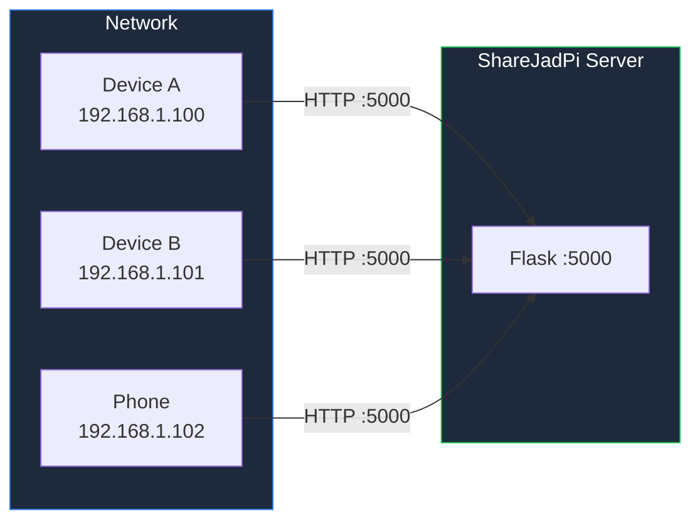

# Configuration

Customize ShareJadPi to fit your needs.

## Environment Variables

ShareJadPi can be configured using environment variables:

```bash
# Set upload folder
set SHAREJADPI_UPLOAD_FOLDER=C:\MyUploads

# Set maximum file size (in bytes)
set SHAREJADPI_MAX_SIZE=1073741824

# Set port
set SHAREJADPI_PORT=8080

# Run
python sharejadpi.py
```

## Configuration Options

| Option | Default | Description |
|--------|---------|-------------|
| `UPLOAD_FOLDER` | `~/ShareJadPi/uploads` | Where files are stored |
| `MAX_CONTENT_LENGTH` | `500MB` | Maximum upload size |
| `PORT` | `5000` | Server port |
| `HOST` | `0.0.0.0` | Bind address |
| `DEBUG` | `False` | Enable debug mode |

## File Storage

### Default Location

By default, ShareJadPi stores files in:

- **Windows:** `C:\Users\<username>\ShareJadPi\uploads`
- **macOS/Linux:** `/home/<username>/ShareJadPi/uploads`

### Custom Location

```python
# In sharejadpi.py
UPLOAD_FOLDER = '/path/to/custom/folder'
```

## Network Configuration

### Firewall Rules

To allow access from other devices, add a firewall rule:

**Windows PowerShell (Admin):**
```powershell
New-NetFirewallRule -DisplayName "ShareJadPi" -Direction Inbound -Port 5000 -Protocol TCP -Action Allow
```

**Linux (ufw):**
```bash
sudo ufw allow 5000/tcp
```

**macOS:**
```bash
# Allow incoming connections in System Preferences > Security > Firewall
```

### Port Configuration



## Security Settings

### Restricting Access

To limit access to specific IPs:

```python
# In sharejadpi.py
ALLOWED_IPS = ['192.168.1.100', '192.168.1.101']

@app.before_request
def check_ip():
    if request.remote_addr not in ALLOWED_IPS:
        abort(403)
```

### HTTPS (SSL/TLS)

For secure connections, use a reverse proxy like nginx:

```nginx
server {
    listen 443 ssl;
    server_name sharejadpi.local;
    
    ssl_certificate /path/to/cert.pem;
    ssl_certificate_key /path/to/key.pem;
    
    location / {
        proxy_pass http://127.0.0.1:5000;
        proxy_set_header Host $host;
    }
}
```

## Performance Tuning

### Production Deployment

For production, use a WSGI server:

```bash
# Install gunicorn
pip install gunicorn

# Run with gunicorn (Linux/macOS)
gunicorn -w 4 -b 0.0.0.0:5000 sharejadpi:app

# For Windows, use waitress
pip install waitress
waitress-serve --port=5000 sharejadpi:app
```

### Concurrent Users

| Config | Single User | 5 Users | 10+ Users |
|--------|-------------|---------|-----------|
| Development | ✅ | ⚠️ | ❌ |
| Flask threaded | ✅ | ✅ | ⚠️ |
| Gunicorn (4 workers) | ✅ | ✅ | ✅ |

## Logging

### Enable Detailed Logging

```python
import logging
logging.basicConfig(level=logging.DEBUG)
```

### Log File Output

```python
logging.basicConfig(
    filename='sharejadpi.log',
    level=logging.INFO,
    format='%(asctime)s - %(levelname)s - %(message)s'
)
```

## Next Steps

- [Development Server](/development/dev-server) - Development setup
- [API Documentation](/api) - REST API reference
