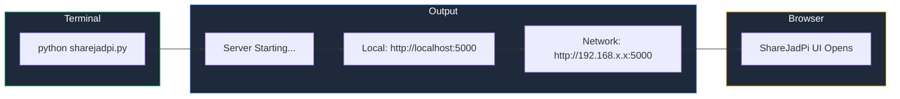

# Getting Started

Welcome to ShareJadPi! This guide will help you get up and running in minutes.

## Prerequisites

Before you begin, make sure you have:

- **Python 3.8+** installed on your system
- **pip** (Python package manager)
- A modern web browser (Chrome, Firefox, Safari, Edge)

## Installation

### Option 1: Clone from GitHub

```bash
# Clone the repository
git clone https://github.com/hetcharusat/sharejadpi.git
cd sharejadpi

# Install dependencies
pip install -r requirements.txt
```

### Option 2: Download Release

1. Go to [GitHub Releases](https://github.com/hetcharusat/sharejadpi/releases)
2. Download the latest `.zip` or `.exe` file
3. Extract and run!

## Running ShareJadPi

### Basic Usage

```bash
python sharejadpi.py
```

This will:
1. Start the web server on port `5000`
2. Detect your local IP address automatically
3. Open your default browser to the ShareJadPi interface

### Command Line Options

```bash
# Custom port
python sharejadpi.py --port 8080

# Don't auto-open browser
python sharejadpi.py --no-browser

# Specify host
python sharejadpi.py --host 0.0.0.0
```

## What You'll See



## Accessing from Other Devices

Once ShareJadPi is running, you can access it from any device on the same network:

1. **Check the Network URL** displayed in the terminal
2. **Open a browser** on your phone, tablet, or another computer
3. **Navigate to the URL** (e.g., `http://192.168.1.100:5000`)

::: tip Network Access
Make sure your firewall allows connections on the port you're using (default: 5000)
:::

## Next Steps

- [Quick Start Guide](/guide/quick-start) - Learn basic file operations
- [Configuration](/guide/configuration) - Customize ShareJadPi settings
- [Development Server](/development/dev-server) - Set up for local development
