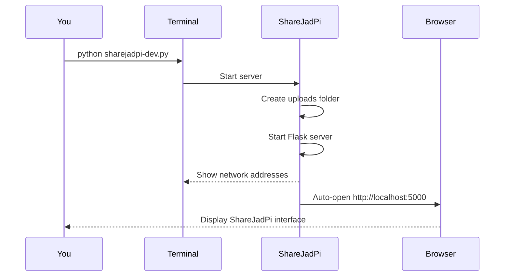

# 📦 Installation

<div class="install-hero">
  <h2>Get ShareJadPi Running in 5 Minutes</h2>
  <p>Follow these simple steps to install and run ShareJadPi on your machine.</p>
</div>

## ✅ Prerequisites

Before installing ShareJadPi, make sure you have:

<div class="prereq-checklist">

- [ ] **Python 3.7 or higher** installed
- [ ] **Terminal/Command Prompt** access
- [ ] **Git** (optional, for cloning the repository)
- [ ] **5 minutes** of your time

</div>

### Check If You Have Python

<div class="check-section">

Open your terminal and run:

```bash
python --version
```

You should see something like:
```
Python 3.11.5
```

**Don't have Python?** [Download it here →](https://www.python.org/downloads/)

<div class="callout tip">
💡 <strong>Windows users:</strong> During Python installation, check "Add Python to PATH"
</div>

</div>

---

## 🚀 Installation Methods

Choose the method that works best for you:

<div class="methods-grid">

<div class="method-card recommended">
  <div class="method-badge">⭐ Recommended</div>
  <h3>Method 1: Git Clone</h3>
  <p>Best for developers and contributors</p>
  <a href="#method-1-git-clone">Use this method →</a>
</div>

<div class="method-card">
  <h3>Method 2: Download ZIP</h3>
  <p>No Git required, simple download</p>
  <a href="#method-2-download-zip">Use this method →</a>
</div>

</div>

---

## Method 1: Git Clone

### Step 1: Clone the Repository

Open your terminal and run:

```bash
git clone https://github.com/hetcharusat/sharejadpi.git
cd sharejadpi/SGP_phase1
```

### Step 2: Install Dependencies

```bash
pip install flask werkzeug
```

<div class="callout tip">
💡 <strong>Tip:</strong> Use a virtual environment for cleaner installations:

```bash
python -m venv venv
source venv/bin/activate  # On Windows: venv\Scripts\activate
pip install flask werkzeug
```
</div>

### Step 3: Run ShareJadPi

```bash
python sharejadpi-dev.py
```

That's it! 🎉

---

## Method 2: Download ZIP

### Step 1: Download

1. Visit [https://github.com/hetcharusat/sharejadpi](https://github.com/hetcharusat/sharejadpi)
2. Click the **Code** button
3. Select **Download ZIP**
4. Extract the ZIP file

### Step 2: Navigate to Folder

Open terminal in the extracted folder:

```bash
cd sharejadpi-main/SGP_phase1
```

### Step 3: Install Dependencies

```bash
pip install flask werkzeug
```

### Step 4: Run ShareJadPi

```bash
python sharejadpi-dev.py
```

Done! ✨

---

## 📱 First Launch

When you run ShareJadPi for the first time, you'll see:

```
ShareJadPi Development Server v4.5.4-dev
==========================================

✓ Upload folder created: /Users/you/ShareJadPi-Dev/uploads

📡 Server running on:
   → Local:   http://127.0.0.1:5000
   → Network: http://192.168.1.100:5000

🌐 Access from other devices:
   1. Connect to the same Wi-Fi
   2. Open: http://192.168.1.100:5000

🚀 Opening browser...
```

<div class="callout success">
✅ <strong>Success!</strong> Your browser should open automatically showing the ShareJadPi interface.
</div>

### What Just Happened?



---

## 🔧 Configuration Options

### Custom Port

By default, ShareJadPi runs on port 5000. To use a different port:

```bash
python sharejadpi-dev.py --port 8080
```

### Don't Open Browser

If you don't want the browser to open automatically:

```bash
python sharejadpi-dev.py --no-browser
```

### Combine Options

```bash
python sharejadpi-dev.py --port 3000 --no-browser
```

---

## 🌐 Accessing from Other Devices

### Step 1: Get Your Network IP

ShareJadPi displays your network IP when it starts:

```
Network: http://192.168.1.100:5000
         ^^^ This is your IP ^^^
```

### Step 2: Connect Devices to Same Wi-Fi

All devices must be on the **same Wi-Fi network** as the computer running ShareJadPi.

### Step 3: Open the URL

On any device (phone, tablet, another computer):

1. Open a web browser
2. Type the network URL: `http://192.168.1.100:5000`
3. Press Enter

You should see the ShareJadPi interface! 🎉

---

## 🐛 Troubleshooting

<div class="troubleshooting">

### Problem: "Python not found"

**Solution:**
1. Install Python from [python.org](https://www.python.org/downloads/)
2. On Windows, reinstall and check "Add to PATH"
3. Restart your terminal

### Problem: "No module named 'flask'"

**Solution:**
```bash
pip install flask werkzeug
```

If that doesn't work:
```bash
python -m pip install flask werkzeug
```

### Problem: "Address already in use"

**Solution:**

Another program is using port 5000. Either:

**Option 1:** Use a different port
```bash
python sharejadpi-dev.py --port 8080
```

**Option 2:** Stop the other program using port 5000

**On Windows:**
```powershell
netstat -ano | findstr :5000
taskkill /PID <PID> /F
```

**On Mac/Linux:**
```bash
lsof -ti:5000 | xargs kill -9
```

### Problem: Can't access from other devices

**Check:**
1. ✅ All devices on same Wi-Fi?
2. ✅ Using the **Network URL** (not localhost)?
3. ✅ Firewall allowing connections?

**Windows Firewall Solution:**

ShareJadPi may ask for firewall permission. Click **Allow Access**.

If you missed it, manually allow Python:
```powershell
# Run as Administrator
New-NetFirewallRule -DisplayName "ShareJadPi" -Direction Inbound -Program "C:\Path\To\python.exe" -Action Allow
```

### Problem: Browser doesn't open automatically

**Solution:**

This is normal on some systems. Just manually open:
```
http://localhost:5000
```

Or use `--no-browser` flag to suppress the message.

</div>

---

## 📂 File Locations

### Where Are Uploaded Files Stored?

All uploaded files are saved to:

<div class="file-locations">

**Windows:**
```
C:\Users\YourName\ShareJadPi-Dev\uploads
```

**Mac/Linux:**
```
/Users/YourName/ShareJadPi-Dev/uploads
```

</div>

You can access this folder anytime to:
- View uploaded files
- Copy files elsewhere
- Delete old files
- Backup files

---

## ⚙️ System Requirements

<div class="requirements">

### Minimum Requirements
- **OS:** Windows 7+, macOS 10.12+, or Linux
- **Python:** 3.7+
- **RAM:** 512 MB
- **Disk:** 100 MB for application + storage for files
- **Network:** Wi-Fi or Ethernet connection

### Recommended
- **OS:** Windows 10/11, macOS 12+, Ubuntu 20.04+
- **Python:** 3.10+
- **RAM:** 1 GB+
- **Disk:** SSD for faster file operations
- **Network:** Gigabit Ethernet for max speed

</div>

---

## 🎯 Next Steps

<div class="next-section">

### You've successfully installed ShareJadPi! 🎉

Now let's learn how to use it:

[Continue to First Steps →](/guide/quick-start){.cta-button}

### Other Helpful Pages

- 📖 [API Reference](/api) - For developers
- 🏗️ [Architecture](/architecture) - How it works
- 🔧 [Configuration](/guide/configuration) - Advanced settings

</div>

---

## 🆘 Still Having Issues?

<div class="help-section">

**Need help?** We're here for you:

- 🐛 [Report a bug](https://github.com/hetcharusat/sharejadpi/issues/new?labels=bug)
- 💡 [Request a feature](https://github.com/hetcharusat/sharejadpi/issues/new?labels=enhancement)
- 💬 [Join discussions](https://github.com/hetcharusat/sharejadpi/discussions)
- 📧 Email: [your-email@example.com]

</div>

---

<style>
.install-hero {
  text-align: center;
  padding: 3rem 2rem;
  background: linear-gradient(135deg, rgba(16, 185, 129, 0.1), rgba(5, 150, 105, 0.05));
  border-radius: 16px;
  margin-bottom: 3rem;
}

.install-hero h2 {
  font-size: 2.5rem;
  background: linear-gradient(135deg, #10b981, #059669);
  -webkit-background-clip: text;
  -webkit-text-fill-color: transparent;
  margin-bottom: 1rem;
}

.prereq-checklist {
  background: rgba(59, 130, 246, 0.1);
  border: 1px solid rgba(59, 130, 246, 0.3);
  border-radius: 12px;
  padding: 2rem;
  margin: 2rem 0;
  font-size: 1.1rem;
  line-height: 2;
}

.check-section {
  background: rgba(139, 92, 246, 0.1);
  border: 1px solid rgba(139, 92, 246, 0.3);
  border-radius: 12px;
  padding: 2rem;
  margin: 2rem 0;
}

.methods-grid {
  display: grid;
  grid-template-columns: repeat(auto-fit, minmax(300px, 1fr));
  gap: 1.5rem;
  margin: 2rem 0;
}

.method-card {
  background: rgba(255, 255, 255, 0.02);
  border: 2px solid rgba(16, 185, 129, 0.2);
  border-radius: 12px;
  padding: 2rem;
  text-align: center;
  transition: all 0.3s ease;
  position: relative;
}

.method-card.recommended {
  border-color: rgba(16, 185, 129, 0.5);
  background: rgba(16, 185, 129, 0.05);
}

.method-badge {
  position: absolute;
  top: -12px;
  right: 20px;
  background: linear-gradient(135deg, #10b981, #059669);
  color: white;
  padding: 4px 12px;
  border-radius: 12px;
  font-size: 0.75rem;
  font-weight: 600;
}

.method-card:hover {
  transform: translateY(-4px);
  border-color: rgba(16, 185, 129, 0.6);
  box-shadow: 0 8px 24px rgba(16, 185, 129, 0.2);
}

.callout {
  padding: 1.5rem;
  border-radius: 12px;
  border-left: 4px solid;
  margin: 2rem 0;
}

.callout.tip {
  background: rgba(16, 185, 129, 0.1);
  border-color: #10b981;
}

.callout.success {
  background: rgba(34, 197, 94, 0.1);
  border-color: #22c55e;
}

.troubleshooting {
  background: rgba(239, 68, 68, 0.1);
  border: 1px solid rgba(239, 68, 68, 0.3);
  border-radius: 12px;
  padding: 2rem;
  margin: 2rem 0;
}

.troubleshooting h3 {
  color: #ef4444;
  margin-top: 1.5rem;
}

.file-locations {
  background: rgba(245, 158, 11, 0.1);
  border: 1px solid rgba(245, 158, 11, 0.3);
  border-radius: 12px;
  padding: 2rem;
  margin: 1rem 0;
}

.requirements {
  background: rgba(59, 130, 246, 0.1);
  border: 1px solid rgba(59, 130, 246, 0.3);
  border-radius: 12px;
  padding: 2rem;
  margin: 2rem 0;
}

.next-section {
  text-align: center;
  padding: 3rem 2rem;
  background: linear-gradient(135deg, rgba(16, 185, 129, 0.1), rgba(5, 150, 105, 0.05));
  border-radius: 16px;
  margin: 3rem 0;
}

.cta-button {
  display: inline-block;
  padding: 1rem 2rem;
  background: linear-gradient(135deg, #10b981, #059669);
  color: white !important;
  text-decoration: none;
  border-radius: 8px;
  font-weight: 600;
  margin-top: 1rem;
  transition: all 0.3s ease;
}

.cta-button:hover {
  transform: translateY(-2px);
  box-shadow: 0 8px 24px rgba(16, 185, 129, 0.3);
}

.help-section {
  background: rgba(245, 158, 11, 0.1);
  border: 1px solid rgba(245, 158, 11, 0.3);
  border-radius: 12px;
  padding: 2rem;
  margin: 2rem 0;
}
</style>
