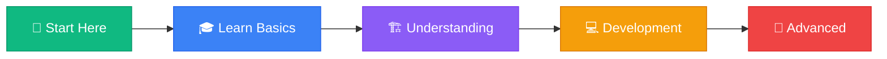

# 👋 Welcome to ShareJadPi

  <h2>Your Journey Starts Here</h2>
  
Welcome! This documentation will guide you from zero to expert, step by step.

## 🎯 What You'll Learn

This documentation follows a clear learning path:

### 📚 Learning Path

**Phase 1: Start Here** ⭐ *You are here!*
1. **Introduction** (this page) - Overview and learning path
2. **What is ShareJadPi?** - Core concept and purpose
3. **Installation** - Get ShareJadPi running on your machine

**Phase 2: Learn the Basics** 🎓
4. **First Steps** - Launch and access the app
5. **Uploading Files** - Learn to upload files
6. **Downloading Files** - Learn to download files
7. **Managing Files** - Delete and organize files

**Phase 3: Understanding ShareJadPi** 🏗️
8. **How It Works** - Architecture and technical design
9. **Features Breakdown** - Deep dive into all features
10. **Development Timeline** - Project evolution and history

**Phase 4: For Developers** 💻
11. **API Reference** - Complete REST API documentation
12. **Development Server** - Development environment setup
13. **Configuration Options** - Customize ShareJadPi
14. **Contributing** - Help improve ShareJadPi

**Phase 5: Advanced** 🚀
15. **Deployment Guide** - Deploy for production
16. **Future Roadmap** - What's coming next

---

## 🎓 Who Is This For?

  
👤

  <h3>End Users</h3>
  
Want to share files on your local network

  <ul>
    <li>✅ Start with Phases 1-2</li>
    <li>✅ Learn basic operations</li>
    <li>✅ Skip technical details</li>
  </ul>

  
💻

  <h3>Developers</h3>
  
Want to integrate or extend ShareJadPi

  <ul>
    <li>✅ Read all phases</li>
    <li>✅ Focus on Phases 3-4</li>
    <li>✅ Use API reference</li>
  </ul>

  
🏢

  <h3>Organizations</h3>
  
Want to deploy for teams

  <ul>
    <li>✅ Read Phases 1, 3, 5</li>
    <li>✅ Review security notes</li>
    <li>✅ Check deployment guide</li>
  </ul>

---

## ⚡ Quick Navigation

**If you want to...**

- 🚀 **Get started immediately** → [Installation →](/guide/installation)
- 📖 **Understand what ShareJadPi is** → [What is ShareJadPi? →](/guide/what-is-sharejadpi)
- 💻 **Use the API** → [API Reference →](/api)
- 🔧 **Contribute to development** → [Contributing →](/development/contributing)
- 🏗️ **Understand the architecture** → [Architecture →](/architecture)

---

## 📖 How to Use This Documentation

### 🎯 Recommended Path

<strong>💡 First Time Here?</strong>

Follow the numbered sequence in the sidebar (1 → 16). Each page builds on the previous one.

### 🔍 Search Anything

Use the search bar at the top to find specific topics quickly.

### 🌐 Navigation Tips

- **Sidebar numbers** show the recommended reading order
- **Collapsed sections** can be expanded by clicking
- **"Edit on GitHub"** link at the bottom of each page for corrections
- **Previous/Next** buttons at the bottom navigate sequentially

---

## 🎯 What is ShareJadPi?

**ShareJadPi** is a modern, lightweight file sharing application for local networks.

Think of it as your personal file sharing server that runs on your computer. Anyone on your network can:
- Upload files through a web browser
- Download files you've shared
- All without installing anything!

**Current Version:** 4.5.4-dev (Development)

### Key Highlights

  813
  Lines of Code

  6
  API Endpoints

  100%
  Open Source

  5
  Minutes to Setup

---

## 🚀 Ready to Start?

### Next Step: Learn What ShareJadPi Is

Understanding the core concept will help you get the most out of ShareJadPi.

[Continue to "What is ShareJadPi?" →](/guide/what-is-sharejadpi){.cta-button}

---

## 💬 Need Help?

**Found an issue or have questions?**

- 🐛 Report bugs on [GitHub Issues](https://github.com/hetcharusat/sharejadpi/issues)
- 💡 Suggest features in [Discussions](https://github.com/hetcharusat/sharejadpi/discussions)
- 📧 Contact: [Your Email]
- ⭐ Star the project if you find it useful!

---

