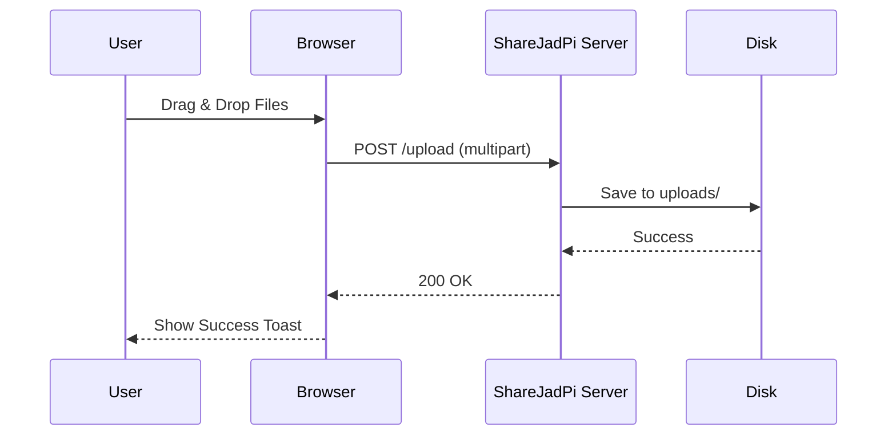
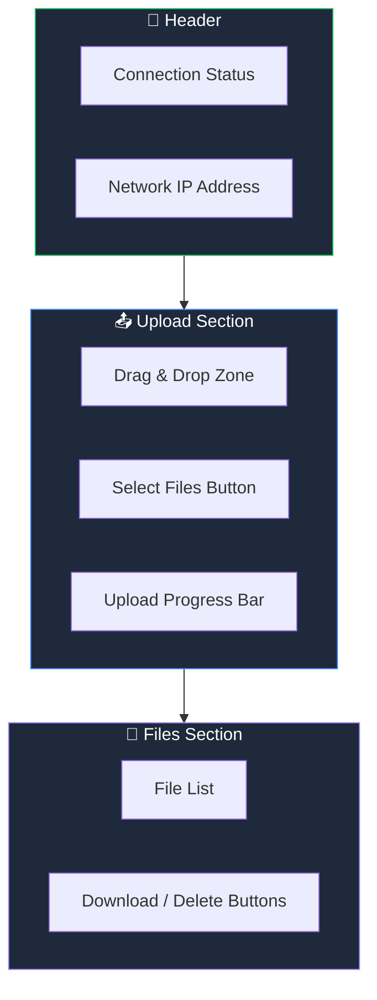

# Quick Start Guide

Learn the basics of using ShareJadPi in 5 minutes.

## Uploading Files

### Method 1: Drag & Drop

1. Open ShareJadPi in your browser
2. Drag files from your file explorer
3. Drop them on the upload zone
4. Watch the progress bar as files upload

### Method 2: Click to Browse

1. Click the **"Select Files"** button
2. Choose files from the file picker
3. Files upload automatically

## Downloading Files

Each file in the list has a **Download** button:

1. Find the file you want
2. Click the **⬇ Download** button
3. The file downloads to your default downloads folder

::: tip Batch Downloads
You can download multiple files by opening each in a new tab using Ctrl+Click (Windows) or Cmd+Click (Mac)
:::

## Deleting Files

1. Find the file in the list
2. Click the **🗑 Delete** button
3. Confirm the deletion
4. File is permanently removed

::: warning
Deleted files cannot be recovered! Make sure you have a backup if needed.
:::

## File Information

Each file displays:

| Info | Description |
|------|-------------|
| **Icon** | File type indicator (PDF, JPG, etc.) |
| **Name** | Original filename |
| **Size** | Human-readable file size |
| **Modified** | Last modified date/time |

## Interface Overview

## Keyboard Shortcuts

| Shortcut | Action |
|----------|--------|
| `Ctrl + V` | Paste files from clipboard |
| `Escape` | Cancel current upload |
| `F5` | Refresh file list |

## Mobile Usage

ShareJadPi works great on mobile devices:

- **Tap** the upload zone to access camera/files
- **Swipe** through the file list
- All buttons are touch-friendly

## Troubleshooting

### Can't access from another device?

1. Check that both devices are on the same network
2. Verify your firewall allows the connection
3. Try using the IP address instead of hostname

### Upload fails?

1. Check file size (max 500MB by default)
2. Ensure you have write permissions
3. Check available disk space

### Files not showing?

1. Click refresh or press F5
2. Check the upload folder exists
3. Restart the server

## Next Steps

- [Configuration Guide](/guide/configuration) - Customize settings
- [API Documentation](/api) - Integrate with your apps
