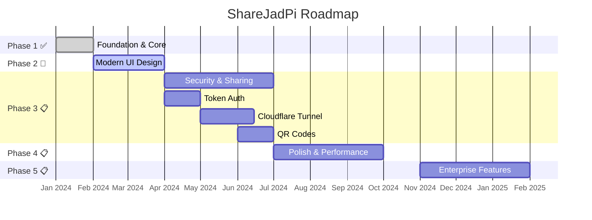

# 🚀 Future Roadmap

*Page 16 of 16: Advanced → Future Roadmap*

[← Previous: Deployment](/DEPLOYMENT)

---

  <h2>What's Coming Next</h2>
  
ShareJadPi's journey from development to enterprise-ready platform

## 🗺️ Development Phases

---

## 📊 Current Status

**Version:** 4.5.4-dev  
**Phase:** 2 of 5 (40% complete)  
**Status:** Active Development

---

## 🎯 Phase 3: Advanced Features (Next)

Coming in next major release:

### 🔐 Token Authentication
Secure your ShareJadPi with password protection

### 🌐 Cloudflare Tunnel Integration  
Share files over the internet securely

### 📱 QR Code Generation
Instant mobile access with QR codes

### 📋 Shared Clipboard
Sync clipboard content across devices

### ⚡ Speed Test Utility
Test your network speed

### 🖱️ Windows Context Menu
Right-click files to share instantly

---

## ⚙️ Phase 4: Polish & Performance

### Settings Panel
Customize ShareJadPi behavior

### Activity Logs
Track all file operations

### Performance Optimizations
Faster uploads, better handling of large files

### Documentation
Comprehensive guides and tutorials

---

## 🏢 Phase 5: Enterprise Features

### 👥 User Management
Multi-user accounts with permissions

### 📈 Analytics Dashboard
Usage statistics and insights

### 📱 Mobile Apps
Native iOS and Android applications

### 🔌 Plugin System
Extend functionality with plugins

---

## 💬 Contribute

Want to help shape ShareJadPi's future?

- 💡 [Suggest features](https://github.com/hetcharusat/sharejadpi/discussions)
- 🐛 [Report bugs](https://github.com/hetcharusat/sharejadpi/issues)
- 🔧 [Contribute code](/development/contributing)
- ⭐ Star the project on GitHub!

---

## 🎉 You've Completed the Documentation!

Congratulations! You've learned everything from installation to advanced concepts.

**What's next?**
- [Try the API](/api)
- [Contribute to development](/development/contributing)
- [Deploy for production](/DEPLOYMENT)

[Back to Introduction →](/guide/introduction)
