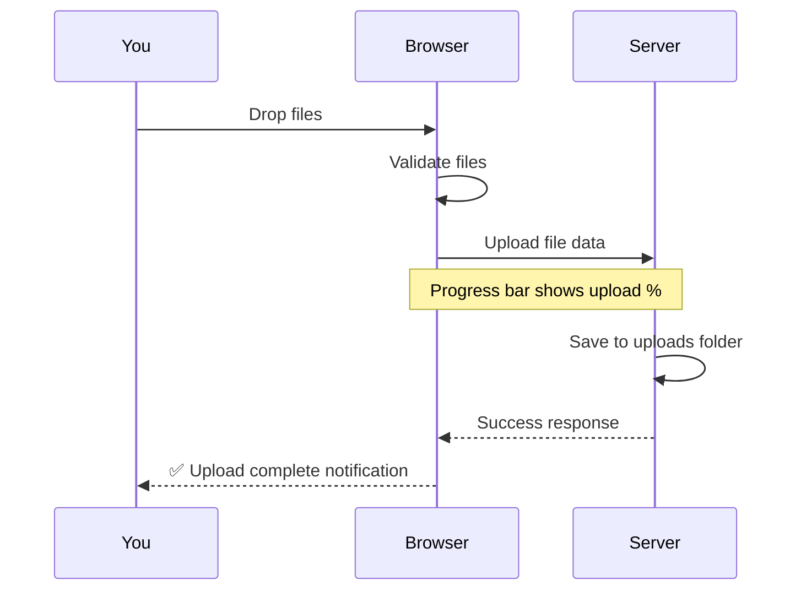
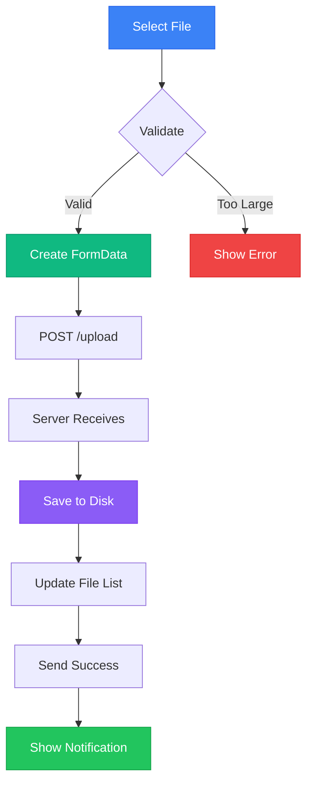

# 📤 Uploading Files

<div class="upload-hero">
  <h2>Learn How to Share Files</h2>
  <p>Master the art of uploading files to ShareJadPi - it's easier than you think!</p>
</div>

## 🎯 The Basics

Uploading files to ShareJadPi is incredibly simple. There are two ways:

<div class="methods-overview">

### Method 1: Drag & Drop 🖱️
Simply drag files from your file explorer directly onto the ShareJadPi window.

### Method 2: Click to Browse 📁
Click the upload area to open a file picker dialog.

</div>

Both methods work perfectly - use whichever feels more natural!

---

## 📖 Step-by-Step Tutorial

### Step 1: Open ShareJadPi

Make sure ShareJadPi is running and open the web interface in your browser:

```
http://localhost:5000
```

Or from another device:

```
http://192.168.1.100:5000
```

You should see the main interface:

<div class="interface-preview">

```
┌─────────────────────────────────────┐
│  📤 ShareJadPi v4.5.4-dev          │
├─────────────────────────────────────┤
│                                     │
│      📁  Drop files here           │
│         or click to browse          │
│                                     │
├─────────────────────────────────────┤
│  📂 Uploaded Files                  │
│  (empty)                            │
└─────────────────────────────────────┘
```

</div>

### Step 2: Select Your Files

**Using Drag & Drop:**
1. Open your file explorer (Finder on Mac, File Explorer on Windows)
2. Navigate to the files you want to share
3. Click and hold on the file(s)
4. Drag them over the ShareJadPi browser window
5. Drop them into the upload area

**Using Click to Browse:**
1. Click anywhere in the upload area
2. A file picker dialog opens
3. Navigate to your files
4. Select one or multiple files
5. Click "Open"

<div class="callout tip">
💡 <strong>Pro Tip:</strong> Hold Ctrl (Windows/Linux) or Cmd (Mac) to select multiple files at once!
</div>

### Step 3: Watch the Upload

Once you drop or select files, uploading begins automatically:



You'll see:
- ⏳ **Progress bar** showing upload progress
- 📊 **Percentage** (0% → 100%)
- ✨ **Shimmer animation** while uploading
- ✅ **Success message** when complete

### Step 4: Verify Upload

After upload completes:
- The progress bar disappears
- You see a **success notification**
- Your file appears in the "Uploaded Files" section
- The file is now accessible to all devices on the network!

---

## 🎨 What Happens During Upload?

### Behind the Scenes



1. **Validation**: File size checked (max 500MB)
2. **Encoding**: File wrapped in FormData
3. **Upload**: Sent via HTTP POST to `/upload`
4. **Processing**: Server receives and validates
5. **Storage**: File saved to `~/ShareJadPi-Dev/uploads/`
6. **Response**: Success message sent back
7. **UI Update**: File appears in list

---

## 📝 Upload Rules & Limits

### File Size Limit

<div class="limit-card">

**Maximum file size:** 500 MB per file

**Why?** This is a development server designed for typical file sharing scenarios. For larger files, consider:
- Splitting into smaller parts
- Using external storage
- Waiting for production version with configurable limits

</div>

### File Types

<div class="types-card">

**Supported:** ALL file types! ✅

ShareJadPi accepts any file extension:
- 📄 Documents (.pdf, .docx, .xlsx, etc.)
- 🖼️ Images (.jpg, .png, .svg, etc.)
- 🎬 Videos (.mp4, .mov, .avi, etc.)
- 🎵 Audio (.mp3, .wav, .flac, etc.)
- 📦 Archives (.zip, .tar, .7z, etc.)
- 💻 Code files (.py, .js, .html, etc.)
- ...literally anything!

</div>

### Filename Handling

**Duplicate names?** ShareJadPi automatically handles them:

```python
# Original upload
document.pdf → document.pdf

# If you upload another file with same name
document.pdf → document (1).pdf

# And another
document.pdf → document (2).pdf
```

<div class="callout warning">
⚠️ <strong>Note:</strong> Filenames are sanitized for security. Special characters may be removed or replaced.
</div>

---

## 🚀 Advanced Upload Techniques

### Multiple Files at Once

You can upload multiple files simultaneously:

**Drag & Drop:**
1. Select multiple files in your file explorer
2. Drag them all together
3. Drop onto ShareJadPi

**Click to Browse:**
1. Click the upload area
2. In the file picker, select multiple files:
   - Hold Ctrl/Cmd and click multiple files
   - Or hold Shift and click first and last file to select range
3. Click "Open"

**Result:** All files upload in parallel! 🎉

### Uploading from Different Devices

<div class="devices-section">

**From Your Phone:**
1. Open ShareJadPi URL in mobile browser
2. Tap the upload area
3. Choose "Photo Library" or "Browse"
4. Select photos/files
5. Tap "Done"

**From Your Tablet:**
1. Same as phone - works in any browser
2. iPads can drag & drop like desktop!

**From Another Computer:**
1. Open ShareJadPi URL
2. Use drag & drop or browse
3. Same experience as the host computer

</div>

---

## 🎯 Real-World Upload Scenarios

### Scenario 1: Photo Transfer
<div class="scenario">

**Goal:** Transfer 50 vacation photos from phone to computer

1. Run ShareJadPi on computer
2. Open ShareJadPi URL on phone
3. Tap upload area → Photo Library
4. Select all 50 photos
5. Tap "Choose"
6. Wait for upload (usually 30-60 seconds)
7. Photos now accessible on computer!

**Time:** 1-2 minutes vs 10+ minutes with cloud upload/download

</div>

### Scenario 2: Document Sharing
<div class="scenario">

**Goal:** Share a presentation with team in meeting room

1. You run ShareJadPi on laptop
2. Upload your presentation.pptx
3. Share the URL with team: `http://192.168.1.100:5000`
4. Everyone opens URL on their devices
5. Everyone downloads the presentation

**Benefit:** No email attachments, no USB drives, instant access for everyone

</div>

### Scenario 3: Large Video File
<div class="scenario">

**Goal:** Move a 400MB video from camera to computer for editing

1. Connect camera SD card to any device with browser
2. Open ShareJadPi URL
3. Upload the video file
4. From editing computer, download the video
5. Start editing immediately

**Speed:** Full LAN speed (often 100+ MB/s) = 4 seconds vs 20+ minutes uploading to cloud then downloading

</div>

---

## 🐛 Troubleshooting Uploads

### Problem: Upload Fails

**Possible causes:**
- File too large (> 500MB)
- Disk space full on server
- Network disconnection

**Solutions:**
1. Check file size - compress if needed
2. Check disk space: `df -h` (Mac/Linux) or File Explorer (Windows)
3. Ensure stable network connection

### Problem: Upload Stucks at 99%

**Solution:**

This is normal for large files - the server is finishing writing to disk. Wait a few more seconds.

### Problem: File Uploaded But Not Showing

**Solution:**

1. Refresh the page (F5)
2. Check the uploads folder manually: `~/ShareJadPi-Dev/uploads/`
3. Restart ShareJadPi if issue persists

### Problem: "No file provided" Error

**Solution:**

The file wasn't properly selected. Try again and ensure:
- You actually selected a file
- The file still exists at the location
- You have read permissions for the file

---

## ⚡ Performance Tips

### For Fastest Uploads

<div class="performance-tips">

1. **Use Wired Connection**
   - Ethernet is faster than Wi-Fi
   - Expected: 100-1000 MB/s wired vs 10-50 MB/s Wi-Fi

2. **Close Unnecessary Apps**
   - Free up network bandwidth
   - Close downloads, streaming, etc.

3. **Upload One Large File at a Time**
   - Better than many small files simultaneously
   - Reduces overhead

4. **Use Same Router**
   - All devices connected to same Wi-Fi router
   - Avoid guest networks or range extenders

5. **Compress When Possible**
   - ZIP large folders before uploading
   - Smaller size = faster transfer

</div>

---

## 🎓 Next Steps

<div class="next-steps">

Now that you can upload files, learn how to download them:

[Continue to Downloading Files →](/guide/downloading){.cta-button}

Or explore related topics:
- [Managing Files](/guide/managing-files) - Delete and organize
- [API Reference](/api) - Programmatic uploads

</div>

---

<style>
.upload-hero {
  text-align: center;
  padding: 3rem 2rem;
  background: linear-gradient(135deg, rgba(16, 185, 129, 0.1), rgba(5, 150, 105, 0.05));
  border-radius: 16px;
  margin-bottom: 3rem;
}

.upload-hero h2 {
  font-size: 2.5rem;
  background: linear-gradient(135deg, #10b981, #059669);
  -webkit-background-clip: text;
  -webkit-text-fill-color: transparent;
  margin-bottom: 1rem;
}

.methods-overview {
  display: grid;
  grid-template-columns: repeat(auto-fit, minmax(250px, 1fr));
  gap: 1.5rem;
  margin: 2rem 0;
}

.methods-overview h3 {
  color: #10b981;
}

.interface-preview {
  background: rgba(0, 0, 0, 0.4);
  border: 1px solid rgba(16, 185, 129, 0.3);
  border-radius: 12px;
  padding: 2rem;
  margin: 2rem 0;
  font-family: 'Monaco', 'Courier New', monospace;
}

.callout {
  padding: 1.5rem;
  border-radius: 12px;
  border-left: 4px solid;
  margin: 2rem 0;
}

.callout.tip {
  background: rgba(16, 185, 129, 0.1);
  border-color: #10b981;
}

.callout.warning {
  background: rgba(245, 158, 11, 0.1);
  border-color: #f59e0b;
}

.limit-card, .types-card {
  background: rgba(59, 130, 246, 0.1);
  border: 1px solid rgba(59, 130, 246, 0.3);
  border-radius: 12px;
  padding: 2rem;
  margin: 2rem 0;
}

.devices-section {
  background: rgba(139, 92, 246, 0.1);
  border: 1px solid rgba(139, 92, 246, 0.3);
  border-radius: 12px;
  padding: 2rem;
  margin: 2rem 0;
}

.scenario {
  background: rgba(16, 185, 129, 0.05);
  border-left: 4px solid #10b981;
  padding: 1.5rem;
  border-radius: 8px;
  margin: 1rem 0;
}

.performance-tips {
  background: rgba(245, 158, 11, 0.1);
  border: 1px solid rgba(245, 158, 11, 0.3);
  border-radius: 12px;
  padding: 2rem;
  margin: 2rem 0;
}

.next-steps {
  text-align: center;
  padding: 3rem 2rem;
  background: linear-gradient(135deg, rgba(16, 185, 129, 0.1), rgba(5, 150, 105, 0.05));
  border-radius: 16px;
  margin: 3rem 0;
}

.cta-button {
  display: inline-block;
  padding: 1rem 2rem;
  background: linear-gradient(135deg, #10b981, #059669);
  color: white !important;
  text-decoration: none;
  border-radius: 8px;
  font-weight: 600;
  margin-top: 1rem;
  transition: all 0.3s ease;
}

.cta-button:hover {
  transform: translateY(-2px);
  box-shadow: 0 8px 24px rgba(16, 185, 129, 0.3);
}
</style>
