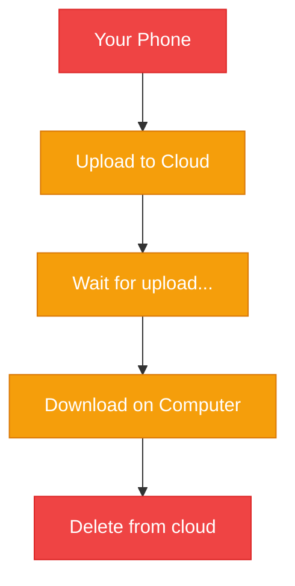
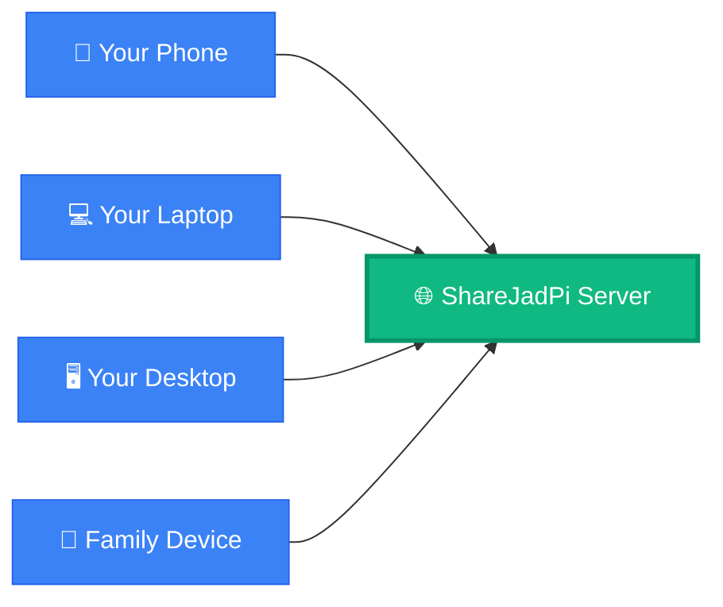
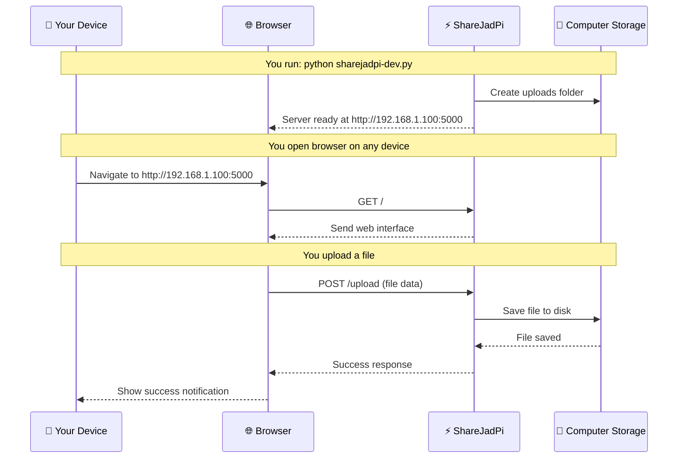

# 🎯 What is ShareJadPi?

  <h2>Understanding the Core Concept</h2>
  
Before diving into installation, let's understand what ShareJadPi is and why it exists.

## 💡 The Problem

Have you ever faced these situations?

- 📱 Need to transfer photos from your phone to your laptop?
- 💼 Want to share large files with colleagues on the same office network?
- 🏠 Need to access files from another room without a USB drive?
- 🚀 Tired of uploading to cloud services just to download on another device?

**Traditional solutions are complicated:**

*Too many steps. Internet required. Privacy concerns. Storage limits.*

---

## ✨ The ShareJadPi Solution

**ShareJadPi makes it simple:**

**One central hub. All devices connected. Direct transfers. No internet needed.**

### How It Works (Simple Version)

1. **Run ShareJadPi** on any computer
2. **Connect devices** to the same Wi-Fi
3. **Open browser** on any device
4. **Drag & drop** files to share
5. **Done!** ✨

---

## 🎭 Real-World Scenarios

### Scenario 1: Home Office

**The Situation:**
You're working from home. Your work computer is upstairs, personal laptop is downstairs. You need files from both, but don't want to keep running up and down stairs.

**With ShareJadPi:**
- Run ShareJadPi on work computer
- Access from laptop via browser
- Transfer files instantly
- No cloud uploads needed

**Time saved:** 15 minutes → 30 seconds

### Scenario 2: Team Collaboration

**The Situation:**
Your team is in the office working on a project. Everyone needs to share design files, documents, and videos. Office internet is slow.

**With ShareJadPi:**
- One person runs ShareJadPi
- Everyone connects via office Wi-Fi
- Share files at local network speed (100+ MB/s)
- No internet bandwidth used

**Speed improvement:** 10x faster than cloud

### Scenario 3: Photography Workflow

**The Situation:**
You took hundreds of photos on your phone at an event. Need them on your computer for editing. Each photo is 5-10MB.

**With ShareJadPi:**
- Run ShareJadPi on computer
- Open ShareJadPi on phone browser
- Select all photos, upload
- Continue working while they transfer

**vs Cloud:** No upload limits, no internet required, much faster

---

## 🏗️ Technical Overview (For Curious Minds)

### What Is It Really?

**ShareJadPi is a web application** that creates a file sharing server on your local network.

**In technical terms:**
- **Backend:** Python Flask server
- **Frontend:** Modern HTML/CSS/JavaScript
- **Protocol:** HTTP/HTTPS over LAN
- **Storage:** Local filesystem
- **Architecture:** Client-server model

### How It Actually Works

### What Makes It Special?

| Aspect | Traditional Cloud | ShareJadPi |
|--------|------------------|------------|
| **Location** | Remote servers | Your computer |
| **Speed** | Internet speed | LAN speed (10-100x faster) |
| **Privacy** | Data on cloud | Data stays local |
| **Cost** | Subscription | Free & Open Source |
| **Limits** | Storage quotas | Only disk space |
| **Offline** | ❌ Needs internet | ✅ Works offline |

---

## 🎯 Key Concepts

### 🖥️ Server

The ShareJadPi application running on one computer. This computer hosts the files and provides the web interface.

**Think of it as:** The library that holds all books

### 🌐 Client

Any device with a web browser that connects to the server. Your phone, tablet, laptop, etc.

**Think of it as:** People visiting the library

### 📁 Uploads Folder

A folder on the server computer where all shared files are stored. Located at `~/ShareJadPi-Dev/uploads`.

**Think of it as:** The shelves in the library

### 🔗 Network URL

The web address to access ShareJadPi, like `http://192.168.1.100:5000`. All devices use this to connect.

**Think of it as:** The library's address

---

## ✅ What ShareJadPi Does

✅ **Upload files** from any device via web browser  
✅ **Download files** that others have shared  
✅ **Delete files** you no longer need  
✅ **List files** to see what's available  
✅ **Works on any device** with a web browser (phone, tablet, computer)  
✅ **No installation on clients** - just open the URL  
✅ **Beautiful interface** - dark theme, smooth animations  
✅ **Fast transfers** - full LAN speed  
✅ **Cross-platform** - works on Windows, Mac, Linux

---

## ❌ What ShareJadPi Doesn't Do (Currently)

❌ **No internet sharing** - only works on local network (coming in Phase 3)  
❌ **No password protection** - anyone on network can access (coming in Phase 3)  
❌ **No user accounts** - single shared space (planned for Phase 5)  
❌ **No automatic sync** - manual upload/download (may come in Phase 5)  
❌ **No mobile app** - browser only (planned for Phase 5)

These limitations are intentional for the development version. They'll be added in future phases!

---

## 🎓 Who Should Use ShareJadPi?

### Perfect For:
- 🏠 **Home users** sharing files between personal devices
- 👨‍👩‍👧‍👦 **Families** sharing photos and documents
- 💼 **Small teams** collaborating on local networks
- 🎓 **Students** transferring files between devices
- 📸 **Photographers** moving large photo libraries
- 🎬 **Content creators** handling large video files
- 💻 **Developers** testing file transfer workflows

### Not Ideal For (Yet):
- 🌍 **Remote access** (no internet sharing yet)
- 🏢 **Large enterprises** (no user management yet)
- 🔐 **Sensitive data** (no encryption/auth yet)
- 📱 **Mobile-first users** (web browser only)

---

## 🚀 Ready to Install?

Now that you understand what ShareJadPi is and how it works, let's get it installed on your machine!

### What You'll Need:
- A computer (Windows, Mac, or Linux)
- Python 3.7 or higher
- 5 minutes of your time

[Continue to Installation →](/guide/installation){.cta-button}

---

