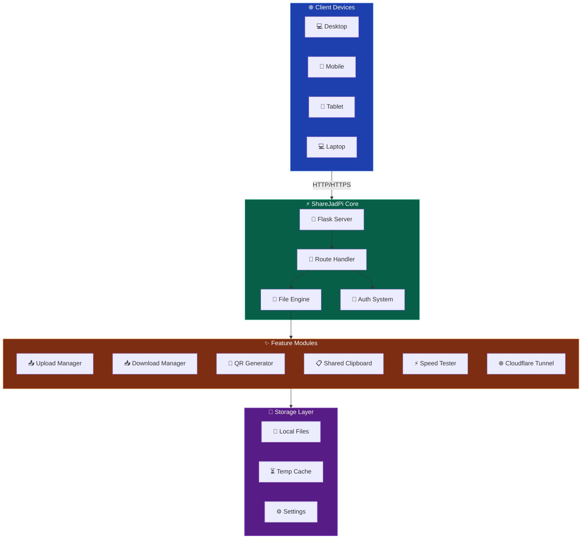

<div class="vp-doc custom-home">

<!-- Hero Stats Section -->
<div class="stats-section">
  <div class="stat-card">
    <div class="stat-number">4.5.4-dev</div>
    <div class="stat-label">Latest Version</div>
  </div>
  <div class="stat-card">
    <div class="stat-number">6</div>
    <div class="stat-label">API Endpoints</div>
  </div>
  <div class="stat-card">
    <div class="stat-number">813</div>
    <div class="stat-label">Lines of Code</div>
  </div>
  <div class="stat-card">
    <div class="stat-number">100%</div>
    <div class="stat-label">Open Source</div>
  </div>
</div>

## 🎬 What is ShareJadPi?

<div class="intro-card">

**ShareJadPi** is a modern, feature-rich file sharing application designed for **local networks** with optional **internet sharing capabilities**. Built with Python and Flask, it provides an elegant web interface that works on any device with a browser.

Whether you're sharing files between your phone and computer, collaborating with teammates, or quickly transferring large files across devices — ShareJadPi makes it effortless.

</div>

## 🏗️ Architecture Overview



## 🚀 Quick Start

<div class="code-showcase">

```bash
# 📥 Clone the repository
git clone https://github.com/hetcharusat/sharejadpi.git
cd sharejadpi

# 📦 Install dependencies
pip install -r requirements.txt

# 🚀 Launch ShareJadPi
python sharejadpi.py
```

</div>

<div class="tip-card">
💡 <strong>Pro Tip:</strong> Your browser opens automatically! Access from other devices using the network URL shown in the terminal.
</div>

## ✨ Feature Highlights

<div class="feature-grid">

<div class="feature-card">
<div class="feature-icon">📤</div>
<h3>Smart Upload System</h3>

- **Drag & Drop** - Simply drag files onto the browser
- **Multi-file Support** - Upload entire folders at once
- **Progress Tracking** - Real-time upload progress bars
- **Auto-naming** - Handles duplicate filenames intelligently
- **Size Validation** - Configurable upload limits

</div>

<div class="feature-card">
<div class="feature-icon">📥</div>
<h3>Powerful Downloads</h3>

- **Direct Links** - One-click file downloads
- **Bulk Selection** - Select and download multiple files
- **ZIP Packaging** - Compress selected files on-the-fly
- **Resume Support** - Pause and resume large downloads
- **Streaming** - Efficient chunked file transfer

</div>

<div class="feature-card">
<div class="feature-icon">🌐</div>
<h3>Internet Sharing</h3>

- **Cloudflare Tunnel** - Share files globally
- **No Port Forwarding** - Works behind any firewall
- **Token Security** - Protected share links
- **Auto Cleanup** - Shares expire automatically
- **Activity Monitoring** - Track who accessed your files

</div>

<div class="feature-card">
<div class="feature-icon">📋</div>
<h3>Shared Clipboard</h3>

- **Cross-Device Sync** - Copy on one, paste on another
- **Rich Text Support** - Preserves formatting
- **One-Click Copy** - Instant clipboard operations
- **History** - Access recent clipboard items
- **Secure** - Stays on your local network

</div>

</div>

## 📊 System Flow

```mermaid
sequenceDiagram
    participant U as 👤 User
    participant B as 🌐 Browser
    participant S as ⚡ ShareJadPi
    participant D as 💾 Disk
    participant C as ☁️ Cloudflare
    
    rect rgb(30, 64, 175)
        Note over U,B: Local Upload
        U->>B: Drag & Drop Files
        B->>S: POST /upload (FormData)
        S->>D: Save to uploads/
        D-->>S: ✓ Saved
        S-->>B: { success: true }
        B-->>U: 🎉 Upload Complete!
    end
    
    rect rgb(6, 95, 70)
        Note over U,C: Internet Sharing
        U->>B: Click "Share Online"
        B->>S: POST /api/share-online
        S->>C: Start Cloudflare Tunnel
        C-->>S: Public URL + Token
        S-->>B: { url, token, qr }
        B-->>U: 📱 QR Code + Link
    end
    
    rect rgb(124, 45, 18)
        Note over U,D: Download
        U->>B: Click Download
        B->>S: GET /download/<id>
        S->>D: Read file
        D-->>S: File bytes
        S-->>B: File stream
        B-->>U: 📥 File saved!
    end
```



## 🛣️ Roadmap

<div class="roadmap">

<div class="roadmap-phase completed">
<div class="phase-header">
  <span class="phase-badge done">✓ COMPLETE</span>
  <h3>Phase 1: Foundation</h3>
</div>
<div class="phase-content">

- ✅ Core Flask application
- ✅ File upload/download
- ✅ Web interface
- ✅ Network auto-discovery
- ✅ Cross-platform support

</div>
</div>

<div class="roadmap-phase completed">
<div class="phase-header">
  <span class="phase-badge done">✓ COMPLETE</span>
  <h3>Phase 2: Modern UI</h3>
</div>
<div class="phase-content">

- ✅ Dark theme design
- ✅ Smooth animations
- ✅ Responsive layout
- ✅ Progress indicators
- ✅ Toast notifications

</div>
</div>

<div class="roadmap-phase completed">
<div class="phase-header">
  <span class="phase-badge done">✓ COMPLETE</span>
  <h3>Phase 3: Advanced Features</h3>
</div>
<div class="phase-content">

- ✅ QR code generation
- ✅ Shared clipboard
- ✅ Context menu integration
- ✅ Cloudflare tunnel
- ✅ Token authentication

</div>
</div>

<div class="roadmap-phase current">
<div class="phase-header">
  <span class="phase-badge active">🔄 IN PROGRESS</span>
  <h3>Phase 4: Polish & Performance</h3>
</div>
<div class="phase-content">

- ✅ Speed test utility
- ✅ Settings panel
- 🔄 Performance optimization
- 🔄 Comprehensive testing
- 📋 Documentation

</div>
</div>

<div class="roadmap-phase future">
<div class="phase-header">
  <span class="phase-badge planned">📅 PLANNED</span>
  <h3>Phase 5: Enterprise</h3>
</div>
<div class="phase-content">

- 📋 User management
- 📋 Analytics dashboard
- 📋 Plugin system
- 📋 Mobile app
- 📋 Cloud sync option

</div>
</div>

</div>

## 💻 Tech Stack

<div class="tech-grid">
  <div class="tech-item">
    <div class="tech-icon">🐍</div>
    <div class="tech-name">Python 3.8+</div>
  </div>
  <div class="tech-item">
    <div class="tech-icon">🌶️</div>
    <div class="tech-name">Flask</div>
  </div>
  <div class="tech-item">
    <div class="tech-icon">🎨</div>
    <div class="tech-name">Modern CSS</div>
  </div>
  <div class="tech-item">
    <div class="tech-icon">⚡</div>
    <div class="tech-name">JavaScript</div>
  </div>
  <div class="tech-item">
    <div class="tech-icon">☁️</div>
    <div class="tech-name">Cloudflare</div>
  </div>
  <div class="tech-item">
    <div class="tech-icon">📦</div>
    <div class="tech-name">PyInstaller</div>
  </div>
</div>

## 🤝 Contributing

We love contributions! Whether it's bug fixes, new features, or documentation improvements.

<div class="cta-buttons">
  <a href="/development/contributing" class="cta-button primary">📝 Contribution Guide</a>
  <a href="https://github.com/hetcharusat/sharejadpi/issues" class="cta-button secondary">🐛 Report Issues</a>
  <a href="https://github.com/hetcharusat/sharejadpi" class="cta-button secondary">⭐ Star on GitHub</a>
</div>

---

<div class="footer-note">
  Built with ❤️ by <strong>Het Charusat</strong> • Licensed under MIT • v4.5.4
</div>

</div>

<style>
.custom-home {
  padding: 0 24px 48px;
}

.stats-section {
  display: grid;
  grid-template-columns: repeat(auto-fit, minmax(140px, 1fr));
  gap: 16px;
  margin: 40px 0;
}

.stat-card {
  background: linear-gradient(135deg, rgba(34,197,94,0.1), rgba(59,130,246,0.1));
  border: 1px solid rgba(34,197,94,0.3);
  border-radius: 12px;
  padding: 20px;
  text-align: center;
}

.stat-number {
  font-size: 2rem;
  font-weight: 800;
  background: linear-gradient(135deg, #22c55e, #3b82f6);
  -webkit-background-clip: text;
  -webkit-text-fill-color: transparent;
  background-clip: text;
}

.stat-label {
  font-size: 0.85rem;
  color: var(--vp-c-text-2);
  margin-top: 4px;
}

.intro-card {
  background: var(--vp-c-bg-soft);
  border-left: 4px solid var(--vp-c-brand);
  padding: 20px 24px;
  border-radius: 0 12px 12px 0;
  margin: 24px 0;
  font-size: 1.1rem;
  line-height: 1.7;
}

.tip-card {
  background: linear-gradient(135deg, rgba(245,158,11,0.1), rgba(245,158,11,0.05));
  border: 1px solid rgba(245,158,11,0.3);
  border-radius: 12px;
  padding: 16px 20px;
  margin: 20px 0;
}

.code-showcase {
  margin: 24px 0;
}

.feature-grid {
  display: grid;
  grid-template-columns: repeat(auto-fit, minmax(280px, 1fr));
  gap: 20px;
  margin: 24px 0;
}

.feature-card {
  background: var(--vp-c-bg-soft);
  border: 1px solid var(--vp-c-divider);
  border-radius: 12px;
  padding: 24px;
  transition: all 0.3s ease;
}

.feature-card:hover {
  border-color: var(--vp-c-brand);
  transform: translateY(-4px);
  box-shadow: 0 12px 24px rgba(0,0,0,0.15);
}

.feature-icon {
  font-size: 2.5rem;
  margin-bottom: 12px;
}

.feature-card h3 {
  margin: 0 0 12px 0;
  font-size: 1.2rem;
}

.feature-card ul {
  margin: 0;
  padding-left: 0;
  list-style: none;
}

.feature-card li {
  padding: 4px 0;
  font-size: 0.9rem;
  color: var(--vp-c-text-2);
}

.roadmap {
  margin: 24px 0;
}

.roadmap-phase {
  background: var(--vp-c-bg-soft);
  border: 1px solid var(--vp-c-divider);
  border-radius: 12px;
  padding: 20px;
  margin-bottom: 16px;
  border-left: 4px solid;
}

.roadmap-phase.completed {
  border-left-color: #22c55e;
}

.roadmap-phase.current {
  border-left-color: #3b82f6;
  background: linear-gradient(135deg, var(--vp-c-bg-soft), rgba(59,130,246,0.05));
}

.roadmap-phase.future {
  border-left-color: #9ca3af;
  opacity: 0.8;
}

.phase-header {
  display: flex;
  align-items: center;
  gap: 12px;
  margin-bottom: 12px;
}

.phase-header h3 {
  margin: 0;
  font-size: 1.1rem;
}

.phase-badge {
  font-size: 0.7rem;
  font-weight: 700;
  padding: 4px 10px;
  border-radius: 9999px;
  text-transform: uppercase;
  letter-spacing: 0.5px;
}

.phase-badge.done {
  background: #22c55e;
  color: #052e16;
}

.phase-badge.active {
  background: #3b82f6;
  color: white;
}

.phase-badge.planned {
  background: #6b7280;
  color: white;
}

.phase-content {
  padding-left: 8px;
}

.phase-content ul {
  margin: 0;
  padding-left: 0;
  list-style: none;
}

.phase-content li {
  padding: 3px 0;
  font-size: 0.9rem;
}

.tech-grid {
  display: grid;
  grid-template-columns: repeat(auto-fit, minmax(100px, 1fr));
  gap: 16px;
  margin: 24px 0;
}

.tech-item {
  background: var(--vp-c-bg-soft);
  border: 1px solid var(--vp-c-divider);
  border-radius: 12px;
  padding: 20px 16px;
  text-align: center;
  transition: all 0.2s;
}

.tech-item:hover {
  border-color: var(--vp-c-brand);
  transform: scale(1.05);
}

.tech-icon {
  font-size: 2rem;
  margin-bottom: 8px;
}

.tech-name {
  font-size: 0.85rem;
  font-weight: 600;
}

.cta-buttons {
  display: flex;
  flex-wrap: wrap;
  gap: 12px;
  margin: 24px 0;
}

.cta-button {
  padding: 12px 24px;
  border-radius: 8px;
  font-weight: 600;
  text-decoration: none;
  transition: all 0.2s;
}

.cta-button.primary {
  background: var(--vp-c-brand);
  color: white;
}

.cta-button.secondary {
  background: var(--vp-c-bg-soft);
  color: var(--vp-c-text-1);
  border: 1px solid var(--vp-c-divider);
}

.cta-button:hover {
  transform: translateY(-2px);
  box-shadow: 0 4px 12px rgba(0,0,0,0.15);
}

.footer-note {
  text-align: center;
  padding: 24px;
  color: var(--vp-c-text-2);
  font-size: 0.9rem;
}

@media (max-width: 640px) {
  .stats-section {
    grid-template-columns: repeat(2, 1fr);
  }
  .feature-grid {
    grid-template-columns: 1fr;
  }
  .cta-buttons {
    flex-direction: column;
  }
}
</style>
