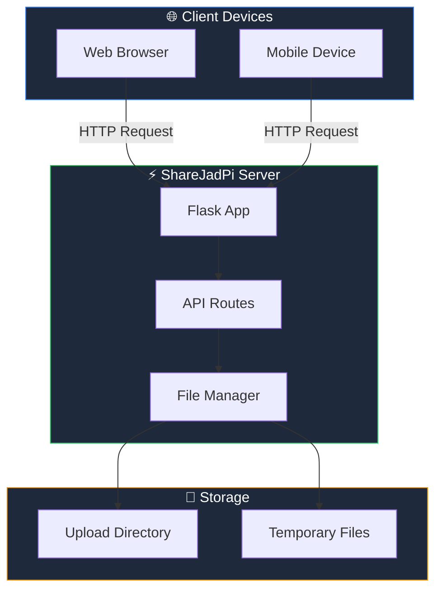

<div class="vp-doc" style="padding: 2rem;">

## 🚀 Quick Start

```bash
# Clone the repository
git clone https://github.com/hetcharusat/sharejadpi.git
cd sharejadpi

# Install dependencies
pip install -r requirements.txt

# Run ShareJadPi
python sharejadpi.py
```

Your browser will automatically open to the ShareJadPi interface!

## 📊 System Architecture

The following diagram shows how ShareJadPi works:



## 💡 Key Features

| Feature | Description | Status |
|---------|-------------|--------|
| **File Upload** | Drag-drop or click-to-upload with progress | ✅ Available |
| **File Download** | Direct download links for all files | ✅ Available |
| **File Management** | Delete files through the web interface | ✅ Available |
| **Auto IP Detection** | Automatically finds your network IP | ✅ Available |
| **Dark Theme** | Modern dark UI with gradient accents | ✅ Available |
| **Mobile Responsive** | Works on all screen sizes | ✅ Available |

## 🛠️ Development Server

For local development and testing, use the lightweight dev server:

```bash
cd SGP_phase1
python sharejadpi-dev.py
```

The dev server includes:
- 🔄 Hot reload for instant feedback
- 📊 Debug mode with detailed logging  
- 🎯 Simplified codebase for easy modification

[Learn more about development →](/development/dev-server)

## 📈 Project Status

<div style="background: linear-gradient(135deg, rgba(34,197,94,0.1), rgba(59,130,246,0.1)); border-radius: 12px; padding: 20px; border: 1px solid rgba(34,197,94,0.3); margin: 20px 0;">

**Current Version:** `4.5.4`

| Milestone | Progress | Status |
|-----------|----------|--------|
| Core File Sharing | 100% | ✅ Complete |
| Modern UI Design | 100% | ✅ Complete |
| Development Tools | 100% | ✅ Complete |
| Documentation | 90% | 🔄 In Progress |
| Testing Suite | 50% | 🔄 In Progress |

</div>

## 🤝 Contributing

We welcome contributions! Check out our [Contributing Guide](/development/contributing) to get started.

</div>
