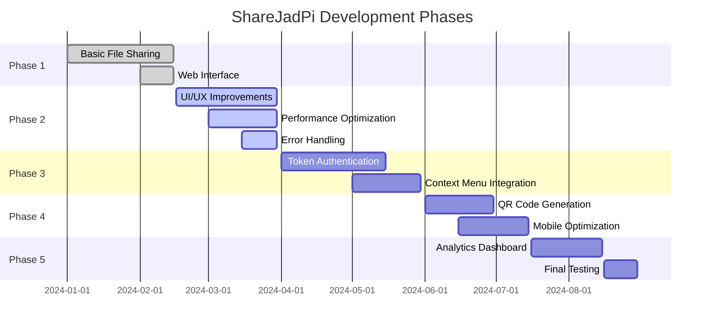
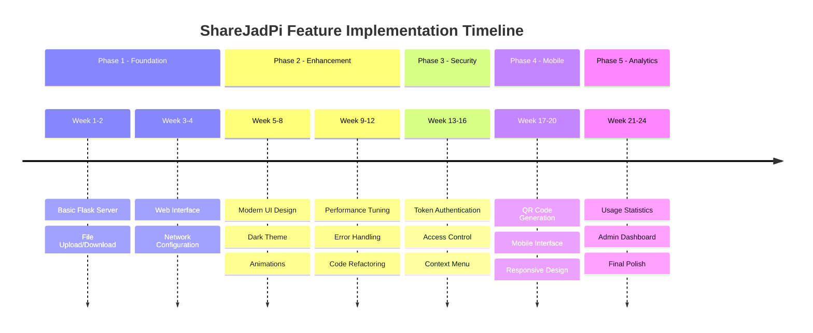

# Development Timeline

## Project Phases Overview

ShareJadPi development is structured across 5 major phases, each building upon the previous one.

## Detailed Timeline

## Current Status by Component

| Component | Status | Phase | Progress | Notes |
|-----------|--------|-------|----------|-------|
| Flask Backend | ✅ Stable | Phase 1 | 100% | Core functionality complete |
| File Upload/Download | ✅ Stable | Phase 1 | 100% | Working reliably |
| Web Interface | ✅ Stable | Phase 1 | 100% | Responsive design implemented |
| Dark Theme UI | ✅ Stable | Phase 2 | 100% | Modern animations added |
| Network Discovery | ✅ Stable | Phase 1 | 100% | Auto-configuration working |
| Error Handling | 🔄 In Progress | Phase 2 | 60% | Improving validation |
| Performance Optimization | 🔄 In Progress | Phase 2 | 40% | Ongoing improvements |
| Token Authentication | 📅 Planned | Phase 3 | 0% | Security architecture designed |
| Context Menu Integration | 📅 Planned | Phase 3 | 0% | Windows integration planned |
| QR Code Sharing | 📅 Planned | Phase 4 | 0% | Mobile access feature |
| Analytics Dashboard | 📅 Planned | Phase 5 | 0% | Usage tracking planned |

## Phase Breakdown

### Phase 1: Foundation ✅ Complete (100%)
- ✅ Flask web server implementation
- ✅ Basic file upload/download functionality
- ✅ Simple web interface
- ✅ Local network configuration
- ✅ Initial testing and deployment

**Completion Date:** February 15, 2024

### Phase 2: Core Development 🔄 Active (45%)
- ✅ Modern dark theme UI
- ✅ Smooth animations and transitions
- ✅ Responsive design improvements
- 🔄 Performance optimization (40%)
- 🔄 Enhanced error handling (60%)
- 🔄 Code refactoring (50%)
- 📋 Testing framework setup

**Target Completion:** March 30, 2024

::: tip Current Focus
We're currently optimizing performance and improving error handling. The UI modernization phase is complete!
:::

### Phase 3: Security & Integration 📅 Planned (0%)
- 📅 Token-based authentication system
- 📅 User access control
- 📅 Windows context menu integration
- 📅 Secure file transfer protocols
- 📅 Session management

**Planned Start:** April 1, 2024

### Phase 4: Mobile & Accessibility 📅 Planned (0%)
- 📅 QR code generation for quick access
- 📅 Mobile-optimized interface
- 📅 Progressive Web App (PWA) features
- 📅 Offline capability
- 📅 Touch-friendly controls

**Planned Start:** June 1, 2024

### Phase 5: Analytics & Final Polish 📅 Planned (0%)
- 📅 Usage statistics tracking
- 📅 Admin dashboard
- 📅 Performance monitoring
- 📅 Comprehensive documentation
- 📅 Final testing and bug fixes

**Planned Start:** July 16, 2024

## Key Milestones

- **✅ Milestone 1:** Basic file sharing functional (Completed: Feb 2024)
- **✅ Milestone 2:** Modern UI implementation (Completed: Mar 2024)
- **🔄 Milestone 3:** Performance optimization (In Progress)
- **📅 Milestone 4:** Security features (Planned: Apr 2024)
- **📅 Milestone 5:** Mobile support (Planned: Jun 2024)
- **📅 Milestone 6:** Production ready (Target: Aug 2024)

## Technology Stack Progress

| Technology | Implementation Status | Notes |
|------------|----------------------|-------|
| Python 3.x | ✅ Stable | Core language |
| Flask 3.x | ✅ Stable | Web framework |
| HTML5/CSS3 | ✅ Stable | Modern UI |
| JavaScript | ✅ Stable | Frontend interactions |
| Socket.IO | 📅 Planned | Real-time features |
| SQLite | 📅 Planned | Data persistence |
| PyInstaller | ✅ Stable | Windows packaging |

## Version History

- **v4.5.4** - Latest stable release (UI improvements)
- **v4.5.3** - Enhanced notifications
- **v4.5.2** - Bug fixes and optimizations
- **v4.5.1** - Performance improvements
- **v4.5.0** - Major UI overhaul
- **v4.1.3** - Stability improvements
- **v4.0.0** - Production release

::: info Repository
Full source code and version history available on [GitHub](https://github.com/hetcharusat/sharejadpi)
:::
