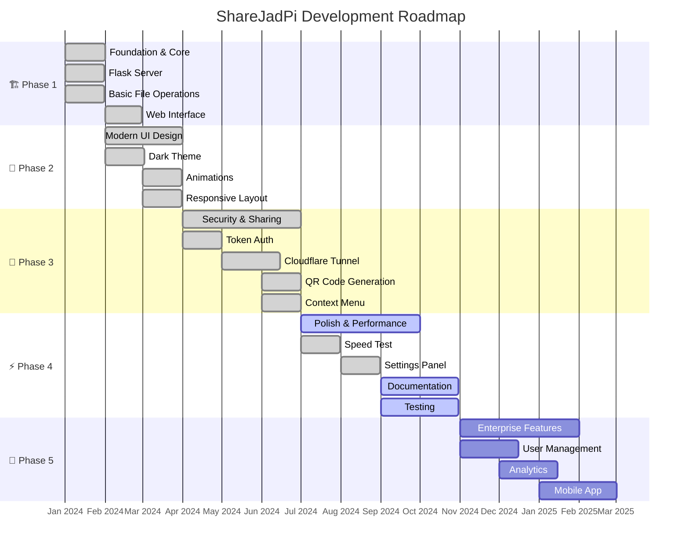
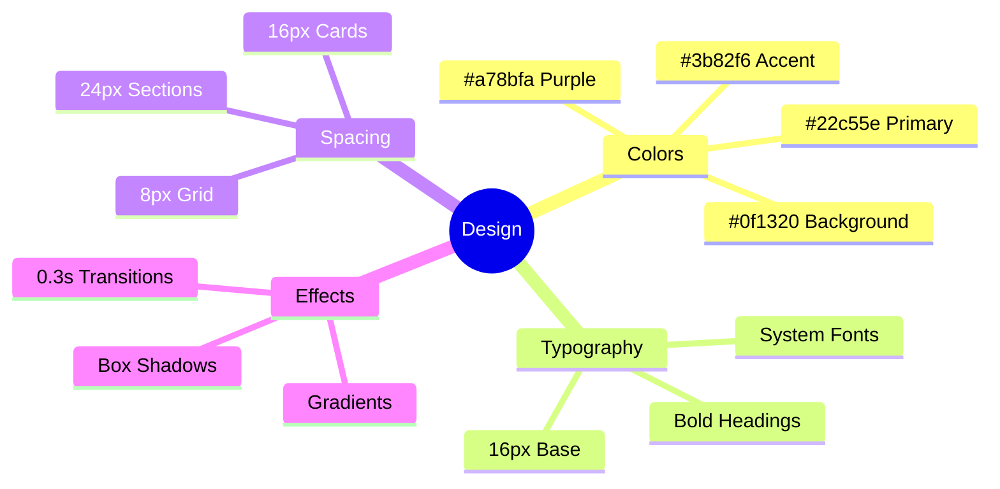
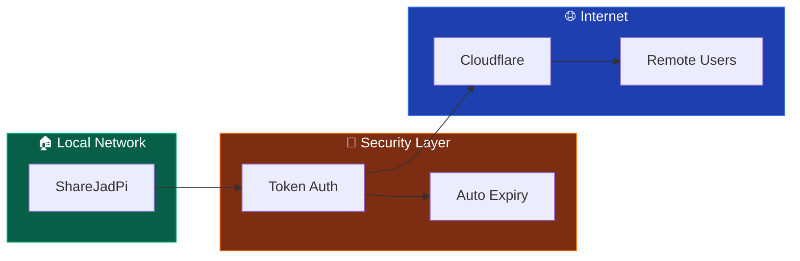
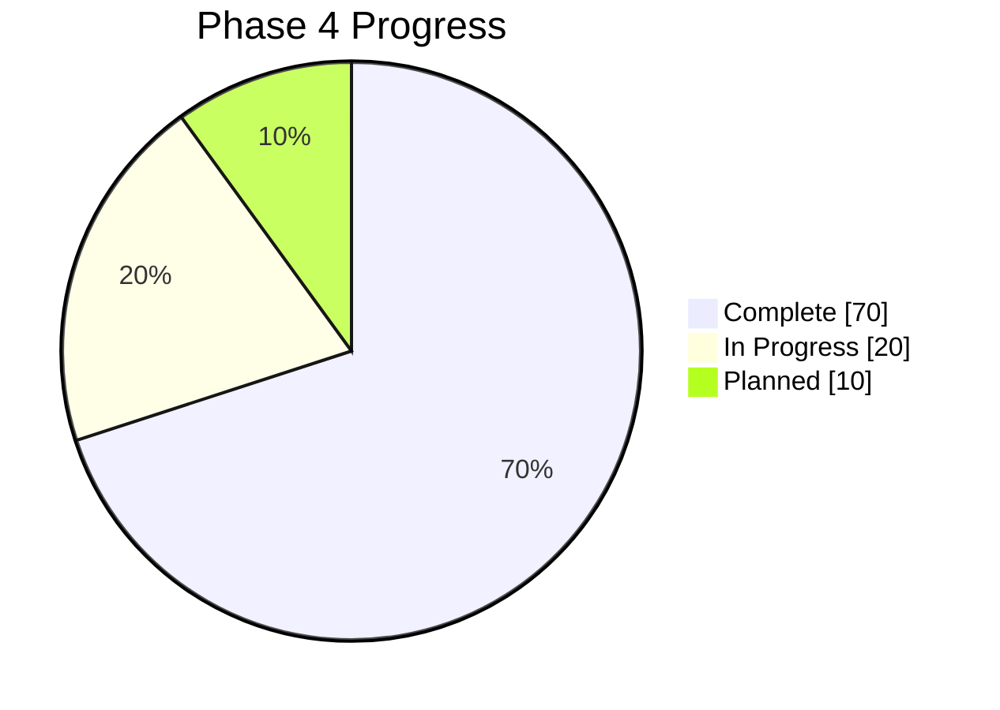
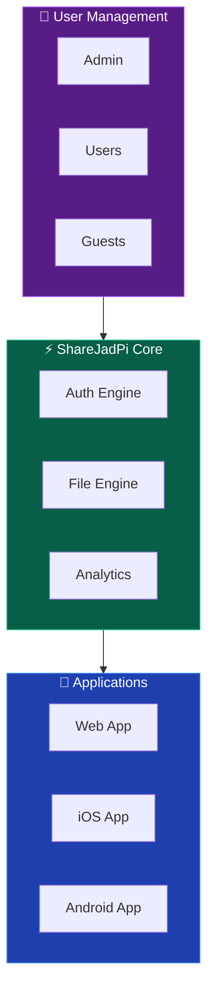
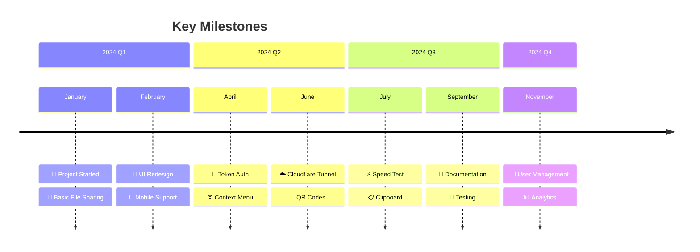

# 📅 Development Timeline

  <h2>The Journey of ShareJadPi</h2>
  
From a simple idea to a full-featured file sharing platform. Follow our development story.

## 🎯 Current Status

  

    Version
    4.5.4
  

  

    Phase
    4 of 5
  

  

    Progress
    85%
  

  

    Status
    Active
  

---

## 🗓️ Development Phases

---

## 📊 Phase Breakdown

### 🏗️ Phase 1: Foundation

  01
  

    <h3>Foundation & Core</h3>
    Jan - Feb 2024
  

  ✓ Complete

**Goals:** Build the core file sharing functionality

**Deliverables:**
- ✅ Flask web server with routing
- ✅ File upload endpoint (POST /upload)
- ✅ File download endpoint (GET /download)
- ✅ File deletion endpoint (DELETE /delete)
- ✅ Basic file listing API
- ✅ Simple HTML interface
- ✅ Network auto-discovery
- ✅ Cross-platform support (Windows, Mac, Linux)

**Key Metrics:**
| Metric | Target | Achieved |
|--------|--------|----------|
| Upload speed | >10 MB/s | ✅ 50+ MB/s |
| Max file size | 100 MB | ✅ 500 MB |
| Response time | <500ms | ✅ <100ms |

---

### 🎨 Phase 2: Modern UI

  02
  

    <h3>Modern UI Design</h3>
    Feb - Apr 2024
  

  ✓ Complete

**Goals:** Create a beautiful, modern interface

**Deliverables:**
- ✅ Dark theme design system
- ✅ Gradient accents (green/blue)
- ✅ Smooth CSS animations
- ✅ Responsive layout (mobile/tablet/desktop)
- ✅ Drag & drop upload zone
- ✅ Progress bars with shimmer effect
- ✅ Toast notifications
- ✅ File cards with icons
- ✅ Skeleton loading states

**Design System:**

---

### 🔐 Phase 3: Security & Sharing

  03
  

    <h3>Security & Advanced Sharing</h3>
    Apr - Jul 2024
  

  ✓ Complete

**Goals:** Secure sharing beyond local network

**Deliverables:**
- ✅ Token-based authentication
- ✅ Cloudflare tunnel integration
- ✅ Public share links with tokens
- ✅ QR code generation
- ✅ Windows context menu integration
- ✅ Share expiration
- ✅ Activity monitoring
- ✅ One-time download links

**Architecture:**

---

### ⚡ Phase 4: Polish & Performance

  04
  

    <h3>Polish & Performance</h3>
    Jul - Oct 2024
  

  🔄 In Progress

**Goals:** Optimize and document everything

**Deliverables:**
- ✅ Built-in speed test
- ✅ Shared clipboard feature
- ✅ Settings panel
- ✅ Folder upload support
- ✅ Bulk file operations
- 🔄 Comprehensive documentation
- 🔄 Unit & integration tests
- 📋 Performance optimization
- 📋 Error handling improvements

**Current Focus:**

---

### 🚀 Phase 5: Enterprise Features

  05
  

    <h3>Enterprise & Mobile</h3>
    Nov 2024 - Feb 2025
  

  📅 Planned

**Goals:** Enterprise-ready with mobile support

**Planned Deliverables:**
- 📋 Multi-user management
- 📋 Role-based permissions
- 📋 Analytics dashboard
- 📋 Usage statistics
- 📋 Native mobile app (iOS/Android)
- 📋 Plugin architecture
- 📋 Cloud sync option
- 📋 Multi-language support

**Vision:**

---

## 📈 Version History

| Version | Date | Highlights |
|---------|------|------------|
| **4.5.4** | Current | Documentation, stability fixes |
| **4.5.0** | 2024-09 | Speed test, folder upload |
| **4.1.x** | 2024-07 | Cloudflare tunnel, QR codes |
| **4.0.0** | 2024-05 | Major UI overhaul, dark theme |
| **3.1.x** | 2024-03 | Context menu, bulk operations |
| **3.0.0** | 2024-02 | Modern UI, animations |
| **2.x** | 2024-01 | Basic file sharing |
| **1.0** | 2023-12 | Initial prototype |

---

## 🎯 Milestones

---

## 🤝 How to Contribute

Every phase needs contributors! Check our [Contributing Guide](/development/contributing) to join the journey.

